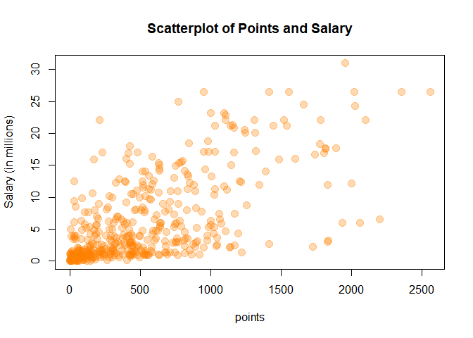
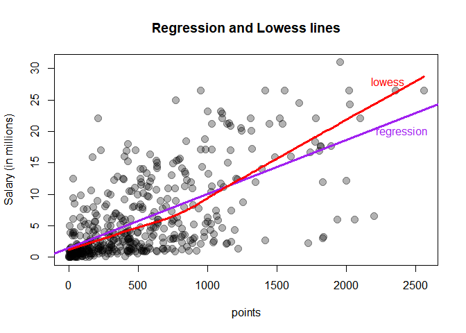
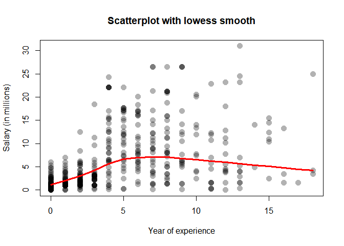
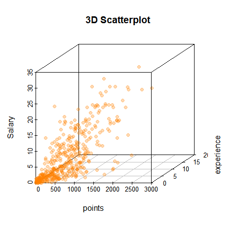
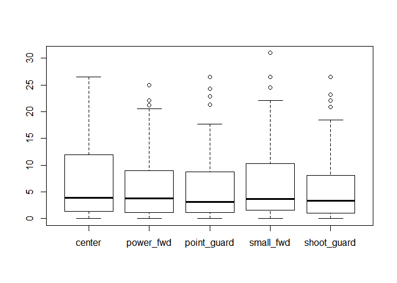

hw01-xiaoya-li
================
Xiaoya Li
September 20, 2017

``` r
#load data file
load("data/nba2017-salary-points.RData")

#list the available objects
ls()
```

    ## [1] "experience" "player"     "points"     "points1"    "points2"   
    ## [6] "points3"    "position"   "salary"     "team"

#### 1) Data Preprocessing

-   Create a new salary variable measured in millions of dollars, up to 2 decimal digits.

``` r
salary_in_millions <- salary / 1000000
round(salary_in_millions, 2)
```

    ##   [1] 26.54 12.00  8.27  1.45  1.41  6.59  6.29  1.83  4.74  5.00  1.22
    ##  [12]  3.09  3.58  1.91  8.00  7.81  0.02  0.26  0.27  0.01  9.70 12.80
    ##  [23]  1.55  0.54 21.17  5.24 17.64 30.96  2.50 15.33  1.59  7.33  1.58
    ##  [34] 26.54 14.20  0.54  2.70 14.38 12.00  1.92  0.87  5.30  1.20  6.05
    ##  [45] 12.25  3.73 22.12  1.20  1.19  0.54 15.94  5.00 16.96 12.00  7.40
    ##  [56]  5.89  0.54  2.87  3.39  1.50  2.71 23.18  8.40  0.39 15.73  4.00
    ##  [67]  2.50  4.84  1.02 20.07  0.42  3.85  2.28  3.00 17.10  5.37  1.55
    ##  [78] 12.52 15.20  0.92  9.61  1.40 10.50  1.81  6.35  2.57  2.37  2.70
    ##  [89] 10.23  4.58  0.65  8.80  1.05  1.80  4.00  4.00 10.77  2.46 18.31
    ## [100]  1.05 14.15  3.49  1.45  2.11  0.87  2.09 23.20  1.02  1.64 17.55
    ## [111]  1.71  3.18  5.78  0.75 14.00 13.22  2.90 15.89 22.12  4.00  5.78
    ## [122]  0.87  2.59  1.23  0.21  0.54  5.63  4.00  6.00  1.02 22.12  6.50
    ## [133]  1.55  7.00  0.87  1.70  6.00 10.99  3.68  4.62  0.65  2.26 14.96
    ## [144]  2.97 17.20  1.05  0.10  0.87  5.32  2.73  6.51  0.16 12.00  6.33
    ## [155] 12.25 13.00 12.50 20.87  6.00  0.54 24.56  0.14 11.24 21.32 17.00
    ## [166]  1.02  4.32  3.90  6.19  0.54  0.54  2.90  0.54  1.41  1.38  4.35
    ## [177] 17.00  5.00  7.25  0.98  2.61 17.00 15.00  6.54  0.03  3.91 11.75
    ## [188]  0.03  0.95 10.00  0.03  2.32  9.00  4.79  9.42  4.83  1.51  2.99
    ## [199]  1.03  1.02  8.00  0.09  0.87  8.55  1.33  6.09  0.12 21.17  1.56
    ## [210]  1.07 11.48  0.98  3.00  3.33  1.79  2.50  1.40  0.98  0.73  9.25
    ## [221] 11.13  1.17  1.55 15.33  1.02  0.98  1.40 26.54  1.18 16.66  0.38
    ## [232]  0.54  5.78 12.11  2.90  0.54 10.00  1.55  0.54  1.18  2.90  0.17
    ## [243]  0.87 17.64  1.19 20.58 14.00  3.58 15.50 14.45  0.68  0.54  1.30
    ## [254] 12.39  0.26 26.54  0.54  7.00  1.00  6.00 18.74  1.72  7.81  0.15
    ## [265]  1.32 11.00 20.14  1.55  1.27 22.87 21.17  0.54  7.38 13.25  2.20
    ## [276]  1.40  3.50  1.55  5.63 10.15  7.00  3.94 11.05  8.00 16.07  1.02
    ## [287]  2.25 11.00  0.60  0.94  1.41  2.12  2.43  2.34  5.99  2.18  2.44
    ## [298]  2.48 17.15  0.98  1.19  4.84  3.75  0.25 26.54  0.54  3.14  8.95
    ## [309]  6.55  0.94  5.70 22.12  1.37  2.90  0.98  1.29 21.17 26.54  5.51
    ## [320]  3.33  4.26  1.79  0.08 10.36  7.68 18.50  3.22 24.33  6.67 16.39
    ## [331]  0.60  1.92  8.99  9.21  2.75  0.87  1.35  0.54 15.05  8.07  3.24
    ## [342]  1.66  3.21  4.54  1.99 12.08  1.63  2.33  3.50  1.36  5.00  3.53
    ## [353] 11.20  4.60 22.12  0.02  0.54  2.98 16.96  0.58  8.08  0.17 11.29
    ## [364]  9.90  0.06 11.24  2.09  0.65  1.02  4.23 25.00  0.54  8.38 22.12
    ## [375]  4.10  0.06  4.38  0.54  0.87  2.90 17.10  0.21  8.00 12.50  4.01
    ## [386]  3.52  5.23  8.00  2.20  8.05  5.20  1.44 13.33  1.19  1.32 10.66
    ## [397]  3.55  2.02  6.01  3.50  7.64  2.35  3.91  5.96  3.87  3.80  0.14
    ## [408] 13.55  3.05  1.34  2.24  5.28  7.60  5.33  0.07  1.03 12.50  3.27
    ## [419]  1.21 18.00  1.55  5.44  6.19  1.05 16.00  1.73  0.87  4.82 12.61
    ## [430]  0.54  2.22  4.28  0.02 14.00 10.47  4.00  2.94  0.28  2.13  0.92
    ## [441] 12.41

-   Replace the values "R" by "0", and create a new experience variable as an integer vector.

``` r
experience_int <- as.vector(replace(experience, experience == "R", "0"), mode = "integer")
typeof(experience_int)
```

    ## [1] "integer"

-   Create a new position variable as an R factor.

``` r
position_fac <- factor(position, labels = c("center", "power_fwd", "point_guard", 
                                            "small_fwd", "shoot_guard"))
table(position_fac)
```

    ## position_fac
    ##      center   power_fwd point_guard   small_fwd shoot_guard 
    ##          89          89          85          83          95

#### 2) Scatter plot of Points and Salary

``` r
plot(points, salary_in_millions, col = rgb(1, 0.5, 0, 0.3),pch = 19,
     ylab = "Salary (in millions)",
     main = "Scatterplot of Points and Salary", cex = 1.5)
```



#### 3) Correlation between Points and Salary

``` r
#number of individuals
n <-  length(player)
n
```

    ## [1] 441

``` r
#mean of variable X(points)
x_mean <- sum(points) / n
x_mean
```

    ## [1] 546.6054

``` r
#mean of variable Y(salary)
y_mean <- sum(salary_in_millions) / n
y_mean
```

    ## [1] 6.187014

``` r
#variance of X
var_x <- sum((points - x_mean) ^ 2) / (n - 1)
var_x
```

    ## [1] 239136.2

``` r
#variance of Y
var_y <- sum((salary_in_millions - y_mean) ^ 2) / (n - 1)
var_y
```

    ## [1] 43.18973

``` r
#standard deviation of X
sd_x <- sqrt(var_x)
sd_x
```

    ## [1] 489.0156

``` r
#standard deviation of Y
sd_y <- sqrt(var_y)
sd_y
```

    ## [1] 6.57189

``` r
#covariance between X and Y
cov_xy <- sum((points - x_mean) * (salary_in_millions - y_mean)) / (n - 1)
cov_xy
```

    ## [1] 2046.213

``` r
#correlation between X and Y
cor_xy <- cov_xy / (sd_x * sd_y)
cor_xy
```

    ## [1] 0.6367043

``` r
#confirm answer with cor() 
cor(points, salary_in_millions)
```

    ## [1] 0.6367043

#### 4) Simple linear regression

``` r
#estimated slope of the regression line
slope <- cor_xy * sd_y / sd_x
slope
```

    ## [1] 0.008556681

``` r
#estimated intercept of the regression line
intercept <- y_mean - slope * x_mean
intercept
```

    ## [1] 1.509886

``` r
#the predicted values of Y
y_pre <- intercept + slope * points
```

-   **Summary of statistics of Y-hat.**

``` r
summary(y_pre)
```

    ##    Min. 1st Qu.  Median    Mean 3rd Qu.    Max. 
    ##   1.510   2.845   5.206   6.187   8.184  23.398

-   **What is the regression equation?**
    $\\hat{Y}$ = 1.5098856 + 0.0085567 \* X

-   **How do you interpret the slope coefficient *b*<sub>1</sub> ?**
    If you score one more point, you would expect your salary to raise 0.0085567 million dollars.

-   **How do you interpret the intecept term *b*<sub>0</sub> ?**
    If you score 0 point, you would expect you salary to be 1.5098856 million dollars.

-   **What is the predicted salary for a player that scores:**
    -   **0 points?**
    -   **100 points?**
    -   **500 points?**
    -   **1000 points?**
    -   **2000 points?**

``` r
intercept + slope * c(0, 100, 500, 1000, 2000)
```

    ## [1]  1.509886  2.365554  5.788226 10.066566 18.623247

#### 5) Plotting the regression line

``` r
plot(points, salary_in_millions, col = rgb(0,0,0,0.3), pch = 19,
    ylab = "Salary (in millions)",
    main = "Regression and Lowess lines", cex = 1.5
)
abline(a = intercept, b = slope, col = "purple", lwd = 3)
lines(lowess(points, salary_in_millions), col = "red", lwd = 3)
text(2400, 20, "regression", col = "purple")  
text(2300, 28, "lowess", col = "red")
```



#### 6) Regression residuals and Coefficient of Determination *R*<sup>2</sup>

``` r
#the vector of residuals (display only its summary() statistics)
residuals_e <- salary_in_millions - y_pre
summary(residuals_e)
```

    ##    Min. 1st Qu.  Median    Mean 3rd Qu.    Max. 
    ## -14.190  -2.794  -1.095   0.000   2.555  18.810

``` r
#the Residual Sum of Squares
RSS <- sum(residuals_e ^ 2)
RSS
```

    ## [1] 11299.62

``` r
#the Total Sum of Squares
TSS <- sum((salary_in_millions - y_mean) ^ 2)
TSS
```

    ## [1] 19003.48

``` r
#the coefficient of determination R^2
coeffi_of_deter <- 1 - RSS / TSS
coeffi_of_deter
```

    ## [1] 0.4053923

#### 7) Exploring Position and Experience

``` r
plot(experience_int, salary_in_millions, xlab = "Year of experience",
     ylab = "Salary (in millions)", main = "Scatterplot with lowess smooth",
     col = rgb(0,0,0,0.3), pch = 16, cex = 1.5)
lines(lowess(experience_int, salary_in_millions), col = "red", lwd = 3)
```



*description: The scatterplot shows a non-linear, weak association between year of experience and salary. The graph is bell-shaped center around 6 years of experience, with several outliers spread out above, especially after 10 years experience. *

-   **From the scatterplots, does Experience seem to be related with Salary?**
    From the scatterplots, players who have less than 4 years experience earn less salary in general. However, after that, there's no linear association between experience and salary, because a longer year of experience doesn't associate with higher salaries and also the players who have experience between 4 to 13 have a widespread salary range.

``` r
library(scatterplot3d)
scatterplot3d(points, experience_int, salary_in_millions,
              ylab = "experience", zlab = "Salary",main = "3D Scatterplot",
              pch = 19, color = rgb(1, 0.5, 0, 0.3) )
```



*description: The 3D scatterplot shows a non-linear association among salary, points, and experience. Most of the scatter are located at the lower left corner, representing the majority of players have a low salary, less than 500 points and less than 5 years experience.*

``` r
boxplot(salary_in_millions ~ position_fac)
```



*description: The median for 5 different positions are almost at the same level, so does their distribution, skew to the right. The 5 box plots are all comparatively the same in Inter-quartile range, with position center having a highest Upper quartile. Except for position center, all other 4 box have outliers. *

-   **From the boxplot, does Position seem to be related with Salary?**
    On average, players in different position seems to have the same salary. But when we comparing the high-income portion, players in position center have a higher salary than other positions, with the position in point guard the lowest.

#### 8) Comments and Reflections

-   **What things were hard, even though you saw them in class?**
    Give detail description of the plots.

-   **Did you need help to complete the assignment? If so, what kind of help? Who helped you?**
    Yes, I did. I need help on some plots function as well as how to describe the plots well. My GSI Xiaoqi helped me.

-   **How much time did it take to complete this HW?**
    Around 4 hours.

-   **What was the most time consuming part?**
    Learn how to use R to generate a detailed graph.

-   **Was there anything exciting? Something that you feel proud of? (Don't be shy, we won't tell anyone).**
    Figure out how to customize the circle in the scatter plot, filling it with different colors and making it transparent.
