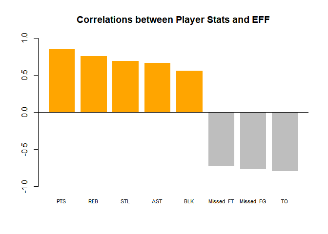

hw02-xiaoya-li
================
Xiaoya Li
September 27, 2017

### 1) Create a data dictionary

### 2) Import the data in R

``` r
#using read.csv() to import data
col_types <- c(
  'character', 'character', 'factor','character','double',
  'integer', 'integer','integer', 'integer', 'integer', 'integer', 'integer', 'integer', 'integer',
  'integer','integer','integer', 'integer','integer', 'integer', 'integer', 'integer', 'integer',  'integer'
)

nba_dat <- read.csv('data/nba2017-player-statistics.csv', header = TRUE, colClasses = col_types)

str(nba_dat)
```

    ## 'data.frame':    441 obs. of  24 variables:
    ##  $ Player      : chr  "Al Horford" "Amir Johnson" "Avery Bradley" "Demetrius Jackson" ...
    ##  $ Team        : chr  "BOS" "BOS" "BOS" "BOS" ...
    ##  $ Position    : Factor w/ 5 levels "C","PF","PG",..: 1 2 5 3 4 3 4 5 4 2 ...
    ##  $ Experience  : chr  "9" "11" "6" "R" ...
    ##  $ Salary      : num  26540100 12000000 8269663 1450000 1410598 ...
    ##  $ Rank        : int  4 6 5 15 11 1 3 13 8 10 ...
    ##  $ Age         : int  30 29 26 22 31 27 26 21 20 29 ...
    ##  $ GP          : int  68 80 55 5 47 76 72 29 78 78 ...
    ##  $ GS          : int  68 77 55 0 0 76 72 0 20 6 ...
    ##  $ MIN         : int  2193 1608 1835 17 538 2569 2335 220 1341 1232 ...
    ##  $ FGM         : int  379 213 359 3 95 682 333 25 192 114 ...
    ##  $ FGA         : int  801 370 775 4 232 1473 720 58 423 262 ...
    ##  $ Points3     : int  86 27 108 1 39 245 157 12 46 45 ...
    ##  $ Points3_atts: int  242 66 277 1 111 646 394 35 135 130 ...
    ##  $ Points2     : int  293 186 251 2 56 437 176 13 146 69 ...
    ##  $ Points2_atts: int  559 304 498 3 121 827 326 23 288 132 ...
    ##  $ FTM         : int  108 67 68 3 33 590 176 6 85 26 ...
    ##  $ FTA         : int  135 100 93 6 41 649 217 9 124 37 ...
    ##  $ OREB        : int  95 117 65 2 17 43 48 6 45 60 ...
    ##  $ DREB        : int  369 248 269 2 68 162 367 20 175 213 ...
    ##  $ AST         : int  337 140 121 3 33 449 155 4 64 71 ...
    ##  $ STL         : int  52 52 68 0 9 70 72 10 35 26 ...
    ##  $ BLK         : int  87 62 11 0 7 13 23 2 18 17 ...
    ##  $ TO          : int  116 77 88 0 25 210 79 4 68 39 ...

``` r
#using read_csv() to import data
library(readr)
nba_dat <- read_csv('data/nba2017-player-statistics.csv', col_names = TRUE, 
                    col_types = cols(Player = col_character(), Team = col_character(), 
                                  Position = col_factor(c('C', 'PF', 'PG','SF', 'SG')),
                                  Salary = col_double())
                    )
str(nba_dat)
```

    ## Classes 'tbl_df', 'tbl' and 'data.frame':    441 obs. of  24 variables:
    ##  $ Player      : chr  "Al Horford" "Amir Johnson" "Avery Bradley" "Demetrius Jackson" ...
    ##  $ Team        : chr  "BOS" "BOS" "BOS" "BOS" ...
    ##  $ Position    : Factor w/ 5 levels "C","PF","PG",..: 1 2 5 3 4 3 4 5 4 2 ...
    ##  $ Experience  : chr  "9" "11" "6" "R" ...
    ##  $ Salary      : num  26540100 12000000 8269663 1450000 1410598 ...
    ##  $ Rank        : int  4 6 5 15 11 1 3 13 8 10 ...
    ##  $ Age         : int  30 29 26 22 31 27 26 21 20 29 ...
    ##  $ GP          : int  68 80 55 5 47 76 72 29 78 78 ...
    ##  $ GS          : int  68 77 55 0 0 76 72 0 20 6 ...
    ##  $ MIN         : int  2193 1608 1835 17 538 2569 2335 220 1341 1232 ...
    ##  $ FGM         : int  379 213 359 3 95 682 333 25 192 114 ...
    ##  $ FGA         : int  801 370 775 4 232 1473 720 58 423 262 ...
    ##  $ Points3     : int  86 27 108 1 39 245 157 12 46 45 ...
    ##  $ Points3_atts: int  242 66 277 1 111 646 394 35 135 130 ...
    ##  $ Points2     : int  293 186 251 2 56 437 176 13 146 69 ...
    ##  $ Points2_atts: int  559 304 498 3 121 827 326 23 288 132 ...
    ##  $ FTM         : int  108 67 68 3 33 590 176 6 85 26 ...
    ##  $ FTA         : int  135 100 93 6 41 649 217 9 124 37 ...
    ##  $ OREB        : int  95 117 65 2 17 43 48 6 45 60 ...
    ##  $ DREB        : int  369 248 269 2 68 162 367 20 175 213 ...
    ##  $ AST         : int  337 140 121 3 33 449 155 4 64 71 ...
    ##  $ STL         : int  52 52 68 0 9 70 72 10 35 26 ...
    ##  $ BLK         : int  87 62 11 0 7 13 23 2 18 17 ...
    ##  $ TO          : int  116 77 88 0 25 210 79 4 68 39 ...
    ##  - attr(*, "spec")=List of 2
    ##   ..$ cols   :List of 24
    ##   .. ..$ Player      : list()
    ##   .. .. ..- attr(*, "class")= chr  "collector_character" "collector"
    ##   .. ..$ Team        : list()
    ##   .. .. ..- attr(*, "class")= chr  "collector_character" "collector"
    ##   .. ..$ Position    :List of 3
    ##   .. .. ..$ levels    : chr  "C" "PF" "PG" "SF" ...
    ##   .. .. ..$ ordered   : logi FALSE
    ##   .. .. ..$ include_na: logi FALSE
    ##   .. .. ..- attr(*, "class")= chr  "collector_factor" "collector"
    ##   .. ..$ Experience  : list()
    ##   .. .. ..- attr(*, "class")= chr  "collector_character" "collector"
    ##   .. ..$ Salary      : list()
    ##   .. .. ..- attr(*, "class")= chr  "collector_double" "collector"
    ##   .. ..$ Rank        : list()
    ##   .. .. ..- attr(*, "class")= chr  "collector_integer" "collector"
    ##   .. ..$ Age         : list()
    ##   .. .. ..- attr(*, "class")= chr  "collector_integer" "collector"
    ##   .. ..$ GP          : list()
    ##   .. .. ..- attr(*, "class")= chr  "collector_integer" "collector"
    ##   .. ..$ GS          : list()
    ##   .. .. ..- attr(*, "class")= chr  "collector_integer" "collector"
    ##   .. ..$ MIN         : list()
    ##   .. .. ..- attr(*, "class")= chr  "collector_integer" "collector"
    ##   .. ..$ FGM         : list()
    ##   .. .. ..- attr(*, "class")= chr  "collector_integer" "collector"
    ##   .. ..$ FGA         : list()
    ##   .. .. ..- attr(*, "class")= chr  "collector_integer" "collector"
    ##   .. ..$ Points3     : list()
    ##   .. .. ..- attr(*, "class")= chr  "collector_integer" "collector"
    ##   .. ..$ Points3_atts: list()
    ##   .. .. ..- attr(*, "class")= chr  "collector_integer" "collector"
    ##   .. ..$ Points2     : list()
    ##   .. .. ..- attr(*, "class")= chr  "collector_integer" "collector"
    ##   .. ..$ Points2_atts: list()
    ##   .. .. ..- attr(*, "class")= chr  "collector_integer" "collector"
    ##   .. ..$ FTM         : list()
    ##   .. .. ..- attr(*, "class")= chr  "collector_integer" "collector"
    ##   .. ..$ FTA         : list()
    ##   .. .. ..- attr(*, "class")= chr  "collector_integer" "collector"
    ##   .. ..$ OREB        : list()
    ##   .. .. ..- attr(*, "class")= chr  "collector_integer" "collector"
    ##   .. ..$ DREB        : list()
    ##   .. .. ..- attr(*, "class")= chr  "collector_integer" "collector"
    ##   .. ..$ AST         : list()
    ##   .. .. ..- attr(*, "class")= chr  "collector_integer" "collector"
    ##   .. ..$ STL         : list()
    ##   .. .. ..- attr(*, "class")= chr  "collector_integer" "collector"
    ##   .. ..$ BLK         : list()
    ##   .. .. ..- attr(*, "class")= chr  "collector_integer" "collector"
    ##   .. ..$ TO          : list()
    ##   .. .. ..- attr(*, "class")= chr  "collector_integer" "collector"
    ##   ..$ default: list()
    ##   .. ..- attr(*, "class")= chr  "collector_guess" "collector"
    ##   ..- attr(*, "class")= chr "col_spec"

### 3) Right after importing the data

``` r
nba_dat$Experience[nba_dat$Experience == 'R'] <- '0'
nba_dat$Experience <- as.integer(nba_dat$Experience)
```

### 4) Performance of players

To compute **EFF**, you will have to add the following variables to your data frame: - **Missed\_FG** (missed field goals) - **Missed\_FT** (missed free throws) - **PTS** (total points) - **REB** (total rebounds: offensive and defensive) - **MPG** (minutes per game; NOT to be used when calculating **EFF**)

``` r
nba_dat$Missed_FG <- nba_dat$FGA - nba_dat$FGM
nba_dat$Missed_FT <- nba_dat$FTA - nba_dat$FTM
nba_dat$PTS <- nba_dat$Points2 * 2 + nba_dat$Points3 * 3 + nba_dat$FTM * 1 
nba_dat$REB <- nba_dat$OREB + nba_dat$DREB
nba_dat$MPG <- nba_dat$MIN / nba_dat$GP
```

Once you have all the necessary statistics, add a variable **EFF** to the data frame using the formula provided above.

``` r
nba_dat$EFF <- (nba_dat$PTS + nba_dat$REB + nba_dat$AST + nba_dat$STL + nba_dat$BLK - 
                  nba_dat$Missed_FG - nba_dat$Missed_FT - nba_dat$TO) / nba_dat$GP
```

Compute summary statistics for **EFF** and confirm that you have the following results, as well as a similar histogram:

``` r
summary(nba_dat$EFF)
```

    ##    Min. 1st Qu.  Median    Mean 3rd Qu.    Max. 
    ##  -0.600   5.452   9.090  10.137  13.247  33.840

``` r
hist(nba_dat$EFF, main = "Histogram of Efficiency (EFF)", xlab = "EFF", col = "grey")
```


-   Display the player name, team, salary, and EFF value of the top-10 players by EFF in decreasing order (display this information in a data frame).

``` r
nba_dat[order(nba_dat$EFF, decreasing = TRUE),][1:10, c("Player", "Team", "Salary", "EFF")]
```

    ## # A tibble: 10 x 4
    ##                   Player  Team   Salary      EFF
    ##                    <chr> <chr>    <dbl>    <dbl>
    ##  1     Russell Westbrook   OKC 26540100 33.83951
    ##  2          James Harden   HOU 26540100 32.34568
    ##  3         Anthony Davis   NOP 22116750 31.16000
    ##  4          LeBron James   CLE 30963450 30.97297
    ##  5    Karl-Anthony Towns   MIN  5960160 30.32927
    ##  6          Kevin Durant   GSW 26540100 30.19355
    ##  7 Giannis Antetokounmpo   MIL  2995421 28.37500
    ##  8      DeMarcus Cousins   NOP 16957900 27.94118
    ##  9          Jimmy Butler   CHI 17552209 25.60526
    ## 10      Hassan Whiteside   MIA 22116750 25.36364

-   Provide the names of the players that have a negative EFF.

``` r
nba_dat[nba_dat$EFF < 0, ]$Player
```

    ## [1] "Patricio Garino"

-   Use the function cor() to compute the correlation coefficients between EFF and all the variables used in the EFF formula.
    Notice that Missed\_FG, Missed\_FT, and TO contribute negatively to EFF, so make sure to take into account this negative association when calculating the correlation coefficients.

``` r
cor_coefficients <- c(
  PTS = cor(nba_dat$EFF, nba_dat$PTS),
  REB = cor(nba_dat$EFF, nba_dat$REB),
  AST = cor(nba_dat$EFF, nba_dat$AST),
  STL = cor(nba_dat$EFF, nba_dat$STL),
  BLK = cor(nba_dat$EFF, nba_dat$BLK),
  Missed_FT = cor(nba_dat$EFF, -nba_dat$Missed_FT),
  Missed_FG = cor(nba_dat$EFF, -nba_dat$Missed_FG),
  TO = cor(nba_dat$EFF, -nba_dat$TO)
)
```

-   Display the computed correlations in descending order, either in a vector or a data frame. And create a barchart with the correlations (bars in decreasing order) like the one below.

``` r
cor_coefficients <- cor_coefficients[order(cor_coefficients, decreasing = TRUE)]
cor_coefficients
```

    ##        PTS        REB        STL        AST        BLK  Missed_FT 
    ##  0.8588644  0.7634501  0.6957286  0.6689232  0.5679571 -0.7271456 
    ##  Missed_FG         TO 
    ## -0.7722477 -0.8003289

``` r
barplot(cor_coefficients, main = "Correlations between Player Stats and EFF",
        col = c("grey", "orange")[(cor_coefficients > 0) + 1] , border = FALSE, 
        cex.names = 0.7, ylim=c(-1,1)
        )
abline(h = 0)
```



### 5) Efficiency and Salary

Once you've calculated the Efficiency statistic, produce a scatterplot between Efficiency (x-axis) and Salary (y-axis), including a lowess smooth line (locally weighted scatterplot smoothing).

``` r
#scatterplot between Efficiency and Salary
plot(nba_dat$EFF, nba_dat$Salary, pch = 16, col = rgb(1, 0.5, 0, 0.3),
     main = "Scatterplot of Efficiency and Salary", xlab = "EFF", ylab = "Salary")
#lowess smooth line
lines(lowess(nba_dat$EFF, nba_dat$Salary), lwd = 3, col = rgb(1,0,0.5))
text(33, 25000000, labels = "lowess", col = rgb(1,0,0.5))
```


Also, compute the linear correlation coefficient between them.

``` r
cor(nba_dat$EFF, nba_dat$Salary)
```

    ## [1] 0.655624

What can you say about the relationship between these two variables?

*Based on the scatterplot and the linear correlation coefficient, there's a positive association between **EFF** and **Salary**.*

Because rookie players (and other low-experience players) seem to form a different universe of players, let's see what's happening with those individuals with a more "solid" or more established trajectory in the NBA.
- Taking into account the column MPG (minutes per game) select those players that have an MPG value of 20 or more minutes per game. - Create a data frame `players2` with these players.

``` r
players2 <- nba_dat[nba_dat$MPG >= 20,]
players2
```

    ## # A tibble: 231 x 30
    ##            Player  Team Position Experience   Salary  Rank   Age    GP
    ##             <chr> <chr>   <fctr>      <int>    <dbl> <int> <int> <int>
    ##  1     Al Horford   BOS        C          9 26540100     4    30    68
    ##  2   Amir Johnson   BOS       PF         11 12000000     6    29    80
    ##  3  Avery Bradley   BOS       SG          6  8269663     5    26    55
    ##  4  Isaiah Thomas   BOS       PG          5  6587132     1    27    76
    ##  5    Jae Crowder   BOS       SF          4  6286408     3    26    72
    ##  6   Kelly Olynyk   BOS        C          3  3094014     7    25    75
    ##  7   Marcus Smart   BOS       SG          2  3578880     2    22    79
    ##  8 Deron Williams   CLE       PG         11   259626    11    32    24
    ##  9    Edy Tavares   CLE        C          1     5145    18    24     1
    ## 10  Iman Shumpert   CLE       SG          5  9700000     4    26    76
    ## # ... with 221 more rows, and 22 more variables: GS <int>, MIN <int>,
    ## #   FGM <int>, FGA <int>, Points3 <int>, Points3_atts <int>,
    ## #   Points2 <int>, Points2_atts <int>, FTM <int>, FTA <int>, OREB <int>,
    ## #   DREB <int>, AST <int>, STL <int>, BLK <int>, TO <int>,
    ## #   Missed_FG <int>, Missed_FT <int>, PTS <dbl>, REB <int>, MPG <dbl>,
    ## #   EFF <dbl>

-   Use this data frame to create a scatterplot between Efficiency and Salary, including a lowess smooth line.

``` r
#scatterplot
plot(players2$EFF, players2$Salary, main = "more established players' scatterplot of EEF and Salary",
     xlab = "EEF", ylab = "Salary", pch = 16, col = rgb(1,0,1, 0.3))
#lowess smooth line
lines(lowess(players2$EFF, players2$Salary), col = rgb(0,0.5,1), lwd = 3)
text(32, 21000000, labels = "lowess",col = rgb(0,0.5,1))
```


-   Compute the linear correlation coefficient between these variables.

``` r
cor(players2$EFF, players2$Salary)
```

    ## [1] 0.5367224

-   What can you say about the relationship between these two variables for the set of "more established players"?

*Based on the scatterplot and linear correlation coefficient, there's still a positive association between **EFF** and **Salary**, but with a more shallow slope. *

### 6) Comments and Reflections

-   What things were hard, even though you saw them in class/lab?
    Make correctly use different data type. For example, sometimes you can not generate a plot of a dataframe directly, which needs to be converted to a vector first.

-   What was easy(-ish) even though we haven't done it in class/lab?
    Calculation part.

-   Did you need help to complete the assignment? If so, what kind of help?
    Yes. I look up resource online.

-   How much time did it take to complete this HW?
    Around 3 hours.

-   What was the most time consuming part?
    Try to figure out how to convert a dataframe into the data type that I want.

-   Was there anything exciting? Something that you feel proud of?
    I'm more familiar with ploting data.

-   Was there anything that you did not understand? or fully grasped?
    How to write a professional dictionary for a data file.
