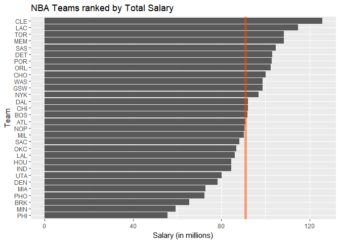
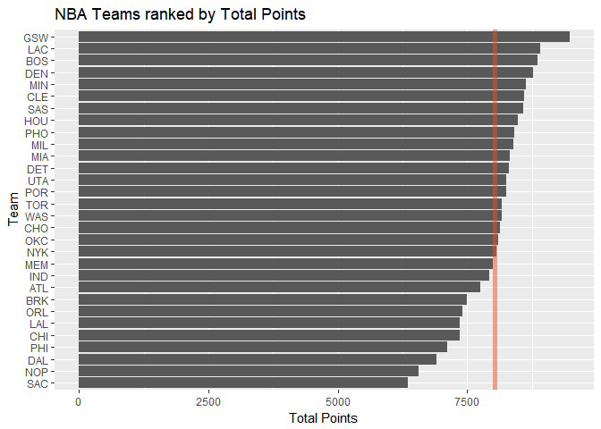
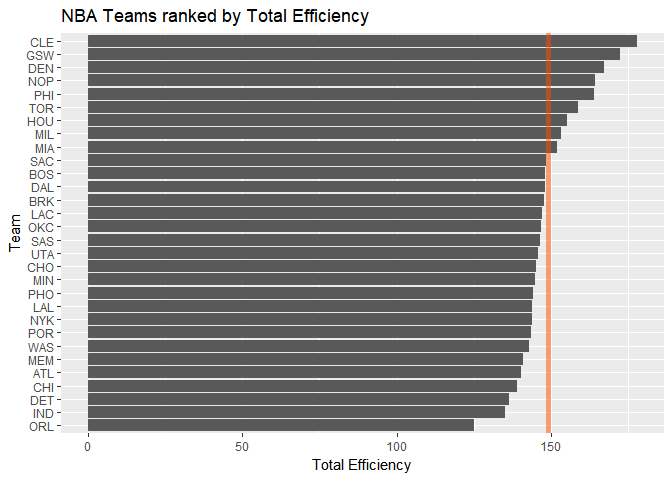
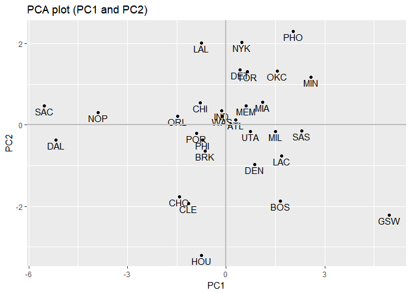
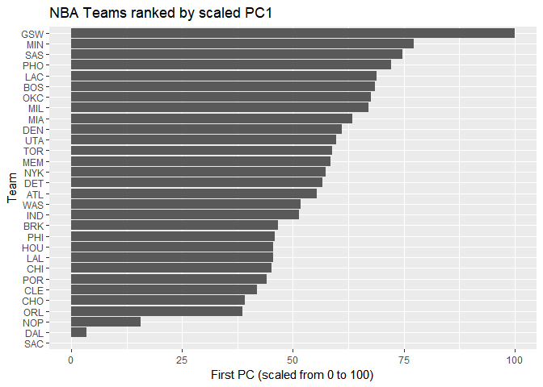

hw03-xiaoya-li.Rmd
================
Xiaoya Li
October 6, 2017

``` r
library(ggplot2)
library(dplyr)
```

    ## 
    ## Attaching package: 'dplyr'

    ## The following objects are masked from 'package:stats':
    ## 
    ##     filter, lag

    ## The following objects are masked from 'package:base':
    ## 
    ##     intersect, setdiff, setequal, union

``` r
teams <- read.csv("../data/nba2017-teams.csv")
```

Ranking of Teams
================

### Basic Rankings

**Start by ranking the teams according to salary, arranged in decreasing order.The vertical red line is the average team salary.**

``` r
ggplot(data = teams, aes(x = reorder(team, salary), y = salary)) +
  geom_bar(stat = 'identity') +
  coord_flip() +
  geom_hline(yintercept = mean(teams$salary), size = 2, colour = rgb(1,0.3,0,0.5)) +
  labs(y = "Salary (in millions)", x = "Team", title = "NBA Teams ranked by Total Salary")
```



**Create another bar chart of teams ranked by total points. The vertical red line is the average team points.**

``` r
ggplot(data = teams, aes(x = reorder(team, points), y = points)) +
  geom_bar(stat = 'identity') +
  coord_flip() +
  geom_hline(yintercept = mean(teams$points), size = 2, colour = rgb(1,0.3,0,0.5)) +
  labs(y = "Total Points", x = "Team", title = "NBA Teams ranked by Total Points")
```



**Use efficiency to obtain a third kind of ranking, and create an associated bar chart of teams ranked by total efficiency. The vertical red line is the average team efficiency.**

``` r
ggplot(data = teams, aes(x = reorder(team, efficiency), y = efficiency)) +
  geom_bar(stat = 'identity') +
  coord_flip() +
  geom_hline(yintercept = mean(teams$efficiency), size = 2, colour = rgb(1,0.3,0,0.5)) +
  labs(y = "Total Efficiency", x = "Team", title = "NBA Teams ranked by Total Efficiency")
```



**Provide concise descriptions of the obtained rankings so far.**
- *ranked by Total Salary: Around half of the teams are above the average salary, where CLE ranked the first with more than 120 millions total salary.*
- *ranked by Total Points: More than half of the teams are above the average total points, where GSW ranked the first with more than 8750 total points.*
- *ranked by Total Efficiency: Only 9 teams out of 30 are above the average efficiency, where CLE ranked the first with more than 175 index of efficiency.*

Principal Components Analysis (PCA)
===================================

**Perform a principal components analysis (PCA) on the following variables, to use the first principal component (PC1) as another index to rank the teams:**

``` r
teams_pca <- prcomp(select(teams, points3, points2, free_throws, off_rebounds, def_rebounds,
                           assists, steals, blocks, turnovers, fouls), scale. = TRUE)
teams_pca
```

    ## Standard deviations (1, .., p=10):
    ##  [1] 2.1669994 1.3046111 0.9897094 0.8784756 0.7308134 0.6913872 0.6182263
    ##  [8] 0.5101592 0.3655034 0.2503921
    ## 
    ## Rotation (n x k) = (10 x 10):
    ##                    PC1         PC2         PC3          PC4         PC5
    ## points3      0.1121782 -0.65652993  0.28806873 -0.042637313  0.28657624
    ## points2      0.3601766  0.32892544 -0.06763180 -0.347710703 -0.15173866
    ## free_throws  0.3227564 -0.17651228  0.39157491  0.147596178 -0.21363792
    ## off_rebounds 0.3029366  0.35931603  0.33884845 -0.288483019 -0.16571824
    ## def_rebounds 0.3719432 -0.12808273  0.15026131 -0.492969442  0.26476256
    ## assists      0.3125312 -0.44134618 -0.26294129 -0.088066602 -0.36972525
    ## steals       0.3447256 -0.03540585 -0.48554101  0.177578661 -0.33549491
    ## blocks       0.3162237  0.06131890 -0.48869371  0.003935374  0.65459381
    ## turnovers    0.3353958 -0.02169833  0.08910421  0.532117541 -0.04471763
    ## fouls        0.3072548  0.28954426  0.26469871  0.454751471  0.26814214
    ##                       PC6         PC7         PC8         PC9         PC10
    ## points3      -0.028435666  0.38167878  0.18027569 -0.20631322  0.409762462
    ## points2      -0.088714347  0.07302430 -0.47216199 -0.35836740  0.499011524
    ## free_throws  -0.487342521 -0.62732220  0.07726675 -0.08283563 -0.006875686
    ## off_rebounds  0.283093235  0.13535335  0.64646479 -0.14735551 -0.124601143
    ## def_rebounds  0.066309015 -0.04926346 -0.23787252  0.64632050 -0.168579984
    ## assists       0.176019008  0.11785039 -0.18235775 -0.34086739 -0.547385461
    ## steals       -0.303664534  0.25883825  0.32703573  0.41596580  0.246739300
    ## blocks       -0.009954065 -0.30799231  0.23947533 -0.27071160 -0.057627209
    ## turnovers     0.675777660 -0.18850849 -0.14308362  0.13524769  0.250947823
    ## fouls        -0.298848473  0.47268121 -0.21462859 -0.04367200 -0.335087245

**Createa a data frame with the eigenvalues:**

``` r
eigs <- data.frame(
  "eigenvalues" = round(teams_pca$sdev ^ 2, 4),
  "prop" = round( teams_pca$sdev ^ 2 / sum(teams_pca$sdev ^ 2), 4),
  "cumprop" = round(cumsum(teams_pca$sdev ^ 2 / sum(teams_pca$sdev ^ 2)), 4),
  row.names = 1:10
)
eigs
```

    ##    eigenvalues   prop cumprop
    ## 1       4.6959 0.4696  0.4696
    ## 2       1.7020 0.1702  0.6398
    ## 3       0.9795 0.0980  0.7377
    ## 4       0.7717 0.0772  0.8149
    ## 5       0.5341 0.0534  0.8683
    ## 6       0.4780 0.0478  0.9161
    ## 7       0.3822 0.0382  0.9543
    ## 8       0.2603 0.0260  0.9804
    ## 9       0.1336 0.0134  0.9937
    ## 10      0.0627 0.0063  1.0000

**Use the first two PCs to get a scatterplot of the teams**

``` r
teams_pca$x <- as.data.frame(teams_pca$x)

ggplot(data = teams_pca$x, aes(x = PC1, y = PC2)) + 
  geom_point() +
  geom_text(aes(label = teams$team), vjust = 1.25) +
  labs(title = "PCA plot (PC1 and PC2)") +
  geom_hline(yintercept = 0, size = 1, color = "grey") +
  geom_vline(xintercept = 0, size = 1, color = "grey")
```



### Index based on PC1

**In order to build an index based on the first PC, you are going to transform PC1. To get a more meaningful scale, you can rescale the first PC with a new scale ranging from 0 to 100.**

``` r
s_1 <- 100 * (teams_pca$x$PC1 - min(teams_pca$x$PC1)) / (max(teams_pca$x$PC1) - min(teams_pca$x$PC1))
```

**Once you have obtained the rescaled PC1, you can produce a barchart like the previous ones:**

``` r
teams$PC1 = s_1
ggplot(data = teams , aes(x = reorder(team, PC1), y = PC1)) +
  geom_bar(stat = 'identity') +
  coord_flip() +
  labs(y = "First PC (scaled from 0 to 100)", x = "Team", title = "NBA Teams ranked by scaled PC1")
```



**Provide a brief description of the PC1 index to rank the teams.**
*Ranked by the first PC, GSW ranked the first way higher than the second with index 100; while SAC ranked the last with index 0.*

Comments and Reflections
========================

-   **Was this your first time working on a project with such file structure? If yes, how do you feel about it?**
    Yes, it was. The file structure is very organized.
-   **Was this your first time using relative paths? If yes, can you tell why they are important for reproducibility purposes?**
    Yes, it was. Because it will ensure that if you move the project location, you can still access each file without an error.
-   **Was this your first time using an R script? If yes, what do you think about just writing code?**
    Yes, it was. I feel more comfortable becasue I don't need to deal with the format of output.
-   **What things were hard, even though you saw them in class/lab?**
    The PCA process and the meaning of doing each step.
-   **What was easy(-ish) even though we haven't done it in class/lab?**
    Using ggplot to generate different plots.
-   **Did anyone help you completing the assignment? If so, who?**
    No. I did everything on my own.
-   **How much time did it take to complete this HW?**
    Around 4 hours.
-   **What was the most time consuming part?**
    Understanding the PCA process.
-   **Was there anything interesting?**
    Using ggplot to generate different plots.
