post01 - Box Plot
================
Xiaoya Li
October 19, 2017

``` r
library(dplyr)
```

    ## 
    ## Attaching package: 'dplyr'

    ## The following objects are masked from 'package:stats':
    ## 
    ##     filter, lag

    ## The following objects are masked from 'package:base':
    ## 
    ##     intersect, setdiff, setequal, union

``` r
library(readr)
library(ggplot2)
```

Box Plot
========

### I. Introduction

Box plot plays an important role in the world of data visualization. It's simplest enough to avoid junk value affect the graphics appealing; it's also efficient enough to show the information we want. And You would find that it makes comparison much easier in some case. So, in this post, I'm going to show you what is a box plot, how do you interpret it, and how can you draw it using R.

### II. Box Plot Terminology

Before we jump into the terminology of box plot, let's review some basic statistic.

-   **Quantile**: *Cutpoints dividing the range of a probability distribution into contiguous intervals with equal probabilities.There is one less quantile than the number of groups created.*
-   **Quartile**: *A special type of quantile, which divides the given population into four equal groups, with each group containing a quarter of the data.*
-   **First Quartile**: *Q*<sub>1</sub> *, also known as lower quartile, is the cutpoint of the lowest 25% of the data.*
-   **Mean**: *Q*<sub>2</sub> *, also known as the second quartile, is the cutpoint of the half of the data.*
-   **Third Quartile**: *Q*<sub>3</sub> *, also know as the upper quartile, is the cutpoint of the lowest 75% of the data.*
-   **Interquartile range**: *I**Q**R* = *Q*<sub>3</sub> − *Q*<sub>1</sub> *, is the difference between the upper quartile and the lower quartile.*
-   **Outlier**: *A observed point that is distant from other data.*

Once we understand the meaning of the statistic behind, it becomes easy to learn about a box plot.

A box plot consists of two main component: the **main box** and its two **whiskers**. The top and bottom of the box will always be the upper and lower quartile, while the line inside the box is always the median. However, there's many possible values that whiskers might present, here are the most common ones:

-   **whiskers represent the minimum and maximum of the data**
    This is the simplest type of box plot with all data present.
    

-   **whiskers represent the lower fence (1.5 \* *I**Q**R* lower than the lower quartile) and the upper fence (1.5 \* *I**Q**R* higher than the upper quartile)**
    In this case, box plot may include infomation of outliers.
    Note: More specifically, *Outliers* can be referred to points that are 3 \* *I**Q**R* more above the upper quartile or 3 \* *I**Q**R* more below the lower quartile; *Suspected outliers* can be referred to points that are more above the upper fence or more below the lower fence.
    

**Note**:
The R basic function `boxplot()` by default will have whiskers represent the lower fence and upper fence, but it allows you to change by using argument `range =`.

> range: this determines how far the plot whiskers extend out from the box. If range is positive, the whiskers extend to the most extreme data point which is no more than range times the interquartile range from the box. A value of zero causes the whiskers to extend to the data extremes.

On the other hand, the `geom_boxplot` function in `ggplot2` package will always have whiskers represent the lower fence and upper fence. However, you can custom the outliers using a family of `outlier` aesthetics arguments.
We will see some examples in section 4 of this post.

Moreover, we could have ...

-   **whiskers represent one standard deviation away from the mean**
-   **whiskers represent the confident interval in an hypothesis test**

In addition to these basic box plots, there are some variations of box plot, which may be found useful in certain scenarios:

-   **Notched Box Plot**
    Notched box plot has all features as a basic box plot has, with an additional notch, which display a 95% confidence interval around the mean.
    

-   **Tufte Box Plot**
    Tufte's version of box plot eliminates the box and put more emphasis on the essential information: median, minimum, maximum and upper, lower quartile, which makes the plot immediately visible.
    

-   **Vase Plot**
    Vase plot is similar to box plot, with its width of the box at each point is proportional to the estimated density.
    

-   **Violin Plot**
    Violin plot is similar to vase plot, but it shows the density of all data, which make it losts its whiskers.
    

### III. Box Plot Intepretation

After seeing the basic structure of a box plot, we are ready to move forward into interpretation. In general, we can understand a box plot by anwering the following questions:

**1. What's the five number summary of this box plot?**
**2. Are there any outliers?**
**3. What's the approximate shape of its distribution? Is it skewed?**
**4. If you're comparing boxplots represents different groups, is there any difference in the center or spread between groups?** 

But how can we approach to answer those question? Don't worry, here's some features we've observed:

**1. The five number summary (min, first quartile, median, third quartile, max) are just the basic components of our box plot, which you can directly read from the plot.**


**2. If data is skewed, that means the majority of the data are falling in interval either very high or very low. It will lead to a shorter box plot, with right-skewed box plot having a longer right whisker and left-skewed box plot having a longer left whisker. On the other hand, if data is symmetric, you would expect the box plot has a line right in the middle of the box and whiskers with the same length. In short, the box plot itself would also be symmetric.**  

Let's look at an example!
The data contains 1000 students' GPA in high school and college. We generated GPA box plots for each group: in the high school year and in college. What can we interpret from each of the individual box plots and what can we observe comparing those two?

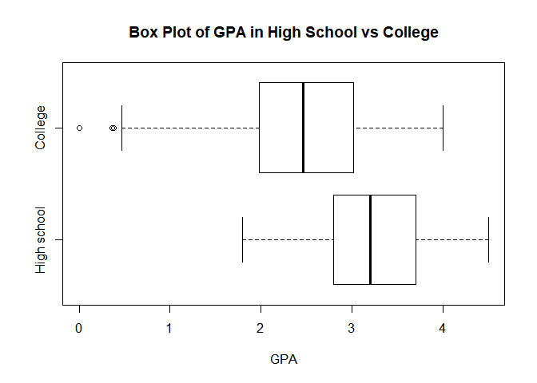

For box plot of the college GPA, we observed that the five number summary are

-   minimum: 0.0, which happens to be an outlier
-   first quartile: around 2.0
-   mean: around 2.5
-   third quartile: around 3.0
-   maximum: 4.0

Moreover, since the box plot has a longer left whisker, we can say that the distribution is slightly lef-skewed.

As for box plot of the high school GPA, we observed that the five number summary are

-   minimum: 1.8
-   first quartile: 2.8
-   mean: 3.2
-   third quartile: 3.7
-   maximum: 4.5

Since the box plot does not contain any longer whisker, we can say that the distribution is approximately normal.

When comparing the two, we can see it clearly that the students' GPA in their college years have a lower mean and wider spread out.

### IV. Draw a Box Plot in R

Finally, it's time to draw our own box plot. Recall in the first homework, we've generate a conditional box plot of nba players' `salary` in terms of their `position` using `boxplot()` function. Here's the code from hw1\_solutions:

``` r
#prepare the data
load("../data/nba2017-salary-points.RData")

#change salary in million dollars
salary <-round(salary / 1000000, 2)

#make position into a factor
pos_labels <-c("center","point_fwd","point_guard","small_fwd","shoot_guard")
position <-factor(position, labels = pos_labels)
```

``` r
#draw the boxplot
boxplot(salary ~ position, las = 1,
        xlab = "Position", 
        ylab = "Salary (in millions)",
        main = "Box Plot of Salary in terms of Position")
```

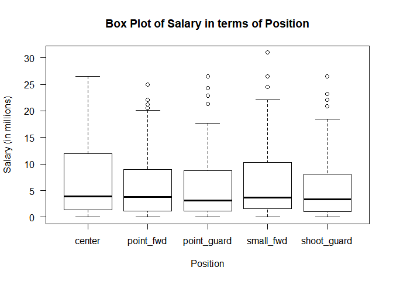

If you want your whiskers represent the maximum and minimum, we can change the `range =` arguement.

``` r
#draw the boxplot 
boxplot(salary ~ position, las = 1, 
        xlab = "Position", 
        ylab = "Salary (in millions)",
        main = "Box Plot of Salary in terms of Position",
        #make whiskers to represent the maximum and minimum, which means no outlier
        range = 0
        )
```

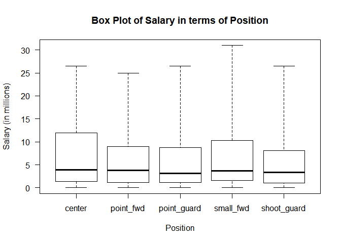

So far, we all have some idea of how to draw a basic box plot using basic R function. What if we want to draw more advanced box plots? We can do it using the `ggplot2` package. Let's see a couple of examples, and learn some techniques.

#### a) NBA players example

In the first example, in order to focus more on the box plot drawing, I use the dataset that everyone in this class is familiar with, the NBA data.

``` r
#prepare the data
player_dat <- read_csv("../data/nba2017-player-statistics.csv",
                       col_names = TRUE,
                       col_types = cols(Player =col_character(),
                                       Team =col_character(),
                                       Position =col_factor(NULL),
                                       Salary =col_double()))

#we want 'Salary' in millions as well
player_dat <- mutate(player_dat, Salary = round(Salary / 1000000, 2))
head(player_dat)
```

    ## # A tibble: 6 x 24
    ##              Player  Team Position Experience Salary  Rank   Age    GP
    ##               <chr> <chr>   <fctr>      <chr>  <dbl> <int> <int> <int>
    ## 1        Al Horford   BOS        C          9  26.54     4    30    68
    ## 2      Amir Johnson   BOS       PF         11  12.00     6    29    80
    ## 3     Avery Bradley   BOS       SG          6   8.27     5    26    55
    ## 4 Demetrius Jackson   BOS       PG          R   1.45    15    22     5
    ## 5      Gerald Green   BOS       SF          9   1.41    11    31    47
    ## 6     Isaiah Thomas   BOS       PG          5   6.59     1    27    76
    ## # ... with 16 more variables: GS <int>, MIN <int>, FGM <int>, FGA <int>,
    ## #   Points3 <int>, Points3_atts <int>, Points2 <int>, Points2_atts <int>,
    ## #   FTM <int>, FTA <int>, OREB <int>, DREB <int>, AST <int>, STL <int>,
    ## #   BLK <int>, TO <int>

First of all, let's draw a conditional box plot similar to the previous one, the nba players' `salary` in terms of their `position`, we add an argument `fill = Position` to **add colors to the box plot** based on their `Position`.

``` r
ggplot(player_dat, aes(x = Position, y = Salary, fill = Position)) +
  geom_boxplot() +
  ggtitle("Box Plot of Salary in terms of Position")
```

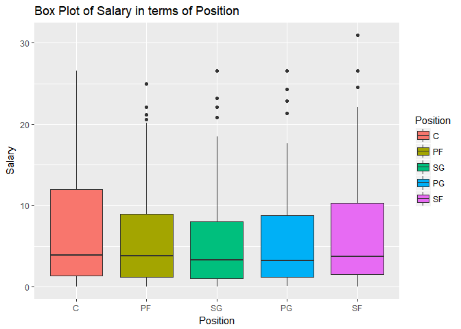

Although we can't change the whiskers to represent maximum and minimum, let's see what else we can do to **custom the outliers** using `outlier` argument.

``` r
ggplot(player_dat, aes(x = Position, y = Salary, fill = Position)) +
  geom_boxplot(
    ## custom outliers
    outlier.shape = 17, 
    outlier.size = 3, 
    outlier.color = "red"
    ) +
  ggtitle("Box Plot of Salary in terms of Position")
```

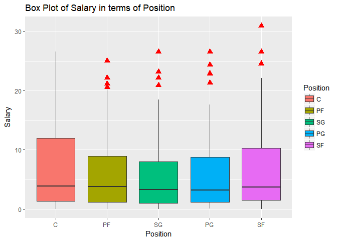

But instead of the relation bewteen `Position` and `Salary` in general, we want to see more detailed relation within each team seperately .
We can use `facet_warp()` or `facet_grid()` in `ggplot2` to **display multiple facets**.
Since there are 30 teams in total, `facet_warp()` will generate a nicer facets in this case. But remember, `facet_grid()` could also do the same job and even give you more control of your graph.

``` r
ggplot(player_dat, aes(x = Position, y = Salary, fill = Position)) +
  geom_boxplot() +
  #facets the data into teams
  facet_wrap( ~ Team) + 
  ggtitle("Box Plot of Salary in terms of Position in each Team")
```

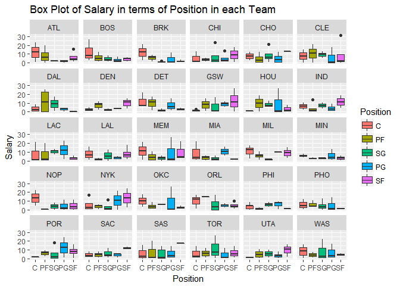

It seems like most of the box plots are squeezing in the bottom of the graph, let's **draw a horizontal box plot** to make our boxes looks clearer.
We can use `coord_flip()` to do that.

``` r
ggplot(player_dat, aes(x = Position, y = Salary, fill = Position)) +
  geom_boxplot() +
  facet_wrap( ~ Team) +
  #flip the x-y coordinate to make it horizontal
  coord_flip() +
  ggtitle("Horizontal Box Plot of Salary in terms of Position in each Team")
```

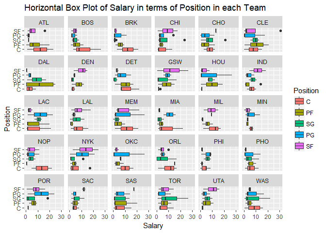

That's basically the outline of all the players' `Salary` in different teams, different position. Next, let's zoom in a little bit. I pick `GSW` as the team that we're interested in and draw a box plot of its players' `Salary`.

``` r
#using filter() to choose players from team 'GSW'
ggplot(filter(player_dat, Team == "GSW"), aes(x = Position, y = Salary, fill = Position)) +
  geom_boxplot() +
  ggtitle("Box Plot of Salary in terms of Position in GSW")
```

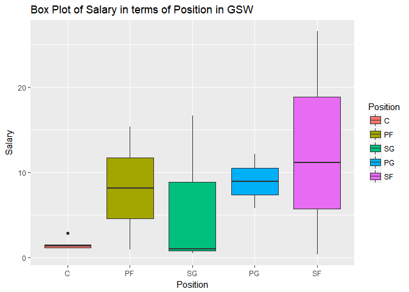

To add more detail, we can use `geom_jitter()` or `geom_dotplot()` to display where each player actually is in the box plot, and `geom_text()` to label who they are.

``` r
#using geom_jitter()
ggplot(filter(player_dat, Team == "GSW"), aes(x = Position, y = Salary, fill = Position)) +
  geom_boxplot() +
  #draw points of each player
  geom_jitter(width = 0.2) +
  #label each point
  geom_text(aes(label = Player), size = 3, vjust = 1) +
  ggtitle("Box Plot of Salary in terms of Position in GSW")
```

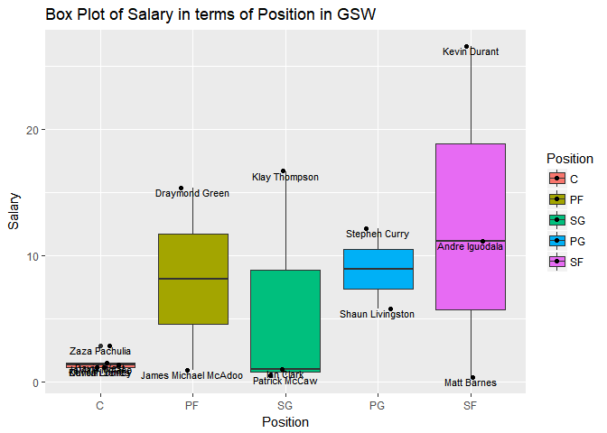

``` r
#using geom_dotplot(), remember to speicify the 'binaxis ='
ggplot(filter(player_dat, Team == "GSW"), aes(x = Position, y = Salary, fill = Position)) +
  geom_boxplot() +
  #draw points of each player
  geom_dotplot(binaxis='y', dotsize=0.5, fill = 'black') +
  geom_text(aes(label = Player), size = 3, vjust = 1) +
  ggtitle("Box Plot of Salary in terms of Position in GSW")
```

    ## `stat_bindot()` using `bins = 30`. Pick better value with `binwidth`.

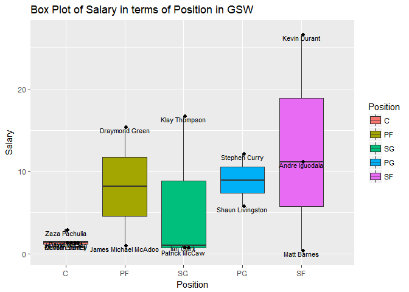

Also, we notice that the number of players varies from positions, so we use **different size of box plots** to represent the difference. Set `varwidth = TURE` in `geom_boxplot()` will do that perfectly.

``` r
ggplot(filter(player_dat, Team == "GSW"), aes(x = Position, y = Salary, fill = Position)) +
  #make box width varies from size 
  geom_boxplot(varwidth = TRUE) +
  ggtitle("Box Plot of Salary in terms of Position in GSW")
```

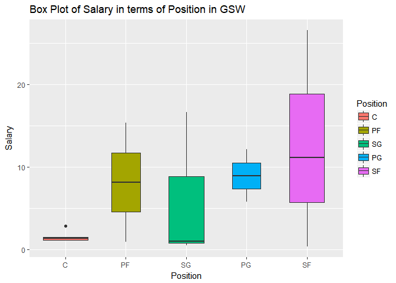

What if we want to **compare multiple groups**? Let's say we want to compare `GSW`, `LAC` and `CLE`.  Since we're comparing these teams, we want to **show the mean** of each team. The function `stat_summary()` would add the statistics you want to your graph.
The argument `position = position_dodge(0.9)` is important, it sets the position of these box plots and helps to make the statistics appear in a right position as well.

``` r
#select all three teams
compare_team <- filter(player_dat, Team == 'GSW' | Team == 'LAC' | Team == 'CLE')

ggplot(compare_team, aes(x = Position, y = Salary, fill = Team)) +
  geom_boxplot(position = position_dodge(0.9)) +
  #add mean to box plot
  stat_summary(fun.y=mean, geom="point", shape=23, size=3, position = position_dodge(0.9)) +
  ggtitle("Box Plot of Salary in terms of Position in CLE, GSW and LAC") 
```

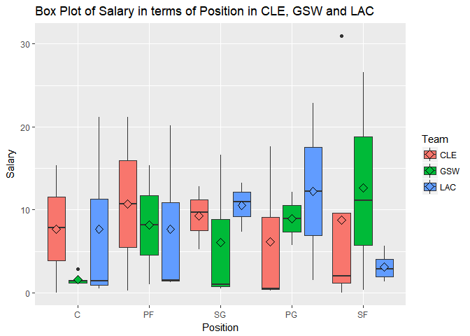

#### b) Global Temperature Example

This example is to illustrate **how to use box plot in time series data set**.
The [Global Temperature](https://datahub.io/core/global-temp#readme) data set contains 3 columns:

-   Source: *GISS Surface Temperature (GISTEMP)* and *global component of Climate at a Glance (GCAG)*
-   Date: date in monthly
-   Mean: Average global mean temperature anomalies in degrees Celsius relative to a base period. GISTEMP base period: 1951-1980. GCAG base period: 20th century average.

``` r
#prepare the data
climate <- read_csv("../data/monthly.csv", col_names = TRUE)
```

    ## Parsed with column specification:
    ## cols(
    ##   Source = col_character(),
    ##   Date = col_date(format = ""),
    ##   Mean = col_double()
    ## )

``` r
head(climate)
```

    ## # A tibble: 6 x 3
    ##    Source       Date   Mean
    ##     <chr>     <date>  <dbl>
    ## 1    GCAG 2016-12-26 0.7895
    ## 2 GISTEMP 2016-12-26 0.8100
    ## 3    GCAG 2016-11-26 0.7504
    ## 4 GISTEMP 2016-11-26 0.9300
    ## 5    GCAG 2016-10-26 0.7292
    ## 6 GISTEMP 2016-10-26 0.8900

We want to know how the global temperature change annually; moreover, we also want to know how temperature varies within years. In this case, box plot would provides us the best visualization. First, let's draw the box plot trend for each index.

``` r
#some data manipulation, in order to create a "year" column
climate$year <- as.POSIXlt(climate$Date, "%Y-%m-%d")$year + 1900

#we can draw box plot based on each year, and facet them into two seperate source 
ggplot(climate, aes(x = year, y = Mean, group = year, fill = Source)) +
  geom_boxplot(outlier.size = 1) +
  #facet boxplot based on two indexs
  facet_grid( Source ~ .) +
  #add more ticks on x axis
  scale_x_continuous(breaks = seq(1880, 2015, by = 10)) +
  ggtitle("Annual Global Tempertaure Change in GCAG index and GISTEMP index")
```

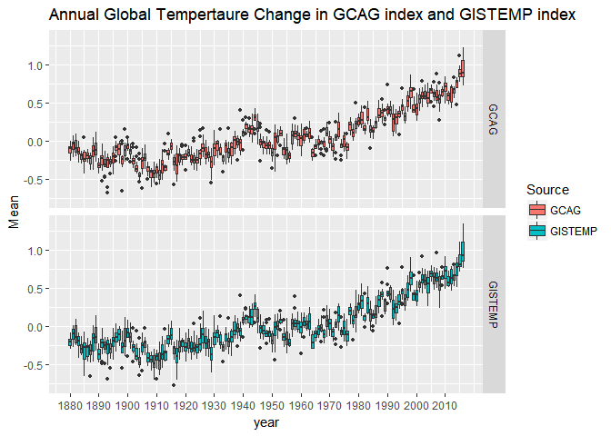

Then we try to compare those two indexs more directly. In order to draw two indexs in one single graph, we need a function `interaction()` to group our data based on both `year` and `Source`.

``` r
ggplot(climate, aes(x = year, y = Mean, fill = Source)) +
  #draw only one boxplot with boxes in groups of two indexs
  geom_boxplot(aes(group = interaction(year, Source)),
              outlier.size = 1) +
  scale_x_continuous(breaks = seq(1880, 2015, by = 10)) +
  ggtitle("Annual Global Tempertaure Change in GCAG index and GISTEMP index")
```

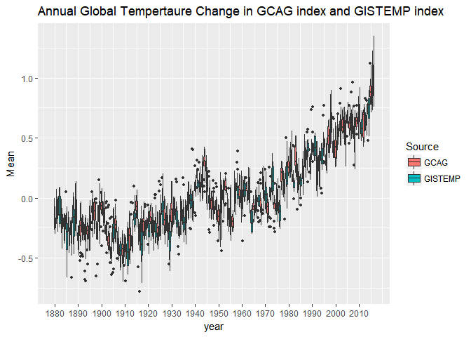

### V. Conclusion

There are few points I want you to take away after reading this post:
1. Knowing what are the basic components of a box plot.
2. Knowing how to interpret a box plot.
3. Be able to use `ggplot` to create clear and informative box plot.

### VI. Reference

1.  <http://www.physics.csbsju.edu/stats/box2.html>
2.  <https://en.wikipedia.org/wiki/Box_plot#Types_of_box_plots>
3.  <http://support.minitab.com/en-us/minitab-express/1/help-and-how-to/graphs/boxplot/interpret-the-results/key-results/>
4.  <http://blog.minitab.com/blog/statistics-and-quality-data-analysis/how-to-think-outside-the-boxplot>
5.  <https://en.wikipedia.org/wiki/Quantile>
6.  <http://www.cvgs.k12.va.us/digstats/main/inferant/a_gpas.html>
7.  <http://r-statistics.co/Top50-Ggplot2-Visualizations-MasterList-R-Code.html#Box%20Plot>
8.  <https://plot.ly/ggplot2/box-plots/>
9.  <https://sites.google.com/site/davidsstatistics/home/notched-box-plots> 10.<http://www.sthda.com/english/wiki/ggplot2-box-plot-quick-start-guide-r-software-and-data-visualization>
10. <http://had.co.nz/stat645/project-03/boxplots.pdf>
