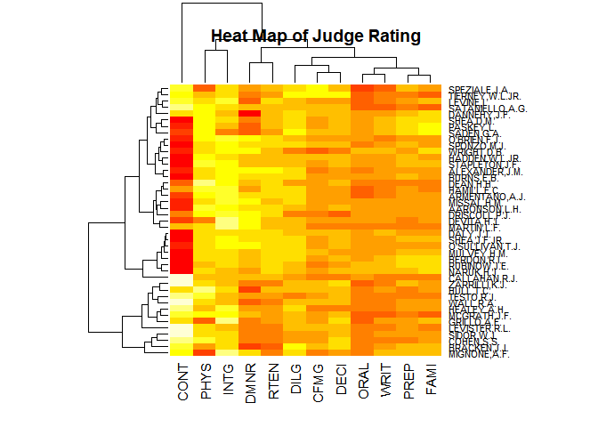
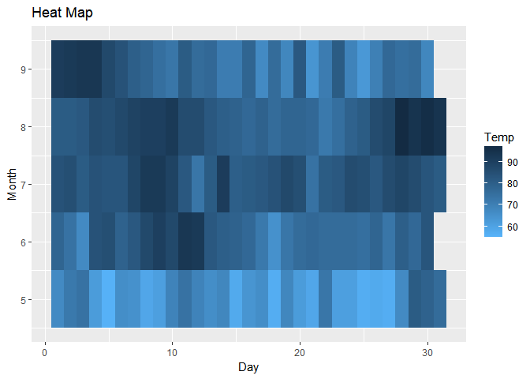
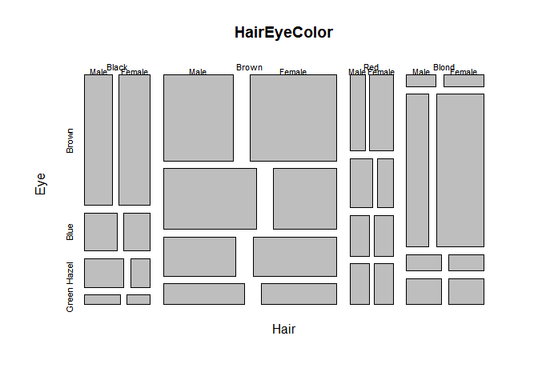
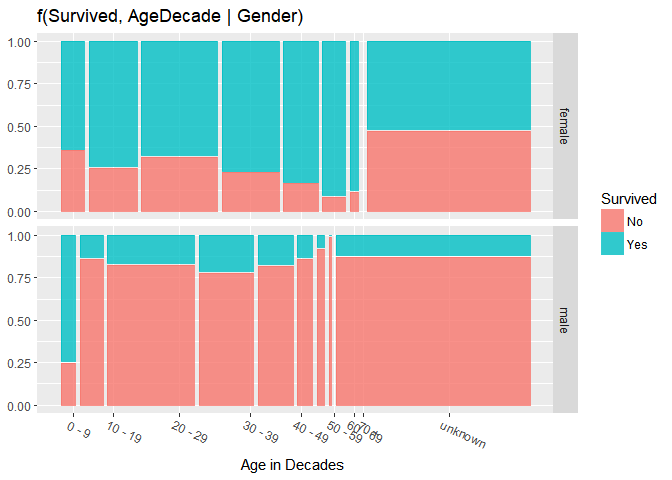

Post02: Advanced Visualization
================
Xiaoya Li
November 26, 2017

Introduction
------------

<br>

Data visulization is one of the most powerful usage of R. So far, we've seen many type of data visualization, for example, Histogram, Barchart, Boxplot, Scatter plot, etc. These are common and efficient, but other than that, there are still many choices of interesting data visualization. In today's post, I'm going to introduce three of them: Heat Map, Mosaic Plot and 3D Graph.

<br> <br>

Advanced Visualization
----------------------

Before we jump into the topic, let's load all packages we are going to use in this post.

``` r
#datasets contains most of the database we are going to use
library(datasets)
library(boot)

#graphic
library(ggplot2)
library(ggmosaic)
library(plotly)
```

<br> <br>

### I. Heat Map

Heat map represents relationship between two or more variable in a two demensional graph, using intensity of color in a tabular format.

<br>

**Example 1**

<br>

For the first example, let's see how to use the `heatmap()` function in R to generate a heat map.
The `USJudgeRatings` dataset contains numeric rating of selected judges from different persepective. Let's take a look.

``` r
head(USJudgeRatings)
```

    ##                CONT INTG DMNR DILG CFMG DECI PREP FAMI ORAL WRIT PHYS RTEN
    ## AARONSON,L.H.   5.7  7.9  7.7  7.3  7.1  7.4  7.1  7.1  7.1  7.0  8.3  7.8
    ## ALEXANDER,J.M.  6.8  8.9  8.8  8.5  7.8  8.1  8.0  8.0  7.8  7.9  8.5  8.7
    ## ARMENTANO,A.J.  7.2  8.1  7.8  7.8  7.5  7.6  7.5  7.5  7.3  7.4  7.9  7.8
    ## BERDON,R.I.     6.8  8.8  8.5  8.8  8.3  8.5  8.7  8.7  8.4  8.5  8.8  8.7
    ## BRACKEN,J.J.    7.3  6.4  4.3  6.5  6.0  6.2  5.7  5.7  5.1  5.3  5.5  4.8
    ## BURNS,E.B.      6.2  8.8  8.7  8.5  7.9  8.0  8.1  8.0  8.0  8.0  8.6  8.6

`heatmap()` function requires our input to be a matrix.

``` r
#convert it to a matrix
heatmap(as.matrix(USJudgeRatings))
#add a title
title(main = "Heat Map of Judge Rating")
```



*Description: This graph represents the rating of each judge. For each column, the dark portion indicates the best judge in this attribute; for each row, the dark portion indicates the best rating of each judge got.*

================================================================================

<br> <br>

**Example 2**

<br>

Alternatively, we can also use `ggplot` to plot the heat map. `airquality` dataset contains air quality measurement in New York City.

``` r
head(airquality)
```

    ##   Ozone Solar.R Wind Temp Month Day
    ## 1    41     190  7.4   67     5   1
    ## 2    36     118  8.0   72     5   2
    ## 3    12     149 12.6   74     5   3
    ## 4    18     313 11.5   62     5   4
    ## 5    NA      NA 14.3   56     5   5
    ## 6    28      NA 14.9   66     5   6

This time, other than plotting all the attribute as the previous graph, we want to compare the temperature on each day in each month. Here's the simple R code using `ggplot()` and `geom_tile()`.

``` r
ggplot(airquality, aes(Day, Month)) +
  #build the heat map
  geom_tile(aes(fill = Temp)) +
  
  #reverse legend color such that dark color related to higher temperature 
  scale_fill_gradient(high = "#132B43", low = "#56B1F7") +
  
  #add a title
  ggtitle(label = "Heat Map") 
```



*Description: This graph represents the temperature of each day in each month. Horizontally, the dark portion indicates the hottest day in this month; vertically, the dark portion indicates the hottest month.*

================================================================================

<br> <br>

### Mosaic Plot

Mosaic plot is useful to represents categorical data.

<br>

**Example 3**

<br>

`mosaicplot()` function in R provides a simple way to generate a mosaic plot.
`HairEyeColor` dataset contains the Hair and Eye Color of Statistics Students.  Let's take a look at the dataset.

``` r
HairEyeColor
```

    ## , , Sex = Male
    ## 
    ##        Eye
    ## Hair    Brown Blue Hazel Green
    ##   Black    32   11    10     3
    ##   Brown    53   50    25    15
    ##   Red      10   10     7     7
    ##   Blond     3   30     5     8
    ## 
    ## , , Sex = Female
    ## 
    ##        Eye
    ## Hair    Brown Blue Hazel Green
    ##   Black    36    9     5     2
    ##   Brown    66   34    29    14
    ##   Red      16    7     7     7
    ##   Blond     4   64     5     8

`HairEyeColor` is in the class of `table`, which is different from what we used to have in data.frame.

Here's the one line simple R code.

``` r
mosaicplot(HairEyeColor)
```



*Description: This graph represents the proportion of students of different hair and eye colors in the size of the area.*

================================================================================

<br> <br>

**Example 4**

<br>

Still, we can use `ggplot()` to graph a detailed mosaic plot. Inorder to graph in ggplot, we need to add another package `ggmosaic`.

`Titanic` is a bit more complicated dataset, it contains information of Survival of passengers on the Titanic. Also, the `Titanic` in `dastasets` is in the class of table, but since `ggplot()` works with dataframe instead of table, we need the `Titanic` data in its original form.

``` r
#download .csv file online
download.file(url = "https://raw.githubusercontent.com/vincentarelbundock/Rdatasets/master/csv/datasets/Titanic.csv", destfile = "../Data/titanic_raw.csv")

#read in data
titanic_raw <- read.csv(file = "../Data/titanic_raw.csv")
head(titanic_raw)
```

    ##   X                                          Name PClass   Age    Sex
    ## 1 1                  Allen, Miss Elisabeth Walton    1st 29.00 female
    ## 2 2                   Allison, Miss Helen Loraine    1st  2.00 female
    ## 3 3           Allison, Mr Hudson Joshua Creighton    1st 30.00   male
    ## 4 4 Allison, Mrs Hudson JC (Bessie Waldo Daniels)    1st 25.00 female
    ## 5 5                 Allison, Master Hudson Trevor    1st  0.92   male
    ## 6 6                            Anderson, Mr Harry    1st 47.00   male
    ##   Survived SexCode
    ## 1        1       1
    ## 2        0       1
    ## 3        0       0
    ## 4        0       1
    ## 5        1       0
    ## 6        1       0

We need some data preparation before we draw the graph.
We add a column `AgeDecade` that categorize each passengers' age into decade.

``` r
#Initialize a empty character vector
AgeDecade <- rep(" ", nrow(titanic_raw))

#Use a for loop to categorize each passengers' age
for(i in 1:nrow(titanic_raw)){
  x = titanic_raw$Age[i]
  if(is.na(x)){AgeDecade[i] = "unknown"}
  else if(x >= 0 & x < 10){AgeDecade[i] = "0 - 9"}
  else if(x >= 10 & x < 20){AgeDecade[i] = "10 - 19"}
  else if(x >= 20 & x < 30){AgeDecade[i] = "20 - 29"}
  else if(x >= 30 & x < 40){AgeDecade[i] = "30 - 39"}
  else if(x >= 40 & x < 50){AgeDecade[i] = "40 - 49"}
  else if(x >= 50 & x < 60){AgeDecade[i] = "50 - 59"}
  else if(x >= 60 & x < 70){AgeDecade[i] = "60 - 69"}
  else{AgeDecade[i] = "70 +"}
}

#Add that vector into a column of the dataframe
titanic_raw$AgeDecade <- as.factor(AgeDecade)
head(titanic_raw)
```

    ##   X                                          Name PClass   Age    Sex
    ## 1 1                  Allen, Miss Elisabeth Walton    1st 29.00 female
    ## 2 2                   Allison, Miss Helen Loraine    1st  2.00 female
    ## 3 3           Allison, Mr Hudson Joshua Creighton    1st 30.00   male
    ## 4 4 Allison, Mrs Hudson JC (Bessie Waldo Daniels)    1st 25.00 female
    ## 5 5                 Allison, Master Hudson Trevor    1st  0.92   male
    ## 6 6                            Anderson, Mr Harry    1st 47.00   male
    ##   Survived SexCode AgeDecade
    ## 1        1       1   20 - 29
    ## 2        0       1     0 - 9
    ## 3        0       0   30 - 39
    ## 4        0       1   20 - 29
    ## 5        1       0     0 - 9
    ## 6        1       0   40 - 49

Now, we are ready to graph. I want to visualize the proportion of survivals within sex and age interval.

``` r
ggplot(titanic_raw) +
  #pick the attribute we are interested in
  geom_mosaic(aes(x = product(Survived,AgeDecade), fill = factor(Survived))) +
  
  #adjust the x-axis to make it more readable
  theme(axis.text.x = element_text(angle = -25, hjust = .1)) +
  
  #facet the data into female and male
  facet_grid(Sex ~ .) +
  
  #add title of the graph
  labs(x="Age in Decades ", title='f(Survived, AgeDecade | Gender)') +
  
  #add label to legend
  scale_fill_discrete(name="Survived", labels = c("No", "Yes")) 
```



*Description: This graph visually shows the proportion of survivals within different age intervals and sex. Generally, more female survived than male. And people in age 20-29 survived most in both female and male.*

================================================================================

<br> <br>

### III. 3D Graph

Obviously, the 3D graph is one of the impressive graphs of all, it can represent relation between up tp three variables visually straightforward.

To draw a 3D graph, package `plotly` is a nice tool combined with `ggplot`.
<br>

**Example 5**

<br>

For this example, I'm showing you how to graph the most basic 3d scatterplot.

The dataset we used is `cane`, which contains the Sugar-cane Disease Data. Since the column name are not meaningful enough, here's the documentation from R about this dataset.

> n: The total number of shoots in each plot.
> r: The number of diseased shoots.
> x: The number of pieces of the stems, out of 50, planted in each plot.
> var: A factor indicating the variety of sugar-cane in each plot.
> block: A factor for the blocks.

Let's take a look of the data.

``` r
head(cane)
```

    ##     n  r  x var block
    ## 1  87 76 19   1     A
    ## 2 119  8 14   2     A
    ## 3  94 74  9   3     A
    ## 4  95 11 12   4     A
    ## 5 134  0 12   5     A
    ## 6  92  0  3   6     A

We're going to visualize the relation of total number of shoots, number of diseased shoots and number of pieces of the stems. Here's the R code:

``` r
plot_ly(cane, x = ~n, y = ~r, z = ~x, color = ~block,
        colors = c('#4AC6B7', '#1972A4', '#965F8A', '#FF7070')) %>% 
  
  #add label to axis
  add_markers() %>% 
  
  #change the label of the axis
  layout(scene = list(
    xaxis = list(title = '# shoots in each plot'),
    yaxis = list(title = '# diseased shoots'),
    zaxis = list(title = '# pieces of the stems')),
    
    #change the label of the legend
         annotations = list(
           x = 1.13, y = 1.05,
           text = 'Block',
           xref = 'paper',
           yref = 'paper',
           showarrow = FALSE))
```

<!--html_preserve-->

<script type="application/json" data-for="31a8ec0557d">{"x":{"visdat":{"31a810a25b5":["function () ","plotlyVisDat"]},"cur_data":"31a810a25b5","attrs":{"31a810a25b5":{"x":{},"y":{},"z":{},"color":{},"colors":["#4AC6B7","#1972A4","#965F8A","#FF7070"],"alpha":1,"sizes":[10,100],"type":"scatter3d","mode":"markers"}},"layout":{"margin":{"b":40,"l":60,"t":25,"r":10},"scene":{"xaxis":{"title":"# shoots in each plot"},"yaxis":{"title":"# diseased shoots"},"zaxis":{"title":"# pieces of the stems"}},"annotations":[{"x":1.13,"y":1.05,"text":"Block","xref":"paper","yref":"paper","showarrow":false}],"xaxis":{"domain":[0,1]},"yaxis":{"domain":[0,1]},"hovermode":"closest","showlegend":true},"source":"A","config":{"modeBarButtonsToAdd":[{"name":"Collaborate","icon":{"width":1000,"ascent":500,"descent":-50,"path":"M487 375c7-10 9-23 5-36l-79-259c-3-12-11-23-22-31-11-8-22-12-35-12l-263 0c-15 0-29 5-43 15-13 10-23 23-28 37-5 13-5 25-1 37 0 0 0 3 1 7 1 5 1 8 1 11 0 2 0 4-1 6 0 3-1 5-1 6 1 2 2 4 3 6 1 2 2 4 4 6 2 3 4 5 5 7 5 7 9 16 13 26 4 10 7 19 9 26 0 2 0 5 0 9-1 4-1 6 0 8 0 2 2 5 4 8 3 3 5 5 5 7 4 6 8 15 12 26 4 11 7 19 7 26 1 1 0 4 0 9-1 4-1 7 0 8 1 2 3 5 6 8 4 4 6 6 6 7 4 5 8 13 13 24 4 11 7 20 7 28 1 1 0 4 0 7-1 3-1 6-1 7 0 2 1 4 3 6 1 1 3 4 5 6 2 3 3 5 5 6 1 2 3 5 4 9 2 3 3 7 5 10 1 3 2 6 4 10 2 4 4 7 6 9 2 3 4 5 7 7 3 2 7 3 11 3 3 0 8 0 13-1l0-1c7 2 12 2 14 2l218 0c14 0 25-5 32-16 8-10 10-23 6-37l-79-259c-7-22-13-37-20-43-7-7-19-10-37-10l-248 0c-5 0-9-2-11-5-2-3-2-7 0-12 4-13 18-20 41-20l264 0c5 0 10 2 16 5 5 3 8 6 10 11l85 282c2 5 2 10 2 17 7-3 13-7 17-13z m-304 0c-1-3-1-5 0-7 1-1 3-2 6-2l174 0c2 0 4 1 7 2 2 2 4 4 5 7l6 18c0 3 0 5-1 7-1 1-3 2-6 2l-173 0c-3 0-5-1-8-2-2-2-4-4-4-7z m-24-73c-1-3-1-5 0-7 2-2 3-2 6-2l174 0c2 0 5 0 7 2 3 2 4 4 5 7l6 18c1 2 0 5-1 6-1 2-3 3-5 3l-174 0c-3 0-5-1-7-3-3-1-4-4-5-6z"},"click":"function(gd) { \n        // is this being viewed in RStudio?\n        if (location.search == '?viewer_pane=1') {\n          alert('To learn about plotly for collaboration, visit:\\n https://cpsievert.github.io/plotly_book/plot-ly-for-collaboration.html');\n        } else {\n          window.open('https://cpsievert.github.io/plotly_book/plot-ly-for-collaboration.html', '_blank');\n        }\n      }"}],"cloud":false},"data":[{"x":[87,119,94,95,134,92,118,70,128,85,77,29,109,209,89,171,243,109,66,177,124,159,68,136,86,75,100,147,49,111,134,179,120,169,45,105,65,192,92,212,79,119,97,129,72],"y":[76,8,74,11,0,0,11,32,33,14,3,3,28,63,3,16,11,2,8,62,14,34,0,13,7,12,0,22,5,17,0,15,20,27,0,0,6,25,2,112,9,10,0,1,27],"z":[19,14,9,12,12,3,17,3,3,21,8,3,7,10,7,14,17,14,18,12,18,10,6,12,10,16,13,18,6,13,8,32,5,6,2,10,7,15,18,12,10,15,10,9,8],"type":"scatter3d","mode":"markers","name":"A","marker":{"fillcolor":"rgba(74,198,183,0.5)","color":"rgba(74,198,183,1)","line":{"color":"transparent"}},"frame":null},{"x":[70,125,105,104,115,195,111,131,108,121,74,111,120,231,113,131,222,109,161,112,121,191,85,143,82,105,140,167,38,81,162,243,66,120,133,119,92,162,131,108,46,147,130,148,100],"y":[70,21,95,21,6,63,7,22,77,12,0,26,50,105,18,32,9,0,36,9,17,110,0,14,7,22,8,7,0,13,1,11,18,25,0,10,43,6,17,48,0,16,11,0,64],"z":[12,13,9,12,25,17,15,6,3,21,4,5,10,12,12,15,9,12,19,14,16,10,8,17,12,13,15,11,3,11,6,18,5,6,6,15,6,26,26,9,5,20,14,17,17],"type":"scatter3d","mode":"markers","name":"B","marker":{"fillcolor":"rgba(25,114,164,0.5)","color":"rgba(25,114,164,1)","line":{"color":"transparent"}},"frame":null},{"x":[73,130,71,104,195,99,63,85,59,113,63,50,102,223,91,169,130,103,98,173,152,137,33,123,88,99,153,154,78,80,161,184,69,141,113,132,63,161,111,78,71,118,84,175,143],"y":[54,10,44,15,3,21,8,28,11,13,0,3,36,59,5,4,57,0,22,92,21,57,0,24,0,8,1,6,4,6,0,7,18,10,8,2,24,22,10,8,0,16,6,0,42],"z":[25,12,6,13,19,11,12,5,4,28,3,1,10,10,15,7,7,8,17,17,22,7,5,10,11,9,9,16,12,17,13,25,2,8,4,10,3,19,20,7,6,20,8,12,24],"type":"scatter3d","mode":"markers","name":"C","marker":{"fillcolor":"rgba(150,95,138,0.5)","color":"rgba(150,95,138,1)","line":{"color":"transparent"}},"frame":null},{"x":[59,177,48,165,150,135,97,75,51,135,102,57,58,157,94,172,105,147,94,106,137,243,137,104,116,102,151,113,67,111,132,220,67,146,110,93,79,167,144,182,61,154,98,129,130],"y":[39,26,38,41,5,47,15,18,11,28,0,39,13,23,1,69,24,1,30,23,15,131,4,2,3,13,3,7,3,13,0,6,2,10,0,2,11,36,16,63,2,12,0,9,24],"z":[14,15,3,11,15,19,11,3,3,19,6,4,9,9,13,10,2,10,36,10,13,17,10,17,13,10,15,15,8,12,12,14,4,9,4,11,3,26,14,17,8,35,8,14,20],"type":"scatter3d","mode":"markers","name":"D","marker":{"fillcolor":"rgba(255,112,112,0.5)","color":"rgba(255,112,112,1)","line":{"color":"transparent"}},"frame":null}],"highlight":{"on":"plotly_click","persistent":false,"dynamic":false,"selectize":false,"opacityDim":0.2,"selected":{"opacity":1}},"base_url":"https://plot.ly"},"evals":["config.modeBarButtonsToAdd.0.click"],"jsHooks":{"render":[{"code":"function(el, x) { var ctConfig = crosstalk.var('plotlyCrosstalkOpts').set({\"on\":\"plotly_click\",\"persistent\":false,\"dynamic\":false,\"selectize\":false,\"opacityDim\":0.2,\"selected\":{\"opacity\":1}}); }","data":null}]}}</script>
<!--/html_preserve-->
*Note: You can interact with the graph by clicking the legend.*
*Description: This 3d scatter plot shows relation of total number of shoots, number of diseased shoots and number of pieces of the stems, with different color representing different blocks.*

================================================================================

<br> <br>

**Example 6**

<br>

In this example, I'm showing to how to use 3D surface graph to visualize the probability density estimation.

`cars` in packages `dataset` contains infomation of Speed and Stopping Distances of Cars.

``` r
head(cars)
```

    ##   speed dist
    ## 1     4    2
    ## 2     4   10
    ## 3     7    4
    ## 4     7   22
    ## 5     8   16
    ## 6     9   10

What if we want to estimate the stopping distance given the speed of the car? **Kernel density estimation** is a way to estimate the probability density function of a random variable. To learn more about **Kernel density estimation**, [click here](https://en.wikipedia.org/wiki/Kernel_density_estimation).

There's a function in package `MASS` called `kde2d()`, "Two-Dimensional Kernel Density Estimation", that allows us to carry out the estimation.

You would end up with a list with x being your independent variable and y being the dependent variable that you're trying to estimate based on x.

``` r
#prepare the data using kernel density estimation

#MASS:: allows us to call functions without actually loading MASS package

#n is the number of grid points in each direction, 
#the larger of n, the smoother your graph would looks like
kd <- with(cars, MASS::kde2d(x = speed, y = dist, n = 50))

str(kd)
```

    ## List of 3
    ##  $ x: num [1:50] 4 4.43 4.86 5.29 5.71 ...
    ##  $ y: num [1:50] 2 4.41 6.82 9.22 11.63 ...
    ##  $ z: num [1:50, 1:50] 0.000303 0.000325 0.000345 0.000362 0.000376 ...

``` r
plot_ly(x = kd$x, y = kd$y, z = kd$z) %>% 
  
  #plot the 3d surface 
  add_surface() %>% 
  
   #change the label of the axis
  layout(scene = list(
    xaxis = list(title = 'Speed (mph)'),
    yaxis = list(title = 'Stopping Distance (ft)')))
```

<!--html_preserve-->

<script type="application/json" data-for="31a8618e5c64">{"x":{"visdat":{"31a89925eec":["function () ","plotlyVisDat"]},"cur_data":"31a89925eec","attrs":{"31a89925eec":{"x":[4,4.42857142857143,4.85714285714286,5.28571428571429,5.71428571428571,6.14285714285714,6.57142857142857,7,7.42857142857143,7.85714285714286,8.28571428571428,8.71428571428572,9.14285714285714,9.57142857142857,10,10.4285714285714,10.8571428571429,11.2857142857143,11.7142857142857,12.1428571428571,12.5714285714286,13,13.4285714285714,13.8571428571429,14.2857142857143,14.7142857142857,15.1428571428571,15.5714285714286,16,16.4285714285714,16.8571428571429,17.2857142857143,17.7142857142857,18.1428571428571,18.5714285714286,19,19.4285714285714,19.8571428571429,20.2857142857143,20.7142857142857,21.1428571428571,21.5714285714286,22,22.4285714285714,22.8571428571429,23.2857142857143,23.7142857142857,24.1428571428571,24.5714285714286,25],"y":[2,4.40816326530612,6.81632653061224,9.22448979591837,11.6326530612245,14.0408163265306,16.4489795918367,18.8571428571429,21.265306122449,23.6734693877551,26.0816326530612,28.4897959183673,30.8979591836735,33.3061224489796,35.7142857142857,38.1224489795918,40.530612244898,42.9387755102041,45.3469387755102,47.7551020408163,50.1632653061224,52.5714285714286,54.9795918367347,57.3877551020408,59.7959183673469,62.2040816326531,64.6122448979592,67.0204081632653,69.4285714285714,71.8367346938775,74.2448979591837,76.6530612244898,79.0612244897959,81.469387755102,83.8775510204082,86.2857142857143,88.6938775510204,91.1020408163265,93.5102040816327,95.9183673469388,98.3265306122449,100.734693877551,103.142857142857,105.551020408163,107.959183673469,110.367346938776,112.775510204082,115.183673469388,117.591836734694,120],"z":[[0.000303078793461621,0.000327449579103259,0.000341381698827491,0.000344026837654114,0.00033572640141836,0.000317840871264708,0.00029242860122008,0.000261871809654177,0.000228539925636992,0.000194546483807817,0.000161613951699873,0.000131028672585163,0.000103654297906506,7.99749977703735e-005,6.01510216300676e-005,4.40798789781839e-005,3.14615630505885e-005,2.18659450165528e-005,1.47978824106113e-005,9.7539896997554e-006,6.26587757371539e-006,3.92745909516345e-006,2.40714728292627e-006,1.44811868238215e-006,8.60765161434568e-007,5.1120424870231e-007,3.08805786521541e-007,1.94626796774863e-007,1.31731113633854e-007,9.77105911430648e-008,7.93079097143786e-008,6.88131853658637e-008,6.18137990727369e-008,5.58770672333469e-008,4.98060667205292e-008,4.32022650878479e-008,3.61692835293705e-008,2.90788906188281e-008,2.23794444930192e-008,1.64548037043122e-008,1.15441187962216e-008,7.72151921022713e-009,4.92143895555344e-009,2.98800788016652e-009,1.72772951063958e-009,9.51286686538366e-010,4.9870951810394e-010,2.48918714675901e-010,1.18283315821833e-010,5.35098842988079e-011],[0.000325422625539587,0.000353835160065542,0.000371657909986583,0.000377814104693634,0.00037241297494647,0.000356598384434324,0.000332251704510608,0.000301643951347907,0.000267121541582211,0.000230874806038956,0.000194798336049232,0.000160424390544189,0.000128901954720115,0.000101000718487294,7.71314021497475e-005,5.73824819376164e-005,4.15746975317563e-005,2.93305333534907e-005,2.01506268341271e-005,1.34865259776102e-005,8.8005703123192e-006,5.60770974930795e-006,3.49866660420995e-006,2.14729211133212e-006,1.30662733786403e-006,7.98295269602903e-007,4.99057651527447e-007,3.27257873648366e-007,2.30807109557944e-007,1.77510885757749e-007,1.47908033680231e-007,1.30384278620536e-007,1.18097323061476e-007,1.07176310767926e-007,9.57000787527567e-008,8.30743298597764e-008,6.9572996797272e-008,5.59421234704803e-008,4.30564169923862e-008,3.16589075979807e-008,2.22113088266735e-008,1.48567981514724e-008,9.46943473799652e-009,5.74942158945527e-009,3.32452709980777e-009,1.83053755084131e-009,9.59686685325745e-010,4.79022088399072e-010,2.27635164208869e-010,1.02983951899591e-010],[0.000345004393240456,0.000377933584453076,0.000400403259639546,0.000411063401570202,0.000409710942784128,0.000397169795218429,0.00037503430656981,0.00034536450622448,0.000310407978405053,0.000272388013001393,0.000233361137948862,0.000195125240273597,0.000159156956501903,0.000126567623795068,9.80797318163779e-005,7.40317771363283e-005,5.44164150328189e-005,3.8948387207825e-005,2.71506096376896e-005,1.84431677236819e-005,1.22216189201472e-005,7.91610972552961e-006,5.02866820229614e-006,3.15060905624404e-006,1.96452014990383e-006,1.23601675752037e-006,7.99999546281186e-007,5.45149570483922e-007,3.99246743639007e-007,3.16824710549112e-007,2.69777851906411e-007,2.40862746644821e-007,2.19604156988955e-007,1.99917106658746e-007,1.78758730101737e-007,1.55268383926562e-007,1.30067444595945e-007,1.045961517327e-007,8.05078386252321e-008,5.91984401054264e-008,4.1533611427461e-008,2.77818941085666e-008,1.77081326283618e-008,1.07519298242025e-008,6.21737977649745e-009,3.42352300317297e-009,1.79491182810763e-009,8.9596347368947e-010,4.25791942807478e-010,1.92643042185489e-010],[0.000361822575893806,0.000399772240994852,0.000427684201858144,0.000443889844087151,0.000447792987846187,0.000439793645613062,0.000421088325698269,0.00039342467774551,0.000358872394335987,0.000319638571230846,0.000277924398466985,0.00023580539573299,0.000195121538262368,0.000157378056687252,0.000123670423095534,9.46499800931614e-005,7.05391881708847e-005,5.11928292263661e-005,3.61905141125342e-005,2.49408769772461e-005,1.67794003061522e-005,1.10475635526177e-005,7.14784197801738e-006,4.57474406330412e-006,2.92566418737673e-006,1.89695601110884e-006,1.27083961564404e-006,8.98090761033283e-007,6.80337282198631e-007,5.54496452668346e-007,4.80640713741076e-007,4.33534141142597e-007,3.97340730597208e-007,3.62611390071305e-007,3.24590820268187e-007,2.82071221643232e-007,2.36337918275304e-007,1.90073075850629e-007,1.46306630428676e-007,1.07584694783182e-007,7.5483665806229e-008,5.04927481035633e-008,3.21851456539737e-008,1.95427986783729e-008,1.13012796932811e-008,6.22322892508135e-009,3.26295056502643e-009,1.6288655159362e-009,7.74145853033453e-010,3.50277462774006e-010],[0.000376012934137005,0.000419496723780018,0.00045365697343797,0.000476463953017267,0.00048685140841245,0.000484695692189186,0.00047068796917742,0.000446163094248145,0.000412931262015878,0.000373127780913809,0.000329071684854867,0.000283117342719561,0.000237494133083641,0.000194147168938853,0.000154604525488121,0.000119896338031419,9.0539492925104e-005,6.65851436932888e-005,4.7712501577578e-005,3.33457410783961e-005,2.2771692268665e-005,1.52416889013437e-005,1.00482777905138e-005,6.57412560228403e-006,4.31531830129637e-006,2.884187957776e-006,1.99808085545344e-006,1.46045985145274e-006,1.13978368574467e-006,9.50103054499167e-007,8.35624138850686e-007,7.59933662062917e-007,6.99391359532041e-007,6.39507558118975e-007,5.72951764114755e-007,4.98085778603528e-007,4.17397614394279e-007,3.35714997724182e-007,2.58424575092633e-007,1.90036054308874e-007,1.33338128345127e-007,8.91965482934318e-008,5.68584057806089e-008,3.45262107359582e-008,1.99671337448769e-008,1.09959554499717e-008,5.76580696557241e-009,2.87853000952346e-009,1.36819501750193e-009,6.1912896417955e-010],[0.000387774587006229,0.000437288755741082,0.000478479984750949,0.000508921718043822,0.000527009171083316,0.000532003836712979,0.000523990552116699,0.000503793423527561,0.000472878656270025,0.000433245926394185,0.00038729309410278,0.000337640992622875,0.00028692241371774,0.000237560314497837,0.00019157231815225,0.000150435875629865,0.000115033440341237,8.56773718126363e-005,6.21979044513306e-005,4.40688077013664e-005,3.05445548649862e-005,2.07874967728561e-005,1.39707195315108e-005,9.34969163931261e-006,6.30219185352687e-006,4.34075089893688e-006,3.1047027369224e-006,2.33994637181209e-006,1.87393628621451e-006,1.59172199828677e-006,1.41661337762555e-006,1.29680094556881e-006,1.19744185273691e-006,1.09660653424044e-006,9.83153029103379e-007,8.54941093497404e-007,7.16537993796057e-007,5.76353658454227e-007,4.43682000722515e-007,3.26281292608689e-007,2.28944574143028e-007,1.5316051254949e-007,9.76381759419271e-008,5.92930549297492e-008,3.42929204381583e-008,1.88868550396791e-008,9.90441936996387e-009,4.94523016003033e-009,2.35079885040548e-009,1.06391168987909e-009],[0.000397300505476604,0.000453290276923153,0.000502233695806209,0.000541282663048256,0.000568238378167107,0.000581668643957031,0.000580959914357661,0.000566330733897476,0.000538815045536403,0.000500202846248984,0.000452917267414186,0.000399817456562387,0.000343939887625579,0.000288214109092276,0.000235200704131171,0.000186894797951638,0.000144621309907742,0.000109026345909262,8.01503657240819e-005,5.75573062462555e-005,4.0490207731325e-005,2.80263385588321e-005,1.92110432093831e-005,1.31575540912702e-005,9.10822627170118e-006,6.45977607764098e-006,4.76015132469879e-006,3.68714692002119e-006,3.01890350764968e-006,2.60456440141374e-006,2.34043459696303e-006,2.15382031196399e-006,1.99403700435624e-006,1.82835151694762e-006,1.64007545337591e-006,1.42652765773601e-006,1.19572053144725e-006,9.61846758418193e-007,7.40473923983627e-007,5.44568005594297e-007,3.82133909842403e-007,2.55659268627187e-007,1.62992842870079e-007,9.89900904496654e-008,5.72580381653113e-008,3.15385016241892e-008,1.6541140696022e-008,8.26007375234934e-009,3.92717492056712e-009,1.77764335727698e-009],[0.000404726092588756,0.000467548208242337,0.000524862596901054,0.000573389829012348,0.000610298595378799,0.0006333998304774,0.000641300444206115,0.000633522246458467,0.0006105741744253,0.000573950962011125,0.000526031485532145,0.00046986809929285,0.000408886577236626,0.00034654176922432,0.000285986094755754,0.000229803192964105,0.000179841418085547,0.000137159048054225,0.0001020720871141,7.4280494374084e-005,5.3040781155386e-005,3.73517370963024e-005,2.6124426397173e-005,1.83159894472034e-005,1.30171885317981e-005,9.49378572719943e-006,7.18974485164879e-006,5.70473500682772e-006,4.75933039197376e-006,4.15932055033762e-006,3.76677061658438e-006,3.48110210772036e-006,3.22958674553842e-006,2.96407924742368e-006,2.65996468284463e-006,2.31404267579754e-006,1.93981085256591e-006,1.56049046222444e-006,1.20140426976523e-006,8.83606696828769e-007,6.20090436558617e-007,4.14896118492176e-007,2.64539695622693e-007,1.60681124359451e-007,9.29537729314365e-008,5.12077780470636e-008,2.686160302657e-008,1.34162065213914e-008,6.37989776752114e-009,2.8885166120995e-009],[0.000410102893231802,0.000479987319872271,0.000546146781579065,0.000604878883204216,0.000652701685117537,0.000686624635015726,0.000704406863593655,0.000704787003396262,0.000687652162058014,0.00065410474731701,0.000606393885081763,0.000547703051495583,0.000481818035063231,0.000412726855052156,0.000344216513508377,0.000279528094579048,0.000221115502921224,0.000170530485248596,0.000128433394596667,9.47094589880348e-005,6.86565613341692e-005,4.92042128712211e-005,3.51250065067624e-005,2.52084073650771e-005,1.83797104350476e-005,1.37608595564713e-005,1.06813048910911e-005,8.65413784705156e-006,7.33489155515739e-006,6.47836682783323e-006,5.90404609960539e-006,5.47472795219911e-006,5.08754073245031e-006,4.67277155902384e-006,4.19469358279487e-006,3.64970093017051e-006,3.05969758199741e-006,2.46153999621087e-006,1.89523928774932e-006,1.39401969478389e-006,9.78379152957914e-007,6.54698699102265e-007,4.17494607238842e-007,2.53624388965086e-007,1.4674652872049e-007,8.08575063942634e-008,4.24237811104552e-008,2.1193870777993e-008,1.00811075278738e-008,4.5655741565688e-009],[0.000413397162652997,0.000490410936608551,0.000565703019188162,0.000635176669769259,0.000694704144479934,0.000740470041269884,0.000769332971169363,0.000779169043202883,0.000769144834808432,0.000739863947397083,0.000693346083966008,0.000632827984054781,0.000562411460264449,0.000486613583625128,0.00040988999325911,0.000336202530258431,0.000268689611290099,0.000209476413245964,0.000159636425491074,0.000119290374191272,8.78072085979767e-005,6.40588476890754e-005,4.66782990335426e-005,3.42793208668429e-005,2.56117221535964e-005,1.96446620881829e-005,1.55861191786628e-005,1.28569688077503e-005,1.10418908437737e-005,9.83735728075632e-006,9.01092443063221e-006,8.37812020350863e-006,7.79562454493953e-006,7.16416174388068e-006,6.432742558359e-006,5.59759060376646e-006,4.69302403277338e-006,3.7758187382019e-006,2.90739880668641e-006,2.13872351997391e-006,1.50123207813175e-006,1.00472475325621e-006,6.40813694407884e-007,3.89365825210745e-007,2.25336517141769e-007,1.24191696441196e-007,6.51781886893438e-008,3.25714414104843e-008,1.54982613433269e-008,7.02156925050955e-009],[0.000414507335172585,0.000498523323551099,0.000583009590616633,0.000663524621367788,0.00073532428054606,0.000793768756704455,0.000834782258293072,0.000855310138242716,0.000853702263729128,0.00082995187166417,0.00078573906971421,0.000724262570745188,0.000649881958781693,0.000567625542276608,0.000482639275665913,0.000399658392348163,0.000322576061266441,0.000254164323747794,0.000195974444423054,0.000148411142532243,0.00011094464267,8.24033818014204e-005,6.12835716901933e-005,4.60201650062497e-005,3.51829770675924e-005,2.75850239006229e-005,2.23110194572806e-005,1.86881379753214e-005,1.62270435068711e-005,1.45594236679341e-005,1.3390779017903e-005,1.24767371224996e-005,1.16207930476815e-005,1.06840351979132e-005,9.59495828952177e-006,8.34998977669136e-006,7.00112531291056e-006,5.63328852675907e-006,4.33812225503773e-006,3.19161423510015e-006,2.24065474300346e-006,1.49988718987194e-006,9.56843592981606e-007,5.81538330609513e-007,3.36649244232667e-007,1.85600475714465e-007,9.74417519448374e-008,4.87139181158323e-008,2.31894850491705e-008,1.05112874480689e-008],[0.000413291808537501,0.000503964955730352,0.000597446763537476,0.00068902061318146,0.000773380539836278,0.000845088850137484,0.000899124388609799,0.000931450212496145,0.000939512297920094,0.000922583342445958,0.000881888561441724,0.000820487221089017,0.000742924740773849,0.00065470689391356,0.000561674613510979,0.000469372385761699,0.00038250320689146,0.000304547115434324,0.000237589227394786,0.000182362237958484,0.000138467141637434,0.000104705435347591,7.94440864394821e-005,6.09424355190195e-005,4.75928984054214e-005,3.80562242825146e-005,3.12987524135329e-005,2.65579190757408e-005,2.32708513611482e-005,2.09995334083091e-005,1.93768236292519e-005,1.80839127205591e-005,1.68558644662096e-005,1.5501854675461e-005,1.39234170450264e-005,1.21176929622006e-005,1.01609607513216e-005,8.17661362143682e-006,6.29757008240632e-006,4.63401692666563e-006,3.2539788243408e-006,2.17875141623536e-006,1.3903252433737e-006,8.45274428713188e-007,4.89507359215216e-007,2.6998650630829e-007,1.41810987227813e-007,7.09319404809283e-008,3.37853720347547e-008,1.53239892389438e-008],[0.000409599044484858,0.000506352535584136,0.000608345533181433,0.000710673697058914,0.000807548280558694,0.000892788023455797,0.000960442658451108,0.00100546465931232,0.00102432586687386,0.00101547765682219,0.000979576570579873,0.000919434925718749,0.000839699123977687,0.000746300173743281,0.000645756559444268,0.000544434594698037,0.000447880324092764,0.000360324800926123,0.000284430206704376,0.000221294080779938,0.000170675882581134,0.000131369202314017,0.000101624874230016,7.95373093211326e-005,6.33325737704663e-005,5.15316140096857e-005,4.29952156980281e-005,3.68815641111334e-005,3.25592325113051e-005,2.95177588952752e-005,2.73067503692172e-005,2.5516781180949e-005,2.37968639858956e-005,2.18898309274574e-005,1.96626131205036e-005,1.7113676977163e-005,1.43514855554202e-005,1.1550276498869e-005,8.89752551916201e-006,6.54865743306095e-006,4.59969502589945e-006,3.08079701284321e-006,1.96668466866331e-006,1.19619358257789e-006,6.93061523406653e-007,3.82461834600035e-007,2.01009127476741e-007,1.00608930764259e-007,4.79562737290547e-008,2.1769669574226e-008],[0.000403294769927545,0.000505318413973983,0.000615039820485892,0.000727468242934558,0.000836433654996089,0.000935093977401366,0.00101661704305025,0.00107494626883877,0.00110553442507414,0.00110592883924929,0.00107611241567887,0.00101854152850044,0.000937866958447012,0.000840372090223521,0.000733208719762237,0.00062354820745084,0.000517784854101412,0.00042092037401242,0.000336220567030319,0.000265175334198164,0.000207727601471352,0.000162684647037355,0.000128200488935293,0.000102223689733706,8.28344356536401e-005,6.84358210505558e-005,5.78046126854703e-005,5.0037419540927e-005,4.44443234025098e-005,4.04423755252899e-005,3.74878023214237e-005,3.5063213070603e-005,3.27119824702188e-005,3.00942956889806e-005,2.70337546423531e-005,2.35307930670452e-005,1.97350409753367e-005,1.58857139786559e-005,1.2240059679744e-005,9.01142556612035e-006,6.3317572510346e-006,4.2426733671693e-006,2.70969481110403e-006,1.64901627652688e-006,9.56011215875701e-007,5.27932745212968e-007,2.77676803554669e-007,1.39101457483103e-007,6.63677431010172e-008,3.01605444316674e-008],[0.000394284426301993,0.000500547240530477,0.000616919887477296,0.000738435547157106,0.000858663377191449,0.000970210741933127,0.00106544405098943,0.00113733441270787,0.00118030348995163,0.00119093816471437,0.0011684588520486,0.00111486043842148,0.00103469160030906,0.000934493458163199,0.000821976597459014,0.000705066580038093,0.000590978308019831,0.000485476288937173,0.000392436854067568,0.000313758696402095,0.000249589829287717,0.000198775414230735,0.000159398605967183,0.00012929014266138,0.000106414689473076,8.90892304916575e-005,7.603690677404e-005,6.63176829870252e-005,5.91984125106559e-005,5.40266109452357e-005,5.01559814859878e-005,4.69433258842211e-005,4.38055306869449e-005,4.03025128930775e-005,3.62049913418696e-005,3.15159422907971e-005,2.64358184908614e-005,2.12841225735151e-005,1.64044255675424e-005,1.20818577782646e-005,8.49300739845796e-006,5.69388258287493e-006,3.63878408774072e-006,2.21597203359379e-006,1.28571215241646e-006,7.1062600931072e-007,3.74134526311592e-007,1.8762723697594e-007,8.96313371525034e-008,4.07913922682796e-008],[0.000382531452596434,0.000491809677114106,0.000613485839994593,0.000742730689998116,0.000872987058976728,0.000996446660311722,0.00110478828971295,0.00119008588765902,0.00124575651070531,0.00126740339313431,0.00125341834031057,0.00120523776296202,0.00112719471774146,0.00102597213066133,0.000909733161638029,0.000787070111841401,0.000665955076164837,0.000552877379152168,0.000452309228325223,0.000366562295829124,0.000296007446905985,0.000239554515065328,0.000195248581879892,0.000160839688647312,0.000134217161935513,0.000113653040289284,9.78554805131678e-005,8.58793252384795e-005,7.6968188179551e-005,7.04059241355452e-005,6.5435983424788e-005,6.12718527917816e-005,5.71828043079431e-005,5.26103827395066e-005,4.72624657823089e-005,4.11449743061612e-005,3.45189343595454e-005,2.77997609261361e-005,2.14343437752762e-005,1.57939185855873e-005,1.11088205362897e-005,7.45261939256414e-006,4.76645285101056e-006,2.90527897162827e-006,1.68732955811707e-006,9.33643728705193e-007,4.92162750577476e-007,2.47164037365148e-007,1.1826245132771e-007,5.39247471628903e-008],[0.000368072692843059,0.000478993144280826,0.000604399252036792,0.0007397101971437,0.00087838481906397,0.00101235377136611,0.00113275272933371,0.00123087217043032,0.001299192383622,0.00133234758160312,0.00132786293367932,0.0012865329686914,0.00121235851151459,0.00111202959509108,0.000994025213130569,0.000867480450321911,0.000741024913447674,0.000621803879323519,0.000514848462329535,0.00042287472982822,0.000346490057312016,0.000284698295553315,0.000235546082831474,0.000196748805981138,0.000166169878219693,0.000142085931356827,0.000123235622818866,0.000108705316064868,9.77389442928863e-005,8.95649834953573e-005,8.33105696124136e-005,7.80296061568699e-005,7.28235596645954e-005,6.69981003972722e-005,6.01884937345956e-005,5.24037561795487e-005,4.39746421734979e-005,3.54273576749631e-005,2.73284292743508e-005,2.01490797809173e-005,1.41823555587273e-005,9.52268187938284e-006,6.09637154212623e-006,3.72003784781532e-006,2.16323262023435e-006,1.19865311045776e-006,6.32855259270812e-007,3.18388073694568e-007,1.52659996524705e-007,6.97890928549753e-008],[0.000351031304360261,0.000462128155498681,0.000589528788532822,0.000729002901294707,0.000874168483320268,0.00101686258138543,0.00114784752973994,0.00125777950115717,0.00133831068663045,0.00138316060027548,0.00138898147301069,0.00135586074859651,0.0012873521947028,0.00119000405350987,0.00107244775232306,0.000944203659482766,0.000814424924435614,0.000690814144312399,0.000578902540314978,0.00048178934453673,0.000400327993241641,0.000333648221042219,0.000279844538460111,0.000236652147765468,0.000201966176507994,0.000174124090671476,0.000151945231379605,0.000134587015299171,0.000121319004276761,0.000111323995904201,0.000103608438135412,9.7052506877309e-005,9.05719441166585e-005,8.33209081186538e-005,7.48532088910189e-005,6.5180854349477e-005,5.47121853690816e-005,4.40971936337895e-005,3.40364625171193e-005,2.51136494662057e-005,1.76927531266229e-005,1.18923301741912e-005,7.62270570867538e-006,4.65786294099034e-006,2.71281192138035e-006,1.50580964295945e-006,7.96597910738002e-007,4.01679621770354e-007,1.93123633330465e-007,8.86000838082992e-008],[0.000331625858552925,0.000441406916715208,0.000568983597827034,0.00071056400309199,0.000860061924948143,0.00100939299416129,0.00114913356006215,0.0012694839429803,0.00136141392820299,0.00141782125787231,0.00143451220720764,0.00141082394845443,0.00134975557954772,0.00125755671351901,0.00114282742587298,0.00101528788871865,0.000884450886642407,0.000758450888062708,0.000643240277162637,0.000542268349742583,0.000456640296355591,0.0003856460896542,0.000327480802580276,0.00027996158013646,0.000241079648443356,0.000209294061182841,0.000183556990777783,0.000163136506808299,0.000147352519158159,0.000135351885342606,0.000126017457909594,0.000118044447756122,0.000110148568588706,0.000101320032364153,9.1024129640342e-005,7.92756143862865e-005,6.65663835019463e-005,5.36802799716306e-005,4.14633124994766e-005,3.06216337921687e-005,2.15971447429568e-005,1.45356443682691e-005,9.33100126884244e-006,5.71144141643476e-006,3.33282555181508e-006,1.85397095503863e-006,9.83204818525838e-007,4.97215848554897e-007,2.39923216504894e-007,1.10617106191648e-007],[0.000310172989800232,0.000417189817152482,0.000543127635505042,0.00068470227504765,0.00083624662826712,0.000989923234901629,0.00113631818340135,0.00126537514790164,0.00136755753483458,0.00143506891084671,0.00146292917861835,0.00144970665303103,0.00139775074955796,0.00131285497894831,0.00120339197451112,0.00107907594124098,0.000949591829390613,0.000823358295514598,0.000706652595317379,0.000603230494044601,0.000514451219708924,0.00043980170782147,0.000377636092996001,0.000325922128827577,0.000282816446133093,0.000246962376886111,0.000217495954488292,0.000193832455682175,0.000175363697416076,0.000161208807146912,0.000150125220130242,0.000140615496447488,0.000131185871929825,0.000120654677525157,0.000108394297477288,9.44221041820113e-005,7.93172625810697e-005,6.40038140869218e-005,4.94805934594226e-005,3.65831430538694e-005,2.58364430834241e-005,1.74163340071925e-005,1.12005816719825e-005,6.86998214501819e-006,4.01824837606286e-006,2.24118947925407e-006,1.19221163443246e-006,6.05159115892059e-007,2.93434301306509e-007,1.36252013873553e-007],[0.000287080819295003,0.000389996086910873,0.00051256979958012,0.000652073366822613,0.0008033629774612,0.000959004365424663,0.00110978774166456,0.00124561010666933,0.00135662599615931,0.00143450067937965,0.00147355694923073,0.00147160128724119,0.00143025574926161,0.00135470723956717,0.00125290169121396,0.00113433046110586,0.00100864758031005,0.00088439190972325,0.000768055677858982,0.000663648882455743,0.000572784147998174,0.000495184062512121,0.000429425088454905,0.000373699156912512,0.000326400269853269,0.000286417840315917,0.000253118545846654,0.000226095381037343,0.000204828079476027,0.000188413294481642,0.000175481950157266,0.000164340360352078,0.000153281748346853,0.000140950273000786,0.000126624567853846,0.000110325007672928,9.27193981797784e-005,7.48741890216717e-005,5.79439180899554e-005,4.2896736057747e-005,3.03437594966626e-005,2.04932083527184e-005,1.32079425095704e-005,8.12123896567312e-006,4.76344623267349e-006,2.6653950442715e-006,1.42329268033697e-006,7.25940392369428e-007,3.54357516582196e-007,1.66256707209316e-007],[0.000262831700311819,0.000360477327251477,0.000478128635440707,0.000613637765935973,0.000762465218894357,0.000917717231478765,0.00107057194431547,0.00121108998112604,0.00132932583317949,0.0014165823680222,0.0014665992700497,0.00147645309585245,0.00144698180987913,0.00138262940665091,0.00129072216793339,0.0011803106409598,0.00106080826078165,0.000940700752691002,0.000826576256254486,0.000722640225326142,0.000630755379179023,0.000550919602898637,0.00048199787910707,0.000422482392066743,0.000371076372310829,0.000326973284155869,0.000289810138372698,0.000259379685647331,0.000235258307730286,0.00021652160380232,0.000201673549400687,0.000188825247109756,0.00017606015308497,0.000161852513768609,0.000145390649993652,0.000126699303213079,0.000106534144659805,8.61020772726165e-005,6.67115349384542e-005,4.94626071159995e-005,3.50532785459909e-005,2.37258601512402e-005,1.53302294485843e-005,9.45356631567512e-006,5.56337921886263e-006,3.12512645276368e-006,1.67675376961985e-006,8.60642387659874e-007,4.24054438995107e-007,2.02035210462299e-007],[0.000237955161277324,0.000329376098741624,0.000440775297591305,0.000570588592341432,0.000714936502174347,0.000867578950931855,0.0010202472404474,0.0011633662204547,0.00128709986726707,0.00138257511832892,0.00144308075300772,0.00146501783121636,0.00144840670484793,0.00139683276410028,0.00131682524008152,0.00121678514188577,0.00110567865813737,0.000991763259403911,0.000881599612043153,0.000779525372924108,0.000687647111984148,0.000606276643653527,0.000534633613001279,0.000471585638584228,0.000416213570763093,0.000368066118493924,0.000327080957992494,0.00029326272548135,0.000266285290388977,0.000245200844329654,0.000228387136565673,0.000213766421900625,0.000199223122167068,0.000183073003571857,0.000164422312626922,0.000143302933049079,0.000120555833803682,9.75225207914371e-005,7.56589901408463e-005,5.61927381488193e-005,3.99069209939265e-005,2.70788222507023e-005,1.75477302350039e-005,1.08573967576751e-005,6.41452035533769e-006,3.62018057792583e-006,1.9540757079074e-006,1.01151635009991e-006,5.05064108089782e-007,2.4615732431433e-007],[0.000212994381053627,0.00029747507460941,0.000401562843124401,0.000524260042089671,0.000662377423610503,0.000810414504027848,0.000960796090945675,0.00110449322895933,0.00123197931167235,0.00133439252418474,0.00140471361691434,0.00143874145195095,0.00143566944447895,0.0013981346810099,0.00133171612784508,0.00124397589434555,0.00114323905228693,0.00103736572259676,0.00093276628309305,0.000833844581431502,0.000742940740283674,0.000660714934307855,0.000586803232075496,0.000520518432628097,0.000461379972954719,0.000409333397317594,0.000364636575050976,0.00032750810470895,0.000297713109872818,0.000274275545115861,0.000255450123965032,0.000238982954102794,0.00022257826021638,0.000204412253381051,0.000183522348998561,0.000159952000855081,0.000134623445712553,0.000109003414727315,8.46849039549617e-005,6.30145526938256e-005,4.48564856263343e-005,3.05227515030723e-005,1.98445433140651e-005,1.23257056724258e-005,7.31530649040481e-006,4.15214465301833e-006,2.25855773431147e-006,1.18272605292521e-006,6.01914705027877e-007,3.03195184197176e-007],[0.000188471191799963,0.000265544268689887,0.000361552354327406,0.000476030245749196,0.000606485107021323,0.000748213407071204,0.000894444432971741,0.00103685130815436,0.00116639782375171,0.00127441174035445,0.00135371151367272,0.00139958158219347,0.0014104032821122,0.00138780604894329,0.00133629732625172,0.00126243987679303,0.00117374599593224,0.00107752299117389,0.000979913314041031,0.000885319379519374,0.000796298450547126,0.000713884849776878,0.000638182802784628,0.00056900901158903,0.000506370602357728,0.000450639361553527,0.000402401556497689,0.000362083014789522,0.000329529136861451,0.000303730939264814,0.000282827947974404,0.000264410554761489,0.000246030307533344,0.000225750299500101,0.000202557177086796,0.000176511935026766,0.000148612665860283,0.0001204386367614,9.37052622743572e-005,6.98663972338107e-005,4.98602907434297e-005,3.40321457645613e-005,2.22072410381023e-005,1.38534654439937e-005,8.26622305529676e-006,4.72496179818058e-006,2.59623199733064e-006,1.38149734743054e-006,7.22408657333999e-007,3.8105558072626e-007],[0.000164854883530789,0.000234293877145741,0.000321746139050686,0.000427231822185859,0.000548939270186269,0.00068299099478105,0.000823499618051388,0.000962964392902713,0.00109299362373345,0.00120526556321982,0.00129257758144265,0.00134979739383822,0.00137453262628048,0.00136737943978979,0.0013316911287764,0.00127290811691807,0.00119758909608372,0.00111235371361094,0.00102296809570583,0.000933764514476876,0.000847491992302911,0.00076557076935616,0.000688608375195084,0.00061696686886554,0.000551173679142768,0.000492041864006939,0.000440483355981298,0.0003971181347904,0.000361859763997024,0.000333665436351954,0.000310574906730959,0.000290052715322341,0.00026953446195202,0.000247003782443061,0.000221418807656881,0.000192865002727632,0.000162409158753318,0.0001317269184282,0.000102637432365459,7.66860486266236e-005,5.48754148243762e-005,3.75805421148969e-005,2.46223062665061e-005,1.5436707659698e-005,9.27000693033648e-006,5.34591260315244e-006,2.97736181797022e-006,1.61994071434936e-006,8.79619370558592e-007,4.93024948783933e-007],[0.000142538943658166,0.000204338415393722,0.000283035584253786,0.000379079918970157,0.000491307548531352,0.000616669241712537,0.000750206485995878,0.000885332934415339,0.00101442256860282,0.00112964064667683,0.00122389380327237,0.00129173645662324,0.0013300633329904,0.00133844776099271,0.00131905014750212,0.0012761100690141,0.00121512989925956,0.00114193335484086,0.00106181443887661,0.000978965554908769,0.000896289969089492,0.000815585985354056,0.000737976309857465,0.000664386343812017,0.000595875605789294,0.000533697428796293,0.000479076864105572,0.000432811895612623,0.000394875337758299,0.00036419771655401,0.000338745203818619,0.00031589752950054,0.000293020631790691,0.000268058941146115,0.000239967432342786,0.000208862823336611,0.000175870807034351,0.000142743125585303,0.000111379417112083,8.33966342185294e-005,5.98488949155838e-005,4.1135675041832e-005,2.70741119562444e-005,1.7072424108286e-005,1.03328125172112e-005,6.02759807697295e-006,3.41894435644839e-006,1.91786841770253e-006,1.09486304411191e-006,6.60754435601021e-007],[0.00012182777969809,0.000176174819369574,0.000246167180956762,0.000332622408302464,0.000434976265709232,0.000550985251124689,0.000676632070378445,0.000806295182448282,0.000933198484741271,0.00105010135770305,0.00115013434443746,0.00122764416712654,0.00127889450081796,0.00130248344228242,0.00129938703660671,0.00127261491717107,0.00122655391277122,0.00116615468457562,0.00109615855531965,0.00102054731662431,0.000942326104928662,0.000863638986458854,0.000786106700133501,0.000711207275499284,0.000640519828949547,0.00057572000663579,0.000518325209240003,0.000469295672714827,0.000428662027929917,0.00039534730511195,0.000367283886855715,0.000341820245868506,0.000316308441267019,0.000288699498493027,0.000257972187153626,0.000224279552166467,0.000188792396678078,0.000153313111743746,0.000119793240083686,8.98967733570995e-005,6.47128930333234e-005,4.46581395007804e-005,2.95458594089251e-005,1.87608985661239e-005,1.14673643283969e-005,6.79157579448211e-006,3.94863988852594e-006,2.3068936748917e-006,1.40185670993394e-006,9.18352735689861e-007],[0.000102933196288128,0.000150174058374102,0.000211726177092638,0.000288711882091628,0.000381106914631259,0.000487428860705042,0.000604582214416049,0.00072792261492888,0.00085156952256305,0.000968951421441475,0.00107351855146766,0.00115951488159009,0.00122267403146372,0.00126070308914409,0.00127345046595678,0.00126271837033534,0.0012317652795248,0.00118462570600745,0.00112542496623836,0.00105786290283488,0.00098497789538411,0.000909200110674865,0.000832598537555874,0.000757161152873763,0.000684947952329056,0.000618021884644672,0.000558165442237445,0.000506488726078374,0.000463089546848659,0.000426917422742804,0.000395926027485171,0.000367499005730973,0.000339039031874397,0.000308553530552624,0.000275071741130263,0.000238784567588294,0.000200888561494638,0.00016320492883043,0.000127702393619763,9.60623425813784e-005,6.93891151229859e-005,4.81071675441196e-005,3.20258284229219e-005,2.05119311813099e-005,1.26989572761838e-005,7.67412601582344e-006,4.61037060633951e-006,2.83591957989406e-006,1.85209629885857e-006,1.31758279610604e-006],[8.59786426899661e-005,0.000126583511414023,0.000180134428452898,0.000247995591080503,0.000330614507056621,0.000427206124935636,0.000535548125768444,0.000651949461129926,0.000771432929039762,0.000888138542623633,0.000995911710591033,0.00108899568082876,0.00116271149748186,0.00121399349070148,0.00124166534408663,0.00124639491721856,0.00123034601149505,0.00119662892700706,0.00114870833750511,0.00108993152993785,0.00102328597220531,0.0009514009054195,0.000876710664274517,0.000801638070045907,0.000728659133740194,0.000660172927953772,0.000598194866062007,0.000543977736870831,0.000497708244988588,0.000458411978928238,0.000424134059746674,0.000392371459288576,0.000360648856247797,0.000327081759334723,0.000290774179689557,0.000251951039577028,0.000211808283394894,0.000172146768349357,0.000134911093527406,0.000101765371196272,7.38061911127651e-005,5.14558612595593e-005,3.45203009228521e-005,2.23556487943517e-005,1.40745647445622e-005,8.73413895223697e-006,5.4714197782861e-006,3.57775774472018e-006,2.52114865519834e-006,1.93384075734217e-006],[7.10084328497873e-005,0.000105536392418343,0.000151657890347098,0.000210918160817646,0.000284162399622575,0.000371223546652047,0.000470678520736183,0.000579733188676771,0.000694286617187656,0.000809201986062607,0.000918775068010137,0.00101734559780234,0.00109995228611341,0.00116290401786488,0.00120414353017237,0.00122332336473167,0.00122158977998647,0.00120115484882482,0.00116479766616986,0.00111544560159852,0.00105593885603438,0.000988994860649218,0.000917300546950905,0.000843608927826241,0.00077072343569374,0.00070131380920653,0.00063759250086144,0.000580953321888011,0.000531705183880478,0.000489013136896896,0.000451096377186782,0.000415652044129188,0.000380402046726607,0.000343620820521554,0.000304506911922304,0.000263308533889157,0.000221186820845225,0.000179875563474043,0.000141247701699857,0.000106911237806231,7.79303477535781e-005,5.47156717670982e-005,3.70726313111051e-005,2.43572097565375e-005,1.56742869691847e-005,1.00623231260823e-005,6.63021658514893e-006,4.6360563398693e-006,3.51504227904345e-006,2.87212376767429e-006],[5.79992870591563e-005,8.70648284429346e-005,0.00012641969532376,0.000177732568428849,0.000242168900597588,0.000320088488479592,0.000410773164255533,0.000512242249905773,0.00062121424523441,0.000733259992213258,0.000843161780971478,0.000945446402011616,0.00103500831926131,0.00110769998208253,0.00116075930978987,0.00119298045025794,0.00120460667319909,0.0011970089374541,0.00117227608821542,0.00113285515151684,0.00108133642950067,0.00102039783681547,0.000952843378146391,0.000881628285574139,0.000809775844845156,0.000740149586751821,0.000675120164375331,0.000616224912509577,0.000563936685480502,0.000517632708908765,0.000475796249729188,0.000436415137041698,0.000397483264296881,0.000357480749336919,0.000315713846830967,0.000272435533110479,0.000228730155487582,0.00018621104071335,0.000146627196504878,0.000111489423737891,8.18051798860617e-005,5.79665479994621e-005,3.97854850897589e-005,2.66329391269879e-005,1.76230730501271e-005,1.17899441632708e-005,8.22318904722226e-006,6.15102267673107e-006,4.97531117115532e-006,4.27160927765889e-006],[4.68723408126002e-005,7.11143243427016e-005,0.000104416228903016,0.00014851661018379,0.00020482285240607,0.000274123015334916,0.000356295078040799,0.000450068165767185,0.000552900279155338,0.000661032333119196,0.000769752319408831,0.000873856148874395,0.000968233970090384,0.00104846309691227,0.00111127386776504,0.00115478586803441,0.00117848272048902,0.00118297783083949,0.00116968540833216,0.00114052315095142,0.0010977305272676,0.0010438113409187,0.000981538627756093,0.000913927639054297,0.000844101743895587,0.000775033692417143,0.000709210931261142,0.000648318243089931,0.000593037340266428,0.000543032874612707,0.000497142315631908,0.000453731731869875,0.00041113596805131,0.000368079924005394,0.000323982391295719,0.000279074661646913,0.000234315739112068,0.000191140559418641,0.000151119931327919,0.000115627103611955,8.55917948659155e-005,6.13858353242244e-005,4.28408465540162e-005,2.93636865619614e-005,2.00993734075301e-005,1.40943280502631e-005,1.0428273401101e-005,8.30173493505003e-006,7.08061651351083e-006,6.30688323730443e-006],[3.75047508934662e-005,5.75586409856144e-005,8.55351914531862e-005,0.000123193864039252,0.000172107211964532,0.000233390103020435,0.000307400004644534,0.000393459746082088,0.000489671438012361,0.000592892290172342,0.000698920760404085,0.000802893509054224,0.000899831448926772,0.000985219644227488,0.0010554862043253,0.00110827393967185,0.00114246845771055,0.00115802950739246,0.001155731863328,0.00113693102263612,0.0011034253902082,0.00105741481231258,0.00100149306328644,0.000938589973989528,0.000871805194291551,0.000804132791227413,0.000738133265203304,0.00067564061340253,0.000617586979839692,0.000563994018208902,0.000514135138159268,0.000466831604925575,0.000420816571005285,0.000375087587193542,0.000329171179009138,0.000283243316063094,0.000238084821314613,0.000194893118139203,0.000155008397245547,0.000119630601182023,8.95974268579154e-005,6.52666884440057e-005,4.65107379727104e-005,3.28000147460894e-005,2.33365167902061e-005,1.71977046366937e-005,1.34621312420544e-005,1.13023687855869e-005,1.00424417513457e-005,9.1834545886219e-006],[2.9740792153427e-005,4.62150300920221e-005,6.95756373343756e-005,0.000101559134957873,0.000143830479426954,0.000197731679016984,0.000263981828711687,0.000342376870240513,0.000431560052748492,0.000528941027233364,0.000630821760534245,0.000732738967367036,0.000829967759621673,0.000918074448921325,0.000993384911637179,0.00105326327738111,0.00109616567655394,0.00112151535083805,0.00112950083832394,0.00112090270359596,0.00109700751117875,0.00105959783769536,0.00101095238952383,0.000953778500593034,0.000891033003750157,0.000825644797668657,0.000760201731713137,0.000696682964887469,0.000636302578904205,0.000579494695490566,0.000526033327992498,0.000475253676202871,0.000426327304672431,0.000378537873037181,0.000331504526123334,0.000285308596131577,0.000240498771961249,0.000197978818797303,0.00015881224227182,0.000123998757387975,9.42799928288082e-005,7.00163884447181e-005,5.1151384672531e-005,3.72537228910489e-005,2.76125646502039e-005,2.13559605242362e-005,1.75681373605317e-005,1.5389685241237e-005,1.40923810906415e-005,1.31252188755056e-005],[2.34026650790168e-005,3.68600513243197e-005,5.62701266092789e-005,8.33082638598661e-005,0.000119665358946897,0.000166817060195292,0.000225731313232483,0.000296559549020734,0.000378382981676782,0.00046909550868236,0.000565486500707806,0.000663538048742178,0.000758885060908222,0.000847329096111259,0.000925275883166179,0.000989996310591318,0.00103968130464754,0.00107334051548544,0.00109064485228017,0.00109180997175142,0.00107756645243305,0.00104919314246128,0.0010085419283492,0.000957979765791374,0.000900214664104777,0.000838030078887904,0.000773994309362726,0.000710218849320152,0.000648215369822244,0.000588864460273695,0.000532480758974217,0.000478947346682434,0.000427892354763712,0.000378882241206575,0.000331603378685742,0.000285999594391344,0.000242336028822477,0.000201174088188568,0.000163265421220705,0.000129395391876368,0.000100218678153184,7.61270764542141e-005,5.71752534499877e-005,4.30715589778446e-005,3.32254922188384e-005,2.6834797572636e-005,2.29930245890154e-005,2.07998893277843e-005,1.94592659049617e-005,1.83522223500018e-005],[1.83011367238033e-005,2.92459100834919e-005,4.53085495088079e-005,6.80712215431379e-005,9.91926230903771e-005,0.000140198479997245,0.000192203258364963,0.000255605549489585,0.00032982739203249,0.0004131792494442,0.000502914889656129,0.000595491898230717,0.00068698780123484,0.000773565709079653,0.000851865017873861,0.000919225180919097,0.00097372202813715,0.00101407302436331,0.00103951191914425,0.00104972287793046,0.00104486751448041,0.00102566881209735,0.000993473089995332,0.000950217034810815,0.000898274074294186,0.000840212629333241,0.000778534700550568,0.000715460911654765,0.000652796454419319,0.000591875783713021,0.000533564214093509,0.000478297310576384,0.000426152925361874,0.000376959091513134,0.000330434567722741,0.000286341791090259,0.000244617187077258,0.000205442722924024,0.000169237812696361,0.000136575140200268,0.000108046432081451,8.41160382716885e-005,6.49990369726354e-005,5.05898613949618e-005,4.04528885895664e-005,3.38727788363687e-005,2.99518432663852e-005,2.77346186967866e-005,2.63359449937747e-005,2.50485751174278e-005],[1.42457965786123e-005,2.31166842060795e-005,3.63623117074219e-005,5.54461783746528e-005,8.19465466901144e-005,0.000117368464908015,0.000162885066372634,0.000219047783091629,0.000285533001618292,0.00036100422182404,0.000443151502579464,0.000528922233006836,0.000614893416514941,0.000697682811970246,0.000774281822430397,0.000842228640310757,0.000899612189874021,0.000944971178039142,0.000977190220438932,0.000995477223013748,0.000999444286409588,0.000989244420903044,0.000965677939130553,0.000930195159697484,0.000884774624948085,0.000831714587799612,0.00077340608036269,0.000712145383439039,0.000650006102119658,0.000588755209116075,0.000529786476186544,0.000474061373189583,0.00042207473540348,0.000373877391161893,0.000329177856214889,0.000287515033610784,0.000248461098029887,0.000211796477464951,0.000177605424340538,0.000146266835347627,0.000118348340185618,9.44391622958232e-005,7.4970814902312e-005,6.00729985262311e-005,4.94987593930439e-005,4.26336541814562e-005,3.85835181821537e-005,3.63182863564919e-005,3.48378955265085e-005,3.33226180831582e-005],[1.10543621134926e-005,1.82233021688146e-005,2.91068809901934e-005,4.50313714241631e-005,6.74572634907478e-005,9.78127549125168e-005,0.000137258731535357,0.00018642201122824,0.000245160323853021,0.000312433102853133,0.000386334821773385,0.000464301296074061,0.000543438729535415,0.000620876993298002,0.000694038819916756,0.000760755237935322,0.000819229506304964,0.000867921858172723,0.000905458644830253,0.000930644911696528,0.000942593024732064,0.000940909570639453,0.000925847915976584,0.000898351988578705,0.000859973371974718,0.000812702204690075,0.000758778295778631,0.000700531673295119,0.000640259599797696,0.000580112586674993,0.000521959412424462,0.00046723086370643,0.000416781638603216,0.000370831018456498,0.000329029366049146,0.000290654495029759,0.000254891218456327,0.000221113489928398,0.000189085940612217,0.000159029273349999,0.000131538647930773,0.00010738833501226,8.72853710983779e-005,7.16431390024727e-005,6.04339028980677e-005,5.31537393361426e-005,4.89023700173654e-005,4.65519203729181e-005,4.49586503962832e-005,4.31641400954242e-005],[8.56030416134752e-006,1.43359536793989e-005,2.3240532771824e-005,3.64515067194388e-005,5.52854826844839e-005,8.10528311824071e-005,0.000114849069872836,0.000157316808610512,0.000208436610729794,0.000267414142171281,0.000332713564181941,0.000402242946570723,0.000473641126853346,0.000544572569131581,0.000612931772699266,0.000676899812478337,0.000734866459987276,0.000785297089692616,0.000826648817643155,0.000857410145055073,0.000876268755102218,0.000882341863211598,0.00087537165414365,0.00085581044092985,0.00082477916746549,0.000783940501197999,0.000735349608605679,0.000681323137078299,0.00062432139394091,0.000566805933114304,0.000511040046159773,0.00045884130619783,0.000411346613316827,0.000368877385758269,0.000330975937499749,0.000296628872500538,0.000264625029557847,0.000233944975764205,0.000204066965410611,0.000175103243702102,0.000147736757454799,0.00012298973711566,0.000101901703662716,8.52130465706818e-005,7.31398464469105e-005,6.52932184046418e-005,6.07538194429338e-005,5.82713591452636e-005,5.65296515184658e-005,5.44059613300611e-005],[6.61815643865658e-006,1.12528432225698e-005,1.84975838062864e-005,2.93762168850299e-005,4.50462387075131e-005,6.66739294187832e-005,9.52535103120461e-005,0.000131401009882063,0.000175175305259119,0.000225985901576069,0.000282629709742111,0.000343457714862226,0.000406621179432269,0.000470310008646692,0.000532895387585795,0.000592931218414911,0.000649037542318406,0.000699750059969274,0.000743439621205861,0.000778371248921031,0.000802901075099284,0.000815740349036524,0.00081618639733415,0.000804245053004255,0.000780628998466684,0.000746672579571307,0.000704221834959242,0.00065553170991285,0.000603154599798798,0.00054977351360191,0.000497945436431907,0.000449772716617445,0.000406582072669371,0.000368723719929441,0.000335583982923145,0.000305838331116055,0.000277886830001811,0.000250347325975367,0.000222460215630944,0.000194288798653098,0.00016666682706038,0.000140923589047705,0.000118479729855059,0.000100436065182069,8.7268443173478e-005,7.87021186554726e-005,7.37842342529029e-005,7.11193277756133e-005,6.91937531734621e-005,6.66987514672307e-005],[5.1061860924922e-006,8.80475402225278e-006,1.46553195065486e-005,2.35295007321348e-005,3.64203763060036e-005,5.4337180529314e-005,7.81523363787856e-005,0.000108428244698801,0.000145269945521153,0.000188254876638817,0.000236474076743913,0.000288681209278626,0.000343500168408588,0.000399610923788116,0.000455836577778212,0.000511097215887018,0.000564261403646198,0.000613981836566071,0.000658616607756798,0.000696300745982149,0.000725161729474557,0.000743605558936963,0.00075057309640926,0.000745692334822505,0.000729311695808431,0.000702453285754308,0.000666739861348176,0.000624319290849263,0.000577761102458885,0.00052987086006401,0.000483386436714872,0.000440581552362355,0.000402872842405307,0.000370564855071141,0.000342846264551362,0.000318074216177714,0.000294283565770722,0.000269776074040747,0.000243614293327904,0.000215876186243525,0.000187605141715764,0.000160485514720832,0.000136352874533906,0.000116687195950155,0.000102228997821942,9.28114941889671e-005,8.74346767295636e-005,8.45407215748814e-005,8.24014028134379e-005,7.95077599980856e-005],[3.92651616413888e-006,6.85558137234008e-006,1.15349029754447e-005,1.86906673693269e-005,2.91546943184338e-005,4.3777445043929e-005,6.33019133980287e-005,8.82224710017738e-005,0.000118668275126501,0.000154354104881792,0.000194625396765872,0.000238590120425818,0.00028529039970797,0.000333841344229259,0.00038347085986851,0.000433435776913597,0.000482850449740101,0.000530514035247332,0.00057483355750102,0.000613902146748069,0.000645722897782089,0.000668504874417316,0.000680933284545653,0.000682342122695187,0.000672775240745606,0.00065297263050563,0.000624330371792954,0.000588850437319501,0.000549046801866181,0.000507747468455949,0.000467755346563464,0.000431399540135051,0.000400087034051998,0.000374007407635036,0.000352120619440464,0.000332473129695262,0.000312774254708667,0.000291069685715957,0.000266310944989562,0.000238652058597882,0.000209393548144531,0.000180604711232063,0.000154549033256929,0.000133085598501687,0.000117211676727297,0.000106857534062024,0.000100965652246501,9.78078537576714e-005,9.5436021493321e-005,9.21377176091127e-005],[3.00317076350661e-006,5.29960799194342e-006,8.99748685540478e-006,1.46886448812211e-005,2.30534806973784e-005,3.479071508412e-005,5.05162052648068e-005,7.06515292261403e-005,9.53355675813338e-005,0.000124393979262597,0.000157386498603322,0.000193721959308886,0.000232797074788055,0.000274094758372464,0.000317186139291697,0.000361619850096293,0.000406737651379968,0.000451499741517142,0.000494410676033562,0.000533599633893665,0.000567043399983428,0.000592860742487077,0.000609584800348076,0.00061634589280678,0.000612951991854367,0.000599901276036588,0.000578369883829253,0.000550184232494178,0.000517737744223493,0.000483787007579178,0.000451089633728287,0.000421920147351364,0.000397584346305696,0.000378098716958301,0.000362177838974193,0.000347581285134019,0.00033174745601355,0.000312535986995596,0.000288855867070263,0.000260990224789278,0.000230526504096106,0.00019992492212084,0.00017186459623937,0.00014856216998743,0.000131250101104102,0.000119940986958448,0.000113514937406067,0.000110077561413795,0.000107470361529241,0.000103787586741336],[2.27875654923722e-006,4.05667364522516e-006,6.93730596585958e-006,1.1392279363841e-005,1.79651547281335e-005,2.72161283468805e-005,3.96431569384169e-005,5.55969615916427e-005,7.52171229401306e-005,9.84168909254042e-005,0.000124930767145134,0.000154413082845473,0.000186547531619335,0.000221111948935924,0.000257952190464089,0.000296855327858283,0.000337361949879469,0.000378595862273443,0.000419194417418564,0.000457387241084424,0.000491210600403192,0.000518790037989573,0.000538604369131193,0.000549668869403037,0.000551626635736961,0.000544780130923896,0.000530100838856905,0.000509220474098639,0.000484358636674849,0.000458119047867958,0.000433116572457699,0.000411474798215913,0.000394321593987193,0.000381458467449905,0.000371355109083518,0.00036152436795721,0.000349201141451719,0.000332135016929262,0.000309257570351091,0.000281020462224214,0.000249305483815496,0.000216942333280634,0.000186986084377131,0.000161967150540806,0.000143318371789799,0.000131117327974022,0.000124183987505833,0.000120475692251675,0.000117649401845581,0.000113630836745779],[1.71055659178739e-006,3.066476006445e-006,5.27362827295103e-006,8.69934148598248e-006,1.37677684371454e-005,2.09175393279239e-005,3.05421648133026e-005,4.29275702725103e-005,5.82085086718793e-005,7.63650963600944e-005,9.72687385830958e-005,0.000120764964691306,0.000146757613695986,0.0001752470366687,0.000206284956995034,0.000239841306045782,0.000275621701304278,0.000312907122017353,0.000350490243332803,0.000386750050110631,0.00041985158470652,0.000448008737439196,0.00046973107190607,0.000483998918854607,0.000490357841990611,0.000488962102150788,0.000480600104827104,0.000466700334906034,0.000449269452093455,0.000430693612599756,0.000413365965569379,0.000399182303732831,0.000389035778803896,0.00038249076163064,0.000377790897021841,0.000372257617840717,0.000362999275144634,0.000347732984332603,0.000325470097393564,0.000296852918981899,0.00026404042955535,0.000230182396260949,0.00019864360221263,0.000172203818385862,0.000152449969932458,0.000139505996618956,0.000132141730725616,0.000128198019663695,0.000125189028196558,0.000120910826383809],[1.26671188396793e-006,2.28306328318795e-006,3.94314424973809e-006,6.52647490808853e-006,1.0356364748595e-005,1.57684579468699e-005,2.30672117785288e-005,3.24818879871131e-005,4.41390105842713e-005,5.80671455646744e-005,7.42395505968226e-005,9.26423348064553e-005,0.000113337322574196,0.000136480237087132,0.000162264587133484,0.000190790268366085,0.000221893007656301,0.000254998354446338,0.000289065317112317,0.000322655129801264,0.000354112167190621,0.000381801086471995,0.0004043299869299,0.000420710840569461,0.000430450628539418,0.000433600443703839,0.000430790895509711,0.000423248390458483,0.00041274249439851,0.000401396254018408,0.000391324095029328,0.000384140417406043,0.000380469885748561,0.000379638768746489,0.000379701182070868,0.000377854794811082,0.000371163653170058,0.00035738695174191,0.000335661412500773,0.000306823044338019,0.000273266891825775,0.000238388099012867,0.000205772257642328,0.000178367467260211,0.000157859989330576,0.000144401628320554,0.000136729487988301,0.000132611751016311,0.000129474997739245,0.000125036301885451],[9.22959661460049e-007,1.6702382567251e-006,2.89383383293602e-006,4.80149663546325e-006,7.63398245588287e-006,1.16424639837629e-005,1.70579343734261e-005,2.40617130652784e-005,3.27699421083885e-005,4.32435391744373e-005,5.55264230411351e-005,6.9700397528316e-005,8.59306467402597e-005,0.000104469751505844,0.000125597243032222,0.000149496188227627,0.00017609942246936,0.000204960730474068,0.000235206589742218,0.000265598035073439,0.000294690231190548,0.000321040478655826,0.000343403651202325,0.000360873558929455,0.000372966012512194,0.000379668455878667,0.000381480158911947,0.000379434601854761,0.000375054478000901,0.000370173837798158,0.000366594622227255,0.000365620924075279,0.000367598887309464,0.000371636143043342,0.000375648831572321,0.000376786580696297,0.000372151639434847,0.000359612383942921,0.000338462438417149,0.000309715935359905,0.000275942322552465,0.000240687885607945,0.000207654153839667,0.000179865951062959,0.000159049724740015,0.000145368092634862,0.000137548845567316,0.000133339996513142,0.000130144966468431,0.000125660375424808],[6.60158184184379e-007,1.19820513447552e-006,2.08074773805922e-006,3.458563853504e-006,5.50682197764595e-006,8.40946179836315e-006,1.23386026899867e-005,1.74359821645996e-005,2.38059769046079e-005,3.15282247078913e-005,4.0690780862489e-005,5.14333614467819e-005,6.39791678563084e-005,7.8629686251293e-005,9.57050060067713e-005,0.000115432646003952,0.000137813432680996,0.000162511273697934,0.000188813253538715,0.000215684073669533,0.000241903285422335,0.00026624280830361,0.000287632908504324,0.000305282231437434,0.00031874981940475,0.000327991516939648,0.000333400715541474,0.000335833058493373,0.000336567291747816,0.000337141088741805,0.000339032607338928,0.000343230530019428,0.000349814581262579,0.00035771075449283,0.000364759448911414,0.000368140671957999,0.000365072327717117,0.000353587773910296,0.000333153937425799,0.000304931300038022,0.000271587318100716,0.000236713719494047,0.000204015776885349,0.000176500219369082,0.000155874721635045,0.000142298208926658,0.000134516370401259,0.000130313643623564,0.00012713843291798,0.000122728378094135],[4.62616494930666e-007,8.41454156149581e-007,1.46362810128049e-006,2.43597833500839e-006,3.88305452711578e-006,5.9367741349293e-006,8.72326890323518e-006,1.23521786401672e-005,1.69152946846808e-005,2.24999605975111e-005,2.92169710116252e-005,3.72339199809359e-005,4.67966517663533e-005,5.82188018873566e-005,7.18264576764576e-005,8.78616573830698e-005,0.000106368998685116,0.000127104095213676,0.000149501746175154,0.000172722842916456,0.000195769522105607,0.000217632659084096,0.000237428655912411,0.000254497773373086,0.000268463756902856,0.000279274602236244,0.000287240684497832,0.000293058703806564,0.000297776702492959,0.000302644648413105,0.000308825538244913,0.000317008465200053,0.000327037353580613,0.000337706466125207,0.000346847823249781,0.000351747080226356,0.000349805163588962,0.000339262035328169,0.00031975958065146,0.00029256076490863,0.00026034729641486,0.000226648519877722,0.000195063400805837,0.000168490258889066,0.000148563781747975,0.000135428018536343,0.000127874869405919,0.000123780800405516,0.00012070508412455,0.000116485448137741]],"alpha":1,"sizes":[10,100],"type":"surface"}},"layout":{"margin":{"b":40,"l":60,"t":25,"r":10},"scene":{"xaxis":{"title":"Speed (mph)"},"yaxis":{"title":"Stopping Distance (ft)"}},"xaxis":{"domain":[0,1]},"yaxis":{"domain":[0,1]},"hovermode":"closest","showlegend":false,"legend":{"y":0.5,"yanchor":"top"}},"source":"A","config":{"modeBarButtonsToAdd":[{"name":"Collaborate","icon":{"width":1000,"ascent":500,"descent":-50,"path":"M487 375c7-10 9-23 5-36l-79-259c-3-12-11-23-22-31-11-8-22-12-35-12l-263 0c-15 0-29 5-43 15-13 10-23 23-28 37-5 13-5 25-1 37 0 0 0 3 1 7 1 5 1 8 1 11 0 2 0 4-1 6 0 3-1 5-1 6 1 2 2 4 3 6 1 2 2 4 4 6 2 3 4 5 5 7 5 7 9 16 13 26 4 10 7 19 9 26 0 2 0 5 0 9-1 4-1 6 0 8 0 2 2 5 4 8 3 3 5 5 5 7 4 6 8 15 12 26 4 11 7 19 7 26 1 1 0 4 0 9-1 4-1 7 0 8 1 2 3 5 6 8 4 4 6 6 6 7 4 5 8 13 13 24 4 11 7 20 7 28 1 1 0 4 0 7-1 3-1 6-1 7 0 2 1 4 3 6 1 1 3 4 5 6 2 3 3 5 5 6 1 2 3 5 4 9 2 3 3 7 5 10 1 3 2 6 4 10 2 4 4 7 6 9 2 3 4 5 7 7 3 2 7 3 11 3 3 0 8 0 13-1l0-1c7 2 12 2 14 2l218 0c14 0 25-5 32-16 8-10 10-23 6-37l-79-259c-7-22-13-37-20-43-7-7-19-10-37-10l-248 0c-5 0-9-2-11-5-2-3-2-7 0-12 4-13 18-20 41-20l264 0c5 0 10 2 16 5 5 3 8 6 10 11l85 282c2 5 2 10 2 17 7-3 13-7 17-13z m-304 0c-1-3-1-5 0-7 1-1 3-2 6-2l174 0c2 0 4 1 7 2 2 2 4 4 5 7l6 18c0 3 0 5-1 7-1 1-3 2-6 2l-173 0c-3 0-5-1-8-2-2-2-4-4-4-7z m-24-73c-1-3-1-5 0-7 2-2 3-2 6-2l174 0c2 0 5 0 7 2 3 2 4 4 5 7l6 18c1 2 0 5-1 6-1 2-3 3-5 3l-174 0c-3 0-5-1-7-3-3-1-4-4-5-6z"},"click":"function(gd) { \n        // is this being viewed in RStudio?\n        if (location.search == '?viewer_pane=1') {\n          alert('To learn about plotly for collaboration, visit:\\n https://cpsievert.github.io/plotly_book/plot-ly-for-collaboration.html');\n        } else {\n          window.open('https://cpsievert.github.io/plotly_book/plot-ly-for-collaboration.html', '_blank');\n        }\n      }"}],"cloud":false},"data":[{"colorbar":{"title":"","ticklen":2,"len":0.5,"y":1,"lenmode":"fraction","yanchor":"top"},"colorscale":[["0","rgba(68,1,84,1)"],["5.66977322124818e-05","rgba(68,1,84,1)"],["0.000397289244904889","rgba(68,1,84,1)"],["0.00151769253403267","rgba(68,2,84,1)"],["0.00425456830527433","rgba(68,3,85,1)"],["0.0093231032090044","rgba(69,5,87,1)"],["0.0178014546219762","rgba(69,9,90,1)"],["0.0298654779578988","rgba(70,14,93,1)"],["0.0469971340930746","rgba(70,20,99,1)"],["0.0680700348558188","rgba(71,27,106,1)"],["0.0883823214228596","rgba(72,34,112,1)"],["0.1129213772431","rgba(72,41,120,1)"],["0.146792284492653","rgba(70,52,125,1)"],["0.182340773274286","rgba(67,62,131,1)"],["0.218520535299771","rgba(63,73,136,1)"],["0.246930754838311","rgba(60,81,138,1)"],["0.275404035388238","rgba(57,89,139,1)"],["0.318571607534309","rgba(52,100,141,1)"],["0.368768270430513","rgba(47,112,142,1)"],["0.431990583026456","rgba(40,127,142,1)"],["0.505262395334563","rgba(36,145,139,1)"],["0.597235996806528","rgba(42,167,131,1)"],["0.694456913207872","rgba(71,188,114,1)"],["0.811076606164956","rgba(133,210,78,1)"],["1","rgba(253,231,37,1)"]],"showscale":true,"x":[4,4.42857142857143,4.85714285714286,5.28571428571429,5.71428571428571,6.14285714285714,6.57142857142857,7,7.42857142857143,7.85714285714286,8.28571428571428,8.71428571428572,9.14285714285714,9.57142857142857,10,10.4285714285714,10.8571428571429,11.2857142857143,11.7142857142857,12.1428571428571,12.5714285714286,13,13.4285714285714,13.8571428571429,14.2857142857143,14.7142857142857,15.1428571428571,15.5714285714286,16,16.4285714285714,16.8571428571429,17.2857142857143,17.7142857142857,18.1428571428571,18.5714285714286,19,19.4285714285714,19.8571428571429,20.2857142857143,20.7142857142857,21.1428571428571,21.5714285714286,22,22.4285714285714,22.8571428571429,23.2857142857143,23.7142857142857,24.1428571428571,24.5714285714286,25],"y":[2,4.40816326530612,6.81632653061224,9.22448979591837,11.6326530612245,14.0408163265306,16.4489795918367,18.8571428571429,21.265306122449,23.6734693877551,26.0816326530612,28.4897959183673,30.8979591836735,33.3061224489796,35.7142857142857,38.1224489795918,40.530612244898,42.9387755102041,45.3469387755102,47.7551020408163,50.1632653061224,52.5714285714286,54.9795918367347,57.3877551020408,59.7959183673469,62.2040816326531,64.6122448979592,67.0204081632653,69.4285714285714,71.8367346938775,74.2448979591837,76.6530612244898,79.0612244897959,81.469387755102,83.8775510204082,86.2857142857143,88.6938775510204,91.1020408163265,93.5102040816327,95.9183673469388,98.3265306122449,100.734693877551,103.142857142857,105.551020408163,107.959183673469,110.367346938776,112.775510204082,115.183673469388,117.591836734694,120],"z":[[0.000303078793461621,0.000327449579103259,0.000341381698827491,0.000344026837654114,0.00033572640141836,0.000317840871264708,0.00029242860122008,0.000261871809654177,0.000228539925636992,0.000194546483807817,0.000161613951699873,0.000131028672585163,0.000103654297906506,7.99749977703735e-005,6.01510216300676e-005,4.40798789781839e-005,3.14615630505885e-005,2.18659450165528e-005,1.47978824106113e-005,9.7539896997554e-006,6.26587757371539e-006,3.92745909516345e-006,2.40714728292627e-006,1.44811868238215e-006,8.60765161434568e-007,5.1120424870231e-007,3.08805786521541e-007,1.94626796774863e-007,1.31731113633854e-007,9.77105911430648e-008,7.93079097143786e-008,6.88131853658637e-008,6.18137990727369e-008,5.58770672333469e-008,4.98060667205292e-008,4.32022650878479e-008,3.61692835293705e-008,2.90788906188281e-008,2.23794444930192e-008,1.64548037043122e-008,1.15441187962216e-008,7.72151921022713e-009,4.92143895555344e-009,2.98800788016652e-009,1.72772951063958e-009,9.51286686538366e-010,4.9870951810394e-010,2.48918714675901e-010,1.18283315821833e-010,5.35098842988079e-011],[0.000325422625539587,0.000353835160065542,0.000371657909986583,0.000377814104693634,0.00037241297494647,0.000356598384434324,0.000332251704510608,0.000301643951347907,0.000267121541582211,0.000230874806038956,0.000194798336049232,0.000160424390544189,0.000128901954720115,0.000101000718487294,7.71314021497475e-005,5.73824819376164e-005,4.15746975317563e-005,2.93305333534907e-005,2.01506268341271e-005,1.34865259776102e-005,8.8005703123192e-006,5.60770974930795e-006,3.49866660420995e-006,2.14729211133212e-006,1.30662733786403e-006,7.98295269602903e-007,4.99057651527447e-007,3.27257873648366e-007,2.30807109557944e-007,1.77510885757749e-007,1.47908033680231e-007,1.30384278620536e-007,1.18097323061476e-007,1.07176310767926e-007,9.57000787527567e-008,8.30743298597764e-008,6.9572996797272e-008,5.59421234704803e-008,4.30564169923862e-008,3.16589075979807e-008,2.22113088266735e-008,1.48567981514724e-008,9.46943473799652e-009,5.74942158945527e-009,3.32452709980777e-009,1.83053755084131e-009,9.59686685325745e-010,4.79022088399072e-010,2.27635164208869e-010,1.02983951899591e-010],[0.000345004393240456,0.000377933584453076,0.000400403259639546,0.000411063401570202,0.000409710942784128,0.000397169795218429,0.00037503430656981,0.00034536450622448,0.000310407978405053,0.000272388013001393,0.000233361137948862,0.000195125240273597,0.000159156956501903,0.000126567623795068,9.80797318163779e-005,7.40317771363283e-005,5.44164150328189e-005,3.8948387207825e-005,2.71506096376896e-005,1.84431677236819e-005,1.22216189201472e-005,7.91610972552961e-006,5.02866820229614e-006,3.15060905624404e-006,1.96452014990383e-006,1.23601675752037e-006,7.99999546281186e-007,5.45149570483922e-007,3.99246743639007e-007,3.16824710549112e-007,2.69777851906411e-007,2.40862746644821e-007,2.19604156988955e-007,1.99917106658746e-007,1.78758730101737e-007,1.55268383926562e-007,1.30067444595945e-007,1.045961517327e-007,8.05078386252321e-008,5.91984401054264e-008,4.1533611427461e-008,2.77818941085666e-008,1.77081326283618e-008,1.07519298242025e-008,6.21737977649745e-009,3.42352300317297e-009,1.79491182810763e-009,8.9596347368947e-010,4.25791942807478e-010,1.92643042185489e-010],[0.000361822575893806,0.000399772240994852,0.000427684201858144,0.000443889844087151,0.000447792987846187,0.000439793645613062,0.000421088325698269,0.00039342467774551,0.000358872394335987,0.000319638571230846,0.000277924398466985,0.00023580539573299,0.000195121538262368,0.000157378056687252,0.000123670423095534,9.46499800931614e-005,7.05391881708847e-005,5.11928292263661e-005,3.61905141125342e-005,2.49408769772461e-005,1.67794003061522e-005,1.10475635526177e-005,7.14784197801738e-006,4.57474406330412e-006,2.92566418737673e-006,1.89695601110884e-006,1.27083961564404e-006,8.98090761033283e-007,6.80337282198631e-007,5.54496452668346e-007,4.80640713741076e-007,4.33534141142597e-007,3.97340730597208e-007,3.62611390071305e-007,3.24590820268187e-007,2.82071221643232e-007,2.36337918275304e-007,1.90073075850629e-007,1.46306630428676e-007,1.07584694783182e-007,7.5483665806229e-008,5.04927481035633e-008,3.21851456539737e-008,1.95427986783729e-008,1.13012796932811e-008,6.22322892508135e-009,3.26295056502643e-009,1.6288655159362e-009,7.74145853033453e-010,3.50277462774006e-010],[0.000376012934137005,0.000419496723780018,0.00045365697343797,0.000476463953017267,0.00048685140841245,0.000484695692189186,0.00047068796917742,0.000446163094248145,0.000412931262015878,0.000373127780913809,0.000329071684854867,0.000283117342719561,0.000237494133083641,0.000194147168938853,0.000154604525488121,0.000119896338031419,9.0539492925104e-005,6.65851436932888e-005,4.7712501577578e-005,3.33457410783961e-005,2.2771692268665e-005,1.52416889013437e-005,1.00482777905138e-005,6.57412560228403e-006,4.31531830129637e-006,2.884187957776e-006,1.99808085545344e-006,1.46045985145274e-006,1.13978368574467e-006,9.50103054499167e-007,8.35624138850686e-007,7.59933662062917e-007,6.99391359532041e-007,6.39507558118975e-007,5.72951764114755e-007,4.98085778603528e-007,4.17397614394279e-007,3.35714997724182e-007,2.58424575092633e-007,1.90036054308874e-007,1.33338128345127e-007,8.91965482934318e-008,5.68584057806089e-008,3.45262107359582e-008,1.99671337448769e-008,1.09959554499717e-008,5.76580696557241e-009,2.87853000952346e-009,1.36819501750193e-009,6.1912896417955e-010],[0.000387774587006229,0.000437288755741082,0.000478479984750949,0.000508921718043822,0.000527009171083316,0.000532003836712979,0.000523990552116699,0.000503793423527561,0.000472878656270025,0.000433245926394185,0.00038729309410278,0.000337640992622875,0.00028692241371774,0.000237560314497837,0.00019157231815225,0.000150435875629865,0.000115033440341237,8.56773718126363e-005,6.21979044513306e-005,4.40688077013664e-005,3.05445548649862e-005,2.07874967728561e-005,1.39707195315108e-005,9.34969163931261e-006,6.30219185352687e-006,4.34075089893688e-006,3.1047027369224e-006,2.33994637181209e-006,1.87393628621451e-006,1.59172199828677e-006,1.41661337762555e-006,1.29680094556881e-006,1.19744185273691e-006,1.09660653424044e-006,9.83153029103379e-007,8.54941093497404e-007,7.16537993796057e-007,5.76353658454227e-007,4.43682000722515e-007,3.26281292608689e-007,2.28944574143028e-007,1.5316051254949e-007,9.76381759419271e-008,5.92930549297492e-008,3.42929204381583e-008,1.88868550396791e-008,9.90441936996387e-009,4.94523016003033e-009,2.35079885040548e-009,1.06391168987909e-009],[0.000397300505476604,0.000453290276923153,0.000502233695806209,0.000541282663048256,0.000568238378167107,0.000581668643957031,0.000580959914357661,0.000566330733897476,0.000538815045536403,0.000500202846248984,0.000452917267414186,0.000399817456562387,0.000343939887625579,0.000288214109092276,0.000235200704131171,0.000186894797951638,0.000144621309907742,0.000109026345909262,8.01503657240819e-005,5.75573062462555e-005,4.0490207731325e-005,2.80263385588321e-005,1.92110432093831e-005,1.31575540912702e-005,9.10822627170118e-006,6.45977607764098e-006,4.76015132469879e-006,3.68714692002119e-006,3.01890350764968e-006,2.60456440141374e-006,2.34043459696303e-006,2.15382031196399e-006,1.99403700435624e-006,1.82835151694762e-006,1.64007545337591e-006,1.42652765773601e-006,1.19572053144725e-006,9.61846758418193e-007,7.40473923983627e-007,5.44568005594297e-007,3.82133909842403e-007,2.55659268627187e-007,1.62992842870079e-007,9.89900904496654e-008,5.72580381653113e-008,3.15385016241892e-008,1.6541140696022e-008,8.26007375234934e-009,3.92717492056712e-009,1.77764335727698e-009],[0.000404726092588756,0.000467548208242337,0.000524862596901054,0.000573389829012348,0.000610298595378799,0.0006333998304774,0.000641300444206115,0.000633522246458467,0.0006105741744253,0.000573950962011125,0.000526031485532145,0.00046986809929285,0.000408886577236626,0.00034654176922432,0.000285986094755754,0.000229803192964105,0.000179841418085547,0.000137159048054225,0.0001020720871141,7.4280494374084e-005,5.3040781155386e-005,3.73517370963024e-005,2.6124426397173e-005,1.83159894472034e-005,1.30171885317981e-005,9.49378572719943e-006,7.18974485164879e-006,5.70473500682772e-006,4.75933039197376e-006,4.15932055033762e-006,3.76677061658438e-006,3.48110210772036e-006,3.22958674553842e-006,2.96407924742368e-006,2.65996468284463e-006,2.31404267579754e-006,1.93981085256591e-006,1.56049046222444e-006,1.20140426976523e-006,8.83606696828769e-007,6.20090436558617e-007,4.14896118492176e-007,2.64539695622693e-007,1.60681124359451e-007,9.29537729314365e-008,5.12077780470636e-008,2.686160302657e-008,1.34162065213914e-008,6.37989776752114e-009,2.8885166120995e-009],[0.000410102893231802,0.000479987319872271,0.000546146781579065,0.000604878883204216,0.000652701685117537,0.000686624635015726,0.000704406863593655,0.000704787003396262,0.000687652162058014,0.00065410474731701,0.000606393885081763,0.000547703051495583,0.000481818035063231,0.000412726855052156,0.000344216513508377,0.000279528094579048,0.000221115502921224,0.000170530485248596,0.000128433394596667,9.47094589880348e-005,6.86565613341692e-005,4.92042128712211e-005,3.51250065067624e-005,2.52084073650771e-005,1.83797104350476e-005,1.37608595564713e-005,1.06813048910911e-005,8.65413784705156e-006,7.33489155515739e-006,6.47836682783323e-006,5.90404609960539e-006,5.47472795219911e-006,5.08754073245031e-006,4.67277155902384e-006,4.19469358279487e-006,3.64970093017051e-006,3.05969758199741e-006,2.46153999621087e-006,1.89523928774932e-006,1.39401969478389e-006,9.78379152957914e-007,6.54698699102265e-007,4.17494607238842e-007,2.53624388965086e-007,1.4674652872049e-007,8.08575063942634e-008,4.24237811104552e-008,2.1193870777993e-008,1.00811075278738e-008,4.5655741565688e-009],[0.000413397162652997,0.000490410936608551,0.000565703019188162,0.000635176669769259,0.000694704144479934,0.000740470041269884,0.000769332971169363,0.000779169043202883,0.000769144834808432,0.000739863947397083,0.000693346083966008,0.000632827984054781,0.000562411460264449,0.000486613583625128,0.00040988999325911,0.000336202530258431,0.000268689611290099,0.000209476413245964,0.000159636425491074,0.000119290374191272,8.78072085979767e-005,6.40588476890754e-005,4.66782990335426e-005,3.42793208668429e-005,2.56117221535964e-005,1.96446620881829e-005,1.55861191786628e-005,1.28569688077503e-005,1.10418908437737e-005,9.83735728075632e-006,9.01092443063221e-006,8.37812020350863e-006,7.79562454493953e-006,7.16416174388068e-006,6.432742558359e-006,5.59759060376646e-006,4.69302403277338e-006,3.7758187382019e-006,2.90739880668641e-006,2.13872351997391e-006,1.50123207813175e-006,1.00472475325621e-006,6.40813694407884e-007,3.89365825210745e-007,2.25336517141769e-007,1.24191696441196e-007,6.51781886893438e-008,3.25714414104843e-008,1.54982613433269e-008,7.02156925050955e-009],[0.000414507335172585,0.000498523323551099,0.000583009590616633,0.000663524621367788,0.00073532428054606,0.000793768756704455,0.000834782258293072,0.000855310138242716,0.000853702263729128,0.00082995187166417,0.00078573906971421,0.000724262570745188,0.000649881958781693,0.000567625542276608,0.000482639275665913,0.000399658392348163,0.000322576061266441,0.000254164323747794,0.000195974444423054,0.000148411142532243,0.00011094464267,8.24033818014204e-005,6.12835716901933e-005,4.60201650062497e-005,3.51829770675924e-005,2.75850239006229e-005,2.23110194572806e-005,1.86881379753214e-005,1.62270435068711e-005,1.45594236679341e-005,1.3390779017903e-005,1.24767371224996e-005,1.16207930476815e-005,1.06840351979132e-005,9.59495828952177e-006,8.34998977669136e-006,7.00112531291056e-006,5.63328852675907e-006,4.33812225503773e-006,3.19161423510015e-006,2.24065474300346e-006,1.49988718987194e-006,9.56843592981606e-007,5.81538330609513e-007,3.36649244232667e-007,1.85600475714465e-007,9.74417519448374e-008,4.87139181158323e-008,2.31894850491705e-008,1.05112874480689e-008],[0.000413291808537501,0.000503964955730352,0.000597446763537476,0.00068902061318146,0.000773380539836278,0.000845088850137484,0.000899124388609799,0.000931450212496145,0.000939512297920094,0.000922583342445958,0.000881888561441724,0.000820487221089017,0.000742924740773849,0.00065470689391356,0.000561674613510979,0.000469372385761699,0.00038250320689146,0.000304547115434324,0.000237589227394786,0.000182362237958484,0.000138467141637434,0.000104705435347591,7.94440864394821e-005,6.09424355190195e-005,4.75928984054214e-005,3.80562242825146e-005,3.12987524135329e-005,2.65579190757408e-005,2.32708513611482e-005,2.09995334083091e-005,1.93768236292519e-005,1.80839127205591e-005,1.68558644662096e-005,1.5501854675461e-005,1.39234170450264e-005,1.21176929622006e-005,1.01609607513216e-005,8.17661362143682e-006,6.29757008240632e-006,4.63401692666563e-006,3.2539788243408e-006,2.17875141623536e-006,1.3903252433737e-006,8.45274428713188e-007,4.89507359215216e-007,2.6998650630829e-007,1.41810987227813e-007,7.09319404809283e-008,3.37853720347547e-008,1.53239892389438e-008],[0.000409599044484858,0.000506352535584136,0.000608345533181433,0.000710673697058914,0.000807548280558694,0.000892788023455797,0.000960442658451108,0.00100546465931232,0.00102432586687386,0.00101547765682219,0.000979576570579873,0.000919434925718749,0.000839699123977687,0.000746300173743281,0.000645756559444268,0.000544434594698037,0.000447880324092764,0.000360324800926123,0.000284430206704376,0.000221294080779938,0.000170675882581134,0.000131369202314017,0.000101624874230016,7.95373093211326e-005,6.33325737704663e-005,5.15316140096857e-005,4.29952156980281e-005,3.68815641111334e-005,3.25592325113051e-005,2.95177588952752e-005,2.73067503692172e-005,2.5516781180949e-005,2.37968639858956e-005,2.18898309274574e-005,1.96626131205036e-005,1.7113676977163e-005,1.43514855554202e-005,1.1550276498869e-005,8.89752551916201e-006,6.54865743306095e-006,4.59969502589945e-006,3.08079701284321e-006,1.96668466866331e-006,1.19619358257789e-006,6.93061523406653e-007,3.82461834600035e-007,2.01009127476741e-007,1.00608930764259e-007,4.79562737290547e-008,2.1769669574226e-008],[0.000403294769927545,0.000505318413973983,0.000615039820485892,0.000727468242934558,0.000836433654996089,0.000935093977401366,0.00101661704305025,0.00107494626883877,0.00110553442507414,0.00110592883924929,0.00107611241567887,0.00101854152850044,0.000937866958447012,0.000840372090223521,0.000733208719762237,0.00062354820745084,0.000517784854101412,0.00042092037401242,0.000336220567030319,0.000265175334198164,0.000207727601471352,0.000162684647037355,0.000128200488935293,0.000102223689733706,8.28344356536401e-005,6.84358210505558e-005,5.78046126854703e-005,5.0037419540927e-005,4.44443234025098e-005,4.04423755252899e-005,3.74878023214237e-005,3.5063213070603e-005,3.27119824702188e-005,3.00942956889806e-005,2.70337546423531e-005,2.35307930670452e-005,1.97350409753367e-005,1.58857139786559e-005,1.2240059679744e-005,9.01142556612035e-006,6.3317572510346e-006,4.2426733671693e-006,2.70969481110403e-006,1.64901627652688e-006,9.56011215875701e-007,5.27932745212968e-007,2.77676803554669e-007,1.39101457483103e-007,6.63677431010172e-008,3.01605444316674e-008],[0.000394284426301993,0.000500547240530477,0.000616919887477296,0.000738435547157106,0.000858663377191449,0.000970210741933127,0.00106544405098943,0.00113733441270787,0.00118030348995163,0.00119093816471437,0.0011684588520486,0.00111486043842148,0.00103469160030906,0.000934493458163199,0.000821976597459014,0.000705066580038093,0.000590978308019831,0.000485476288937173,0.000392436854067568,0.000313758696402095,0.000249589829287717,0.000198775414230735,0.000159398605967183,0.00012929014266138,0.000106414689473076,8.90892304916575e-005,7.603690677404e-005,6.63176829870252e-005,5.91984125106559e-005,5.40266109452357e-005,5.01559814859878e-005,4.69433258842211e-005,4.38055306869449e-005,4.03025128930775e-005,3.62049913418696e-005,3.15159422907971e-005,2.64358184908614e-005,2.12841225735151e-005,1.64044255675424e-005,1.20818577782646e-005,8.49300739845796e-006,5.69388258287493e-006,3.63878408774072e-006,2.21597203359379e-006,1.28571215241646e-006,7.1062600931072e-007,3.74134526311592e-007,1.8762723697594e-007,8.96313371525034e-008,4.07913922682796e-008],[0.000382531452596434,0.000491809677114106,0.000613485839994593,0.000742730689998116,0.000872987058976728,0.000996446660311722,0.00110478828971295,0.00119008588765902,0.00124575651070531,0.00126740339313431,0.00125341834031057,0.00120523776296202,0.00112719471774146,0.00102597213066133,0.000909733161638029,0.000787070111841401,0.000665955076164837,0.000552877379152168,0.000452309228325223,0.000366562295829124,0.000296007446905985,0.000239554515065328,0.000195248581879892,0.000160839688647312,0.000134217161935513,0.000113653040289284,9.78554805131678e-005,8.58793252384795e-005,7.6968188179551e-005,7.04059241355452e-005,6.5435983424788e-005,6.12718527917816e-005,5.71828043079431e-005,5.26103827395066e-005,4.72624657823089e-005,4.11449743061612e-005,3.45189343595454e-005,2.77997609261361e-005,2.14343437752762e-005,1.57939185855873e-005,1.11088205362897e-005,7.45261939256414e-006,4.76645285101056e-006,2.90527897162827e-006,1.68732955811707e-006,9.33643728705193e-007,4.92162750577476e-007,2.47164037365148e-007,1.1826245132771e-007,5.39247471628903e-008],[0.000368072692843059,0.000478993144280826,0.000604399252036792,0.0007397101971437,0.00087838481906397,0.00101235377136611,0.00113275272933371,0.00123087217043032,0.001299192383622,0.00133234758160312,0.00132786293367932,0.0012865329686914,0.00121235851151459,0.00111202959509108,0.000994025213130569,0.000867480450321911,0.000741024913447674,0.000621803879323519,0.000514848462329535,0.00042287472982822,0.000346490057312016,0.000284698295553315,0.000235546082831474,0.000196748805981138,0.000166169878219693,0.000142085931356827,0.000123235622818866,0.000108705316064868,9.77389442928863e-005,8.95649834953573e-005,8.33105696124136e-005,7.80296061568699e-005,7.28235596645954e-005,6.69981003972722e-005,6.01884937345956e-005,5.24037561795487e-005,4.39746421734979e-005,3.54273576749631e-005,2.73284292743508e-005,2.01490797809173e-005,1.41823555587273e-005,9.52268187938284e-006,6.09637154212623e-006,3.72003784781532e-006,2.16323262023435e-006,1.19865311045776e-006,6.32855259270812e-007,3.18388073694568e-007,1.52659996524705e-007,6.97890928549753e-008],[0.000351031304360261,0.000462128155498681,0.000589528788532822,0.000729002901294707,0.000874168483320268,0.00101686258138543,0.00114784752973994,0.00125777950115717,0.00133831068663045,0.00138316060027548,0.00138898147301069,0.00135586074859651,0.0012873521947028,0.00119000405350987,0.00107244775232306,0.000944203659482766,0.000814424924435614,0.000690814144312399,0.000578902540314978,0.00048178934453673,0.000400327993241641,0.000333648221042219,0.000279844538460111,0.000236652147765468,0.000201966176507994,0.000174124090671476,0.000151945231379605,0.000134587015299171,0.000121319004276761,0.000111323995904201,0.000103608438135412,9.7052506877309e-005,9.05719441166585e-005,8.33209081186538e-005,7.48532088910189e-005,6.5180854349477e-005,5.47121853690816e-005,4.40971936337895e-005,3.40364625171193e-005,2.51136494662057e-005,1.76927531266229e-005,1.18923301741912e-005,7.62270570867538e-006,4.65786294099034e-006,2.71281192138035e-006,1.50580964295945e-006,7.96597910738002e-007,4.01679621770354e-007,1.93123633330465e-007,8.86000838082992e-008],[0.000331625858552925,0.000441406916715208,0.000568983597827034,0.00071056400309199,0.000860061924948143,0.00100939299416129,0.00114913356006215,0.0012694839429803,0.00136141392820299,0.00141782125787231,0.00143451220720764,0.00141082394845443,0.00134975557954772,0.00125755671351901,0.00114282742587298,0.00101528788871865,0.000884450886642407,0.000758450888062708,0.000643240277162637,0.000542268349742583,0.000456640296355591,0.0003856460896542,0.000327480802580276,0.00027996158013646,0.000241079648443356,0.000209294061182841,0.000183556990777783,0.000163136506808299,0.000147352519158159,0.000135351885342606,0.000126017457909594,0.000118044447756122,0.000110148568588706,0.000101320032364153,9.1024129640342e-005,7.92756143862865e-005,6.65663835019463e-005,5.36802799716306e-005,4.14633124994766e-005,3.06216337921687e-005,2.15971447429568e-005,1.45356443682691e-005,9.33100126884244e-006,5.71144141643476e-006,3.33282555181508e-006,1.85397095503863e-006,9.83204818525838e-007,4.97215848554897e-007,2.39923216504894e-007,1.10617106191648e-007],[0.000310172989800232,0.000417189817152482,0.000543127635505042,0.00068470227504765,0.00083624662826712,0.000989923234901629,0.00113631818340135,0.00126537514790164,0.00136755753483458,0.00143506891084671,0.00146292917861835,0.00144970665303103,0.00139775074955796,0.00131285497894831,0.00120339197451112,0.00107907594124098,0.000949591829390613,0.000823358295514598,0.000706652595317379,0.000603230494044601,0.000514451219708924,0.00043980170782147,0.000377636092996001,0.000325922128827577,0.000282816446133093,0.000246962376886111,0.000217495954488292,0.000193832455682175,0.000175363697416076,0.000161208807146912,0.000150125220130242,0.000140615496447488,0.000131185871929825,0.000120654677525157,0.000108394297477288,9.44221041820113e-005,7.93172625810697e-005,6.40038140869218e-005,4.94805934594226e-005,3.65831430538694e-005,2.58364430834241e-005,1.74163340071925e-005,1.12005816719825e-005,6.86998214501819e-006,4.01824837606286e-006,2.24118947925407e-006,1.19221163443246e-006,6.05159115892059e-007,2.93434301306509e-007,1.36252013873553e-007],[0.000287080819295003,0.000389996086910873,0.00051256979958012,0.000652073366822613,0.0008033629774612,0.000959004365424663,0.00110978774166456,0.00124561010666933,0.00135662599615931,0.00143450067937965,0.00147355694923073,0.00147160128724119,0.00143025574926161,0.00135470723956717,0.00125290169121396,0.00113433046110586,0.00100864758031005,0.00088439190972325,0.000768055677858982,0.000663648882455743,0.000572784147998174,0.000495184062512121,0.000429425088454905,0.000373699156912512,0.000326400269853269,0.000286417840315917,0.000253118545846654,0.000226095381037343,0.000204828079476027,0.000188413294481642,0.000175481950157266,0.000164340360352078,0.000153281748346853,0.000140950273000786,0.000126624567853846,0.000110325007672928,9.27193981797784e-005,7.48741890216717e-005,5.79439180899554e-005,4.2896736057747e-005,3.03437594966626e-005,2.04932083527184e-005,1.32079425095704e-005,8.12123896567312e-006,4.76344623267349e-006,2.6653950442715e-006,1.42329268033697e-006,7.25940392369428e-007,3.54357516582196e-007,1.66256707209316e-007],[0.000262831700311819,0.000360477327251477,0.000478128635440707,0.000613637765935973,0.000762465218894357,0.000917717231478765,0.00107057194431547,0.00121108998112604,0.00132932583317949,0.0014165823680222,0.0014665992700497,0.00147645309585245,0.00144698180987913,0.00138262940665091,0.00129072216793339,0.0011803106409598,0.00106080826078165,0.000940700752691002,0.000826576256254486,0.000722640225326142,0.000630755379179023,0.000550919602898637,0.00048199787910707,0.000422482392066743,0.000371076372310829,0.000326973284155869,0.000289810138372698,0.000259379685647331,0.000235258307730286,0.00021652160380232,0.000201673549400687,0.000188825247109756,0.00017606015308497,0.000161852513768609,0.000145390649993652,0.000126699303213079,0.000106534144659805,8.61020772726165e-005,6.67115349384542e-005,4.94626071159995e-005,3.50532785459909e-005,2.37258601512402e-005,1.53302294485843e-005,9.45356631567512e-006,5.56337921886263e-006,3.12512645276368e-006,1.67675376961985e-006,8.60642387659874e-007,4.24054438995107e-007,2.02035210462299e-007],[0.000237955161277324,0.000329376098741624,0.000440775297591305,0.000570588592341432,0.000714936502174347,0.000867578950931855,0.0010202472404474,0.0011633662204547,0.00128709986726707,0.00138257511832892,0.00144308075300772,0.00146501783121636,0.00144840670484793,0.00139683276410028,0.00131682524008152,0.00121678514188577,0.00110567865813737,0.000991763259403911,0.000881599612043153,0.000779525372924108,0.000687647111984148,0.000606276643653527,0.000534633613001279,0.000471585638584228,0.000416213570763093,0.000368066118493924,0.000327080957992494,0.00029326272548135,0.000266285290388977,0.000245200844329654,0.000228387136565673,0.000213766421900625,0.000199223122167068,0.000183073003571857,0.000164422312626922,0.000143302933049079,0.000120555833803682,9.75225207914371e-005,7.56589901408463e-005,5.61927381488193e-005,3.99069209939265e-005,2.70788222507023e-005,1.75477302350039e-005,1.08573967576751e-005,6.41452035533769e-006,3.62018057792583e-006,1.9540757079074e-006,1.01151635009991e-006,5.05064108089782e-007,2.4615732431433e-007],[0.000212994381053627,0.00029747507460941,0.000401562843124401,0.000524260042089671,0.000662377423610503,0.000810414504027848,0.000960796090945675,0.00110449322895933,0.00123197931167235,0.00133439252418474,0.00140471361691434,0.00143874145195095,0.00143566944447895,0.0013981346810099,0.00133171612784508,0.00124397589434555,0.00114323905228693,0.00103736572259676,0.00093276628309305,0.000833844581431502,0.000742940740283674,0.000660714934307855,0.000586803232075496,0.000520518432628097,0.000461379972954719,0.000409333397317594,0.000364636575050976,0.00032750810470895,0.000297713109872818,0.000274275545115861,0.000255450123965032,0.000238982954102794,0.00022257826021638,0.000204412253381051,0.000183522348998561,0.000159952000855081,0.000134623445712553,0.000109003414727315,8.46849039549617e-005,6.30145526938256e-005,4.48564856263343e-005,3.05227515030723e-005,1.98445433140651e-005,1.23257056724258e-005,7.31530649040481e-006,4.15214465301833e-006,2.25855773431147e-006,1.18272605292521e-006,6.01914705027877e-007,3.03195184197176e-007],[0.000188471191799963,0.000265544268689887,0.000361552354327406,0.000476030245749196,0.000606485107021323,0.000748213407071204,0.000894444432971741,0.00103685130815436,0.00116639782375171,0.00127441174035445,0.00135371151367272,0.00139958158219347,0.0014104032821122,0.00138780604894329,0.00133629732625172,0.00126243987679303,0.00117374599593224,0.00107752299117389,0.000979913314041031,0.000885319379519374,0.000796298450547126,0.000713884849776878,0.000638182802784628,0.00056900901158903,0.000506370602357728,0.000450639361553527,0.000402401556497689,0.000362083014789522,0.000329529136861451,0.000303730939264814,0.000282827947974404,0.000264410554761489,0.000246030307533344,0.000225750299500101,0.000202557177086796,0.000176511935026766,0.000148612665860283,0.0001204386367614,9.37052622743572e-005,6.98663972338107e-005,4.98602907434297e-005,3.40321457645613e-005,2.22072410381023e-005,1.38534654439937e-005,8.26622305529676e-006,4.72496179818058e-006,2.59623199733064e-006,1.38149734743054e-006,7.22408657333999e-007,3.8105558072626e-007],[0.000164854883530789,0.000234293877145741,0.000321746139050686,0.000427231822185859,0.000548939270186269,0.00068299099478105,0.000823499618051388,0.000962964392902713,0.00109299362373345,0.00120526556321982,0.00129257758144265,0.00134979739383822,0.00137453262628048,0.00136737943978979,0.0013316911287764,0.00127290811691807,0.00119758909608372,0.00111235371361094,0.00102296809570583,0.000933764514476876,0.000847491992302911,0.00076557076935616,0.000688608375195084,0.00061696686886554,0.000551173679142768,0.000492041864006939,0.000440483355981298,0.0003971181347904,0.000361859763997024,0.000333665436351954,0.000310574906730959,0.000290052715322341,0.00026953446195202,0.000247003782443061,0.000221418807656881,0.000192865002727632,0.000162409158753318,0.0001317269184282,0.000102637432365459,7.66860486266236e-005,5.48754148243762e-005,3.75805421148969e-005,2.46223062665061e-005,1.5436707659698e-005,9.27000693033648e-006,5.34591260315244e-006,2.97736181797022e-006,1.61994071434936e-006,8.79619370558592e-007,4.93024948783933e-007],[0.000142538943658166,0.000204338415393722,0.000283035584253786,0.000379079918970157,0.000491307548531352,0.000616669241712537,0.000750206485995878,0.000885332934415339,0.00101442256860282,0.00112964064667683,0.00122389380327237,0.00129173645662324,0.0013300633329904,0.00133844776099271,0.00131905014750212,0.0012761100690141,0.00121512989925956,0.00114193335484086,0.00106181443887661,0.000978965554908769,0.000896289969089492,0.000815585985354056,0.000737976309857465,0.000664386343812017,0.000595875605789294,0.000533697428796293,0.000479076864105572,0.000432811895612623,0.000394875337758299,0.00036419771655401,0.000338745203818619,0.00031589752950054,0.000293020631790691,0.000268058941146115,0.000239967432342786,0.000208862823336611,0.000175870807034351,0.000142743125585303,0.000111379417112083,8.33966342185294e-005,5.98488949155838e-005,4.1135675041832e-005,2.70741119562444e-005,1.7072424108286e-005,1.03328125172112e-005,6.02759807697295e-006,3.41894435644839e-006,1.91786841770253e-006,1.09486304411191e-006,6.60754435601021e-007],[0.00012182777969809,0.000176174819369574,0.000246167180956762,0.000332622408302464,0.000434976265709232,0.000550985251124689,0.000676632070378445,0.000806295182448282,0.000933198484741271,0.00105010135770305,0.00115013434443746,0.00122764416712654,0.00127889450081796,0.00130248344228242,0.00129938703660671,0.00127261491717107,0.00122655391277122,0.00116615468457562,0.00109615855531965,0.00102054731662431,0.000942326104928662,0.000863638986458854,0.000786106700133501,0.000711207275499284,0.000640519828949547,0.00057572000663579,0.000518325209240003,0.000469295672714827,0.000428662027929917,0.00039534730511195,0.000367283886855715,0.000341820245868506,0.000316308441267019,0.000288699498493027,0.000257972187153626,0.000224279552166467,0.000188792396678078,0.000153313111743746,0.000119793240083686,8.98967733570995e-005,6.47128930333234e-005,4.46581395007804e-005,2.95458594089251e-005,1.87608985661239e-005,1.14673643283969e-005,6.79157579448211e-006,3.94863988852594e-006,2.3068936748917e-006,1.40185670993394e-006,9.18352735689861e-007],[0.000102933196288128,0.000150174058374102,0.000211726177092638,0.000288711882091628,0.000381106914631259,0.000487428860705042,0.000604582214416049,0.00072792261492888,0.00085156952256305,0.000968951421441475,0.00107351855146766,0.00115951488159009,0.00122267403146372,0.00126070308914409,0.00127345046595678,0.00126271837033534,0.0012317652795248,0.00118462570600745,0.00112542496623836,0.00105786290283488,0.00098497789538411,0.000909200110674865,0.000832598537555874,0.000757161152873763,0.000684947952329056,0.000618021884644672,0.000558165442237445,0.000506488726078374,0.000463089546848659,0.000426917422742804,0.000395926027485171,0.000367499005730973,0.000339039031874397,0.000308553530552624,0.000275071741130263,0.000238784567588294,0.000200888561494638,0.00016320492883043,0.000127702393619763,9.60623425813784e-005,6.93891151229859e-005,4.81071675441196e-005,3.20258284229219e-005,2.05119311813099e-005,1.26989572761838e-005,7.67412601582344e-006,4.61037060633951e-006,2.83591957989406e-006,1.85209629885857e-006,1.31758279610604e-006],[8.59786426899661e-005,0.000126583511414023,0.000180134428452898,0.000247995591080503,0.000330614507056621,0.000427206124935636,0.000535548125768444,0.000651949461129926,0.000771432929039762,0.000888138542623633,0.000995911710591033,0.00108899568082876,0.00116271149748186,0.00121399349070148,0.00124166534408663,0.00124639491721856,0.00123034601149505,0.00119662892700706,0.00114870833750511,0.00108993152993785,0.00102328597220531,0.0009514009054195,0.000876710664274517,0.000801638070045907,0.000728659133740194,0.000660172927953772,0.000598194866062007,0.000543977736870831,0.000497708244988588,0.000458411978928238,0.000424134059746674,0.000392371459288576,0.000360648856247797,0.000327081759334723,0.000290774179689557,0.000251951039577028,0.000211808283394894,0.000172146768349357,0.000134911093527406,0.000101765371196272,7.38061911127651e-005,5.14558612595593e-005,3.45203009228521e-005,2.23556487943517e-005,1.40745647445622e-005,8.73413895223697e-006,5.4714197782861e-006,3.57775774472018e-006,2.52114865519834e-006,1.93384075734217e-006],[7.10084328497873e-005,0.000105536392418343,0.000151657890347098,0.000210918160817646,0.000284162399622575,0.000371223546652047,0.000470678520736183,0.000579733188676771,0.000694286617187656,0.000809201986062607,0.000918775068010137,0.00101734559780234,0.00109995228611341,0.00116290401786488,0.00120414353017237,0.00122332336473167,0.00122158977998647,0.00120115484882482,0.00116479766616986,0.00111544560159852,0.00105593885603438,0.000988994860649218,0.000917300546950905,0.000843608927826241,0.00077072343569374,0.00070131380920653,0.00063759250086144,0.000580953321888011,0.000531705183880478,0.000489013136896896,0.000451096377186782,0.000415652044129188,0.000380402046726607,0.000343620820521554,0.000304506911922304,0.000263308533889157,0.000221186820845225,0.000179875563474043,0.000141247701699857,0.000106911237806231,7.79303477535781e-005,5.47156717670982e-005,3.70726313111051e-005,2.43572097565375e-005,1.56742869691847e-005,1.00623231260823e-005,6.63021658514893e-006,4.6360563398693e-006,3.51504227904345e-006,2.87212376767429e-006],[5.79992870591563e-005,8.70648284429346e-005,0.00012641969532376,0.000177732568428849,0.000242168900597588,0.000320088488479592,0.000410773164255533,0.000512242249905773,0.00062121424523441,0.000733259992213258,0.000843161780971478,0.000945446402011616,0.00103500831926131,0.00110769998208253,0.00116075930978987,0.00119298045025794,0.00120460667319909,0.0011970089374541,0.00117227608821542,0.00113285515151684,0.00108133642950067,0.00102039783681547,0.000952843378146391,0.000881628285574139,0.000809775844845156,0.000740149586751821,0.000675120164375331,0.000616224912509577,0.000563936685480502,0.000517632708908765,0.000475796249729188,0.000436415137041698,0.000397483264296881,0.000357480749336919,0.000315713846830967,0.000272435533110479,0.000228730155487582,0.00018621104071335,0.000146627196504878,0.000111489423737891,8.18051798860617e-005,5.79665479994621e-005,3.97854850897589e-005,2.66329391269879e-005,1.76230730501271e-005,1.17899441632708e-005,8.22318904722226e-006,6.15102267673107e-006,4.97531117115532e-006,4.27160927765889e-006],[4.68723408126002e-005,7.11143243427016e-005,0.000104416228903016,0.00014851661018379,0.00020482285240607,0.000274123015334916,0.000356295078040799,0.000450068165767185,0.000552900279155338,0.000661032333119196,0.000769752319408831,0.000873856148874395,0.000968233970090384,0.00104846309691227,0.00111127386776504,0.00115478586803441,0.00117848272048902,0.00118297783083949,0.00116968540833216,0.00114052315095142,0.0010977305272676,0.0010438113409187,0.000981538627756093,0.000913927639054297,0.000844101743895587,0.000775033692417143,0.000709210931261142,0.000648318243089931,0.000593037340266428,0.000543032874612707,0.000497142315631908,0.000453731731869875,0.00041113596805131,0.000368079924005394,0.000323982391295719,0.000279074661646913,0.000234315739112068,0.000191140559418641,0.000151119931327919,0.000115627103611955,8.55917948659155e-005,6.13858353242244e-005,4.28408465540162e-005,2.93636865619614e-005,2.00993734075301e-005,1.40943280502631e-005,1.0428273401101e-005,8.30173493505003e-006,7.08061651351083e-006,6.30688323730443e-006],[3.75047508934662e-005,5.75586409856144e-005,8.55351914531862e-005,0.000123193864039252,0.000172107211964532,0.000233390103020435,0.000307400004644534,0.000393459746082088,0.000489671438012361,0.000592892290172342,0.000698920760404085,0.000802893509054224,0.000899831448926772,0.000985219644227488,0.0010554862043253,0.00110827393967185,0.00114246845771055,0.00115802950739246,0.001155731863328,0.00113693102263612,0.0011034253902082,0.00105741481231258,0.00100149306328644,0.000938589973989528,0.000871805194291551,0.000804132791227413,0.000738133265203304,0.00067564061340253,0.000617586979839692,0.000563994018208902,0.000514135138159268,0.000466831604925575,0.000420816571005285,0.000375087587193542,0.000329171179009138,0.000283243316063094,0.000238084821314613,0.000194893118139203,0.000155008397245547,0.000119630601182023,8.95974268579154e-005,6.52666884440057e-005,4.65107379727104e-005,3.28000147460894e-005,2.33365167902061e-005,1.71977046366937e-005,1.34621312420544e-005,1.13023687855869e-005,1.00424417513457e-005,9.1834545886219e-006],[2.9740792153427e-005,4.62150300920221e-005,6.95756373343756e-005,0.000101559134957873,0.000143830479426954,0.000197731679016984,0.000263981828711687,0.000342376870240513,0.000431560052748492,0.000528941027233364,0.000630821760534245,0.000732738967367036,0.000829967759621673,0.000918074448921325,0.000993384911637179,0.00105326327738111,0.00109616567655394,0.00112151535083805,0.00112950083832394,0.00112090270359596,0.00109700751117875,0.00105959783769536,0.00101095238952383,0.000953778500593034,0.000891033003750157,0.000825644797668657,0.000760201731713137,0.000696682964887469,0.000636302578904205,0.000579494695490566,0.000526033327992498,0.000475253676202871,0.000426327304672431,0.000378537873037181,0.000331504526123334,0.000285308596131577,0.000240498771961249,0.000197978818797303,0.00015881224227182,0.000123998757387975,9.42799928288082e-005,7.00163884447181e-005,5.1151384672531e-005,3.72537228910489e-005,2.76125646502039e-005,2.13559605242362e-005,1.75681373605317e-005,1.5389685241237e-005,1.40923810906415e-005,1.31252188755056e-005],[2.34026650790168e-005,3.68600513243197e-005,5.62701266092789e-005,8.33082638598661e-005,0.000119665358946897,0.000166817060195292,0.000225731313232483,0.000296559549020734,0.000378382981676782,0.00046909550868236,0.000565486500707806,0.000663538048742178,0.000758885060908222,0.000847329096111259,0.000925275883166179,0.000989996310591318,0.00103968130464754,0.00107334051548544,0.00109064485228017,0.00109180997175142,0.00107756645243305,0.00104919314246128,0.0010085419283492,0.000957979765791374,0.000900214664104777,0.000838030078887904,0.000773994309362726,0.000710218849320152,0.000648215369822244,0.000588864460273695,0.000532480758974217,0.000478947346682434,0.000427892354763712,0.000378882241206575,0.000331603378685742,0.000285999594391344,0.000242336028822477,0.000201174088188568,0.000163265421220705,0.000129395391876368,0.000100218678153184,7.61270764542141e-005,5.71752534499877e-005,4.30715589778446e-005,3.32254922188384e-005,2.6834797572636e-005,2.29930245890154e-005,2.07998893277843e-005,1.94592659049617e-005,1.83522223500018e-005],[1.83011367238033e-005,2.92459100834919e-005,4.53085495088079e-005,6.80712215431379e-005,9.91926230903771e-005,0.000140198479997245,0.000192203258364963,0.000255605549489585,0.00032982739203249,0.0004131792494442,0.000502914889656129,0.000595491898230717,0.00068698780123484,0.000773565709079653,0.000851865017873861,0.000919225180919097,0.00097372202813715,0.00101407302436331,0.00103951191914425,0.00104972287793046,0.00104486751448041,0.00102566881209735,0.000993473089995332,0.000950217034810815,0.000898274074294186,0.000840212629333241,0.000778534700550568,0.000715460911654765,0.000652796454419319,0.000591875783713021,0.000533564214093509,0.000478297310576384,0.000426152925361874,0.000376959091513134,0.000330434567722741,0.000286341791090259,0.000244617187077258,0.000205442722924024,0.000169237812696361,0.000136575140200268,0.000108046432081451,8.41160382716885e-005,6.49990369726354e-005,5.05898613949618e-005,4.04528885895664e-005,3.38727788363687e-005,2.99518432663852e-005,2.77346186967866e-005,2.63359449937747e-005,2.50485751174278e-005],[1.42457965786123e-005,2.31166842060795e-005,3.63623117074219e-005,5.54461783746528e-005,8.19465466901144e-005,0.000117368464908015,0.000162885066372634,0.000219047783091629,0.000285533001618292,0.00036100422182404,0.000443151502579464,0.000528922233006836,0.000614893416514941,0.000697682811970246,0.000774281822430397,0.000842228640310757,0.000899612189874021,0.000944971178039142,0.000977190220438932,0.000995477223013748,0.000999444286409588,0.000989244420903044,0.000965677939130553,0.000930195159697484,0.000884774624948085,0.000831714587799612,0.00077340608036269,0.000712145383439039,0.000650006102119658,0.000588755209116075,0.000529786476186544,0.000474061373189583,0.00042207473540348,0.000373877391161893,0.000329177856214889,0.000287515033610784,0.000248461098029887,0.000211796477464951,0.000177605424340538,0.000146266835347627,0.000118348340185618,9.44391622958232e-005,7.4970814902312e-005,6.00729985262311e-005,4.94987593930439e-005,4.26336541814562e-005,3.85835181821537e-005,3.63182863564919e-005,3.48378955265085e-005,3.33226180831582e-005],[1.10543621134926e-005,1.82233021688146e-005,2.91068809901934e-005,4.50313714241631e-005,6.74572634907478e-005,9.78127549125168e-005,0.000137258731535357,0.00018642201122824,0.000245160323853021,0.000312433102853133,0.000386334821773385,0.000464301296074061,0.000543438729535415,0.000620876993298002,0.000694038819916756,0.000760755237935322,0.000819229506304964,0.000867921858172723,0.000905458644830253,0.000930644911696528,0.000942593024732064,0.000940909570639453,0.000925847915976584,0.000898351988578705,0.000859973371974718,0.000812702204690075,0.000758778295778631,0.000700531673295119,0.000640259599797696,0.000580112586674993,0.000521959412424462,0.00046723086370643,0.000416781638603216,0.000370831018456498,0.000329029366049146,0.000290654495029759,0.000254891218456327,0.000221113489928398,0.000189085940612217,0.000159029273349999,0.000131538647930773,0.00010738833501226,8.72853710983779e-005,7.16431390024727e-005,6.04339028980677e-005,5.31537393361426e-005,4.89023700173654e-005,4.65519203729181e-005,4.49586503962832e-005,4.31641400954242e-005],[8.56030416134752e-006,1.43359536793989e-005,2.3240532771824e-005,3.64515067194388e-005,5.52854826844839e-005,8.10528311824071e-005,0.000114849069872836,0.000157316808610512,0.000208436610729794,0.000267414142171281,0.000332713564181941,0.000402242946570723,0.000473641126853346,0.000544572569131581,0.000612931772699266,0.000676899812478337,0.000734866459987276,0.000785297089692616,0.000826648817643155,0.000857410145055073,0.000876268755102218,0.000882341863211598,0.00087537165414365,0.00085581044092985,0.00082477916746549,0.000783940501197999,0.000735349608605679,0.000681323137078299,0.00062432139394091,0.000566805933114304,0.000511040046159773,0.00045884130619783,0.000411346613316827,0.000368877385758269,0.000330975937499749,0.000296628872500538,0.000264625029557847,0.000233944975764205,0.000204066965410611,0.000175103243702102,0.000147736757454799,0.00012298973711566,0.000101901703662716,8.52130465706818e-005,7.31398464469105e-005,6.52932184046418e-005,6.07538194429338e-005,5.82713591452636e-005,5.65296515184658e-005,5.44059613300611e-005],[6.61815643865658e-006,1.12528432225698e-005,1.84975838062864e-005,2.93762168850299e-005,4.50462387075131e-005,6.66739294187832e-005,9.52535103120461e-005,0.000131401009882063,0.000175175305259119,0.000225985901576069,0.000282629709742111,0.000343457714862226,0.000406621179432269,0.000470310008646692,0.000532895387585795,0.000592931218414911,0.000649037542318406,0.000699750059969274,0.000743439621205861,0.000778371248921031,0.000802901075099284,0.000815740349036524,0.00081618639733415,0.000804245053004255,0.000780628998466684,0.000746672579571307,0.000704221834959242,0.00065553170991285,0.000603154599798798,0.00054977351360191,0.000497945436431907,0.000449772716617445,0.000406582072669371,0.000368723719929441,0.000335583982923145,0.000305838331116055,0.000277886830001811,0.000250347325975367,0.000222460215630944,0.000194288798653098,0.00016666682706038,0.000140923589047705,0.000118479729855059,0.000100436065182069,8.7268443173478e-005,7.87021186554726e-005,7.37842342529029e-005,7.11193277756133e-005,6.91937531734621e-005,6.66987514672307e-005],[5.1061860924922e-006,8.80475402225278e-006,1.46553195065486e-005,2.35295007321348e-005,3.64203763060036e-005,5.4337180529314e-005,7.81523363787856e-005,0.000108428244698801,0.000145269945521153,0.000188254876638817,0.000236474076743913,0.000288681209278626,0.000343500168408588,0.000399610923788116,0.000455836577778212,0.000511097215887018,0.000564261403646198,0.000613981836566071,0.000658616607756798,0.000696300745982149,0.000725161729474557,0.000743605558936963,0.00075057309640926,0.000745692334822505,0.000729311695808431,0.000702453285754308,0.000666739861348176,0.000624319290849263,0.000577761102458885,0.00052987086006401,0.000483386436714872,0.000440581552362355,0.000402872842405307,0.000370564855071141,0.000342846264551362,0.000318074216177714,0.000294283565770722,0.000269776074040747,0.000243614293327904,0.000215876186243525,0.000187605141715764,0.000160485514720832,0.000136352874533906,0.000116687195950155,0.000102228997821942,9.28114941889671e-005,8.74346767295636e-005,8.45407215748814e-005,8.24014028134379e-005,7.95077599980856e-005],[3.92651616413888e-006,6.85558137234008e-006,1.15349029754447e-005,1.86906673693269e-005,2.91546943184338e-005,4.3777445043929e-005,6.33019133980287e-005,8.82224710017738e-005,0.000118668275126501,0.000154354104881792,0.000194625396765872,0.000238590120425818,0.00028529039970797,0.000333841344229259,0.00038347085986851,0.000433435776913597,0.000482850449740101,0.000530514035247332,0.00057483355750102,0.000613902146748069,0.000645722897782089,0.000668504874417316,0.000680933284545653,0.000682342122695187,0.000672775240745606,0.00065297263050563,0.000624330371792954,0.000588850437319501,0.000549046801866181,0.000507747468455949,0.000467755346563464,0.000431399540135051,0.000400087034051998,0.000374007407635036,0.000352120619440464,0.000332473129695262,0.000312774254708667,0.000291069685715957,0.000266310944989562,0.000238652058597882,0.000209393548144531,0.000180604711232063,0.000154549033256929,0.000133085598501687,0.000117211676727297,0.000106857534062024,0.000100965652246501,9.78078537576714e-005,9.5436021493321e-005,9.21377176091127e-005],[3.00317076350661e-006,5.29960799194342e-006,8.99748685540478e-006,1.46886448812211e-005,2.30534806973784e-005,3.479071508412e-005,5.05162052648068e-005,7.06515292261403e-005,9.53355675813338e-005,0.000124393979262597,0.000157386498603322,0.000193721959308886,0.000232797074788055,0.000274094758372464,0.000317186139291697,0.000361619850096293,0.000406737651379968,0.000451499741517142,0.000494410676033562,0.000533599633893665,0.000567043399983428,0.000592860742487077,0.000609584800348076,0.00061634589280678,0.000612951991854367,0.000599901276036588,0.000578369883829253,0.000550184232494178,0.000517737744223493,0.000483787007579178,0.000451089633728287,0.000421920147351364,0.000397584346305696,0.000378098716958301,0.000362177838974193,0.000347581285134019,0.00033174745601355,0.000312535986995596,0.000288855867070263,0.000260990224789278,0.000230526504096106,0.00019992492212084,0.00017186459623937,0.00014856216998743,0.000131250101104102,0.000119940986958448,0.000113514937406067,0.000110077561413795,0.000107470361529241,0.000103787586741336],[2.27875654923722e-006,4.05667364522516e-006,6.93730596585958e-006,1.1392279363841e-005,1.79651547281335e-005,2.72161283468805e-005,3.96431569384169e-005,5.55969615916427e-005,7.52171229401306e-005,9.84168909254042e-005,0.000124930767145134,0.000154413082845473,0.000186547531619335,0.000221111948935924,0.000257952190464089,0.000296855327858283,0.000337361949879469,0.000378595862273443,0.000419194417418564,0.000457387241084424,0.000491210600403192,0.000518790037989573,0.000538604369131193,0.000549668869403037,0.000551626635736961,0.000544780130923896,0.000530100838856905,0.000509220474098639,0.000484358636674849,0.000458119047867958,0.000433116572457699,0.000411474798215913,0.000394321593987193,0.000381458467449905,0.000371355109083518,0.00036152436795721,0.000349201141451719,0.000332135016929262,0.000309257570351091,0.000281020462224214,0.000249305483815496,0.000216942333280634,0.000186986084377131,0.000161967150540806,0.000143318371789799,0.000131117327974022,0.000124183987505833,0.000120475692251675,0.000117649401845581,0.000113630836745779],[1.71055659178739e-006,3.066476006445e-006,5.27362827295103e-006,8.69934148598248e-006,1.37677684371454e-005,2.09175393279239e-005,3.05421648133026e-005,4.29275702725103e-005,5.82085086718793e-005,7.63650963600944e-005,9.72687385830958e-005,0.000120764964691306,0.000146757613695986,0.0001752470366687,0.000206284956995034,0.000239841306045782,0.000275621701304278,0.000312907122017353,0.000350490243332803,0.000386750050110631,0.00041985158470652,0.000448008737439196,0.00046973107190607,0.000483998918854607,0.000490357841990611,0.000488962102150788,0.000480600104827104,0.000466700334906034,0.000449269452093455,0.000430693612599756,0.000413365965569379,0.000399182303732831,0.000389035778803896,0.00038249076163064,0.000377790897021841,0.000372257617840717,0.000362999275144634,0.000347732984332603,0.000325470097393564,0.000296852918981899,0.00026404042955535,0.000230182396260949,0.00019864360221263,0.000172203818385862,0.000152449969932458,0.000139505996618956,0.000132141730725616,0.000128198019663695,0.000125189028196558,0.000120910826383809],[1.26671188396793e-006,2.28306328318795e-006,3.94314424973809e-006,6.52647490808853e-006,1.0356364748595e-005,1.57684579468699e-005,2.30672117785288e-005,3.24818879871131e-005,4.41390105842713e-005,5.80671455646744e-005,7.42395505968226e-005,9.26423348064553e-005,0.000113337322574196,0.000136480237087132,0.000162264587133484,0.000190790268366085,0.000221893007656301,0.000254998354446338,0.000289065317112317,0.000322655129801264,0.000354112167190621,0.000381801086471995,0.0004043299869299,0.000420710840569461,0.000430450628539418,0.000433600443703839,0.000430790895509711,0.000423248390458483,0.00041274249439851,0.000401396254018408,0.000391324095029328,0.000384140417406043,0.000380469885748561,0.000379638768746489,0.000379701182070868,0.000377854794811082,0.000371163653170058,0.00035738695174191,0.000335661412500773,0.000306823044338019,0.000273266891825775,0.000238388099012867,0.000205772257642328,0.000178367467260211,0.000157859989330576,0.000144401628320554,0.000136729487988301,0.000132611751016311,0.000129474997739245,0.000125036301885451],[9.22959661460049e-007,1.6702382567251e-006,2.89383383293602e-006,4.80149663546325e-006,7.63398245588287e-006,1.16424639837629e-005,1.70579343734261e-005,2.40617130652784e-005,3.27699421083885e-005,4.32435391744373e-005,5.55264230411351e-005,6.9700397528316e-005,8.59306467402597e-005,0.000104469751505844,0.000125597243032222,0.000149496188227627,0.00017609942246936,0.000204960730474068,0.000235206589742218,0.000265598035073439,0.000294690231190548,0.000321040478655826,0.000343403651202325,0.000360873558929455,0.000372966012512194,0.000379668455878667,0.000381480158911947,0.000379434601854761,0.000375054478000901,0.000370173837798158,0.000366594622227255,0.000365620924075279,0.000367598887309464,0.000371636143043342,0.000375648831572321,0.000376786580696297,0.000372151639434847,0.000359612383942921,0.000338462438417149,0.000309715935359905,0.000275942322552465,0.000240687885607945,0.000207654153839667,0.000179865951062959,0.000159049724740015,0.000145368092634862,0.000137548845567316,0.000133339996513142,0.000130144966468431,0.000125660375424808],[6.60158184184379e-007,1.19820513447552e-006,2.08074773805922e-006,3.458563853504e-006,5.50682197764595e-006,8.40946179836315e-006,1.23386026899867e-005,1.74359821645996e-005,2.38059769046079e-005,3.15282247078913e-005,4.0690780862489e-005,5.14333614467819e-005,6.39791678563084e-005,7.8629686251293e-005,9.57050060067713e-005,0.000115432646003952,0.000137813432680996,0.000162511273697934,0.000188813253538715,0.000215684073669533,0.000241903285422335,0.00026624280830361,0.000287632908504324,0.000305282231437434,0.00031874981940475,0.000327991516939648,0.000333400715541474,0.000335833058493373,0.000336567291747816,0.000337141088741805,0.000339032607338928,0.000343230530019428,0.000349814581262579,0.00035771075449283,0.000364759448911414,0.000368140671957999,0.000365072327717117,0.000353587773910296,0.000333153937425799,0.000304931300038022,0.000271587318100716,0.000236713719494047,0.000204015776885349,0.000176500219369082,0.000155874721635045,0.000142298208926658,0.000134516370401259,0.000130313643623564,0.00012713843291798,0.000122728378094135],[4.62616494930666e-007,8.41454156149581e-007,1.46362810128049e-006,2.43597833500839e-006,3.88305452711578e-006,5.9367741349293e-006,8.72326890323518e-006,1.23521786401672e-005,1.69152946846808e-005,2.24999605975111e-005,2.92169710116252e-005,3.72339199809359e-005,4.67966517663533e-005,5.82188018873566e-005,7.18264576764576e-005,8.78616573830698e-005,0.000106368998685116,0.000127104095213676,0.000149501746175154,0.000172722842916456,0.000195769522105607,0.000217632659084096,0.000237428655912411,0.000254497773373086,0.000268463756902856,0.000279274602236244,0.000287240684497832,0.000293058703806564,0.000297776702492959,0.000302644648413105,0.000308825538244913,0.000317008465200053,0.000327037353580613,0.000337706466125207,0.000346847823249781,0.000351747080226356,0.000349805163588962,0.000339262035328169,0.00031975958065146,0.00029256076490863,0.00026034729641486,0.000226648519877722,0.000195063400805837,0.000168490258889066,0.000148563781747975,0.000135428018536343,0.000127874869405919,0.000123780800405516,0.00012070508412455,0.000116485448137741]],"type":"surface","frame":null}],"highlight":{"on":"plotly_click","persistent":false,"dynamic":false,"selectize":false,"opacityDim":0.2,"selected":{"opacity":1}},"base_url":"https://plot.ly"},"evals":["config.modeBarButtonsToAdd.0.click"],"jsHooks":{"render":[{"code":"function(el, x) { var ctConfig = crosstalk.var('plotlyCrosstalkOpts').set({\"on\":\"plotly_click\",\"persistent\":false,\"dynamic\":false,\"selectize\":false,\"opacityDim\":0.2,\"selected\":{\"opacity\":1}}); }","data":null}]}}</script>
<!--/html_preserve-->
*Description: This 3D surface estimate the Stopping distance of a car giving its speed. Rotate the object to see more detail.*

================================================================================

<br> <br>

Conclusion
----------

I hope this post can give you more idea about data visulization.

-   To visualize data from many perspectives at the same time, consider **Heat Map**.

-   To visualize categorical data, try **Mosaic Plot**.

-   To visualize multi-variables, try using different kind of **3D Graph**.

<br> <br>

Reference
---------

1.  <http://flowingdata.com/2010/01/21/how-to-make-a-heatmap-a-quick-and-easy-solution/>
2.  <https://www.r-bloggers.com/7-visualizations-you-should-learn-in-r/>
3.  <https://www.analyticsvidhya.com/blog/2015/07/guide-data-visualization-r/>
4.  <https://www.statmethods.net/advgraphs/mosaic.html>
5.  <https://cran.r-project.org/web/packages/ggmosaic/vignettes/ggmosaic.html>
6.  <https://plot.ly/r/3d-scatter-plots/#basic-3d-scatter-plot>
7.  <https://plot.ly/r/3d-surface-plots/>
